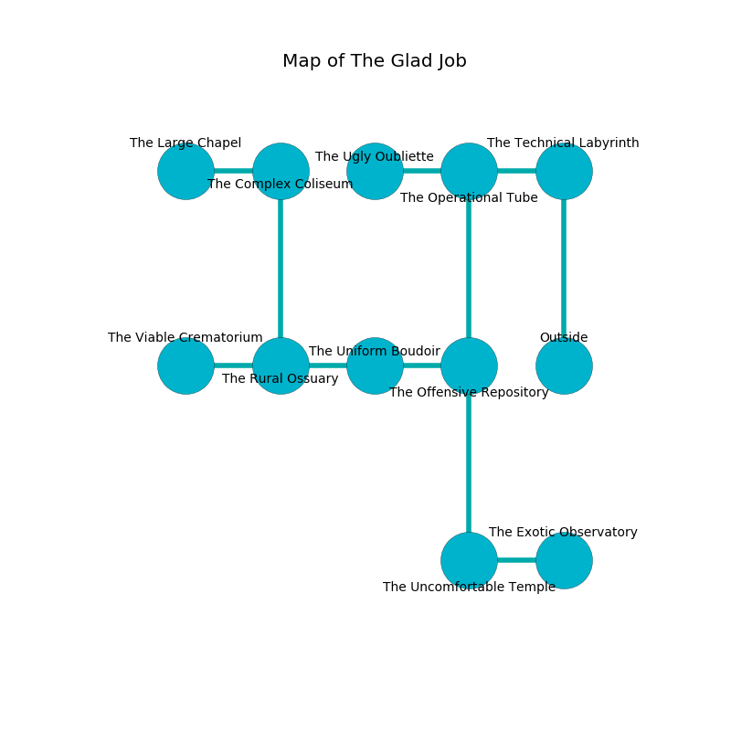

%Ruin Dogs

##The Glad Job
###Overview
The Glad Job is located under an obsidion rift. Parts of The Glad Job are frozen. The ruin is burning. It is occupied by Drows. Yasmin Fernandez The Unreliable, a Cambion is here. The Drows are battling Yasmin Fernandez The Unreliable. She  is trying to discover [Huhl](#Huhl). 

###Artifact
####Huhl

Huhl looks like a transparent meteorite. It is a sickly green color. It smells like capers. When held it destroys others. 

###Locations

####the technical labyrinth
The concrete walls are pristine. The floor is sticky. 

* To the west a windy cave connects to [the operational tube](#the-operational-tube).
* To the south is the entrance.

####the operational tube
The crystal walls are bloodstained. 

There is an engraving on a tablet written in Drows Script. 

> We are maddened
>
> balanced and traditional
>
> We are maddened
>

* To the west a twisted threshold leads to [the ugly oubliette](#the-ugly-oubliette).
* To the east a windy cave connects to [the technical labyrinth](#the-technical-labyrinth).
* To the south a small artery leads to [the offensive repository](#the-offensive-repository).

####the ugly oubliette
The mirrored walls are caving in. The air tastes like barley here. The floor is smooth. 

* [Yasmin Fernandez The Unreliable](#Yasmin-Fernandez-The-Unreliable) is here.
* To the east a twisted threshold opens to [the operational tube](#the-operational-tube).

####the offensive repository
Green ferns are decaying in a patch on the floor. The air smells like corn chip here. The floor is bloodstained. There are twenty four Drows here. The mirrored walls are bloodstained. The Drows are feasting. 

* To the west a torchlit corridor leads to [the uniform boudoir](#the-uniform-boudoir).
* To the north a small artery opens to [the operational tube](#the-operational-tube).
* To the south a small gap opens to [the uncomfortable temple](#the-uncomfortable-temple).

####the uniform boudoir
Green mushrooms are swaying in cracks in the floor. The floor is bloodstained. The air tastes like popcorn here. 

* There is a hare here.
* There is a wheel here.
* To the west a narrow threshold opens to [the rural ossuary](#the-rural-ossuary).
* To the east a torchlit corridor leads to [the offensive repository](#the-offensive-repository).

####the rural ossuary
The wooden walls are covered in mold. There is a Githzerai Zerth here. The air tastes like mutton here. 

* To the west a long cavern connects to [the viable crematorium](#the-viable-crematorium).
* To the east a narrow threshold connects to [the uniform boudoir](#the-uniform-boudoir).
* To the north a dripping passageway connects to [the complex coliseum](#the-complex-coliseum).

####the complex coliseum
The floor is cluttered with bones. Gray moss is decaying in broken urns. The concrete walls are caving in. 

There is an engraving on a tablet written in common. 

> O my fate is inhumane
>
> it is always opposed
>
> but vain
>
> nothing is closed
>

* [Huhl](#Huhl) is here.
* To the west a hazy corridor connects to [the large chapel](#the-large-chapel).
* To the south a dripping passageway leads to [the rural ossuary](#the-rural-ossuary).

####the uncomfortable temple
The floor is bloodstained. Red razorgrass is growing in a patch on the floor. The air tastes like grapefruit here. The brick walls are ruined. 

* To the east a twisted threshold opens to [the exotic observatory](#the-exotic-observatory).
* To the north a small gap leads to [the offensive repository](#the-offensive-repository).

####the viable crematorium
The air smells like cotton candy here. Yellow ferns are growing from the walls. There are a Quipper, a Hook Horror, and a Killer Whale here. The metallic walls are ruined. 

* To the east a long cavern connects to [the rural ossuary](#the-rural-ossuary).

####the exotic observatory
There are twenty four Drows here. Blue razorgrass is sprouting in cracks in the floor. One of the Drows is on watch, the rest are celebrating. 

* To the west a twisted threshold opens to [the uncomfortable temple](#the-uncomfortable-temple).

####the large chapel
Blue lichens are swaying from the ceiling. The air tastes like sulfur here. 

* To the east a hazy corridor connects to [the complex coliseum](#the-complex-coliseum).

