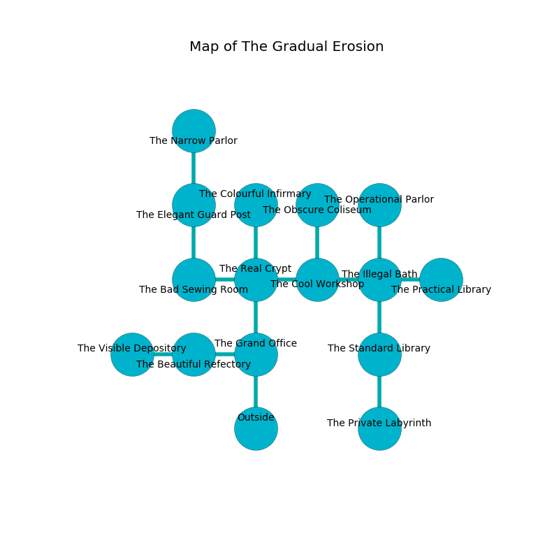

%Ruin Dogs

##The Gradual Erosion
###Overview
The Gradual Erosion is located in a poisoned mountain. Some areas of it are foggy. The ruin is larger on the inside than the outside. It is occupied by Kenku. Monroe Ison The Narrow-Minded, a Priest is here. The Kenku are ruled by Monroe Ison The Narrow-Minded. He  is trying to steal [The Structural Contraction](#The-Structural-Contraction). 

###Artifact
####The Structural Contraction

The Structural Contraction looks like a wet cube. When rubbed it repels insects. 

###Locations

####the grand office
The floor is flooded with seven inch deep scalding water. 

* There is a map here.
* There is a leaf here.
* To the west a hazy cave opens to [the beautiful refectory](#the-beautiful-refectory).
* To the north a dark pathway leads to [the real crypt](#the-real-crypt).
* To the south is the entrance.

####the real crypt
The air tastes like bell pepper here. The wooden walls are bloodstained. There are a Crawling Claw, a Badger, a Satyr, a Hippogriff, and a Harpy here. 

There is an engraving on the wall written in common. 

> A trap ahead.
>

* To the west a flooded opening leads to [the bad sewing room](#the-bad-sewing-room).
* To the east a hazy cavern connects to [the cool workshop](#the-cool-workshop).
* To the north a twisted artery opens to [the colourful infirmary](#the-colourful-infirmary).
* To the south a dark pathway leads to [the grand office](#the-grand-office).

####the bad sewing room
There are a Giant Wolf Spider, a Giant Octopus, a Warhorse Skeleton, and a Giant Goat here. The air tastes like almond here. 

* To the east a flooded opening leads to [the real crypt](#the-real-crypt).
* To the north a dark artery connects to [the elegant guard post](#the-elegant-guard-post).

####the elegant guard post

* [Monroe Ison The Narrow-Minded](#Monroe-Ison-The-Narrow-Minded) is here.
* To the north a torchlit path connects to [the narrow parlor](#the-narrow-parlor).
* To the south a dark artery connects to [the bad sewing room](#the-bad-sewing-room).

####the beautiful refectory
The floor is cluttered with broken glass. There is a trap here. When activated, a tripwire will make the walls close in. Yellow lichens are sprouting from the walls. The stone walls are ruined. The air smells like blueberry here. 

There is an engraving on the ceiling written in Kenku Script. 

> I tried dying.
>

* There is a bell here.
* To the west a windy hall connects to [the visible depository](#the-visible-depository).
* To the east a hazy cave connects to [the grand office](#the-grand-office).

####the cool workshop
There are eight Kenkus here. The air smells like dill here. One of the Kenku is on watch, the rest are caring for babies. 

* There is a box here.
* There is a fowl here.
* To the west a hazy cavern opens to [the real crypt](#the-real-crypt).
* To the east a windy path leads to [the illegal bath](#the-illegal-bath).
* To the north a torchlit cavern connects to [the obscure coliseum](#the-obscure-coliseum).

####the illegal bath
The floor is sticky. 

* There is a tree here.
* To the west a windy path opens to [the cool workshop](#the-cool-workshop).
* To the east a dripping cavern connects to [the practical library](#the-practical-library).
* To the north a long path connects to [the operational parlor](#the-operational-parlor).
* To the south a hazy hallway opens to [the standard library](#the-standard-library).

####the narrow parlor

There is an engraving on a tablet written in common. 

> [The Structural Contraction](#The-Structural-Contraction)
>
> full-time and aesthetic
>
> likely, faithful, joint
>

* To the south a torchlit path leads to [the elegant guard post](#the-elegant-guard-post).

####the colourful infirmary
There are eight Kenkus here. One of the Kenku is on watch, the rest are feasting. 

There is an engraving on the ceiling written in common. 

> O! sorry you
>
> it is never extraordinary
>
> subsequent, competitive, true
>
> fate is ordinary
>

* To the south a twisted artery opens to [the real crypt](#the-real-crypt).

####the visible depository
There are eight Kenkus here. Green mushrooms are swaying in broken urns. The floor is glossy. One of the Kenku is pointing a ballista at the entrance. 

* To the east a windy hall connects to [the beautiful refectory](#the-beautiful-refectory).

####the standard library
The air tastes like cucumber skin here. 

There is an engraving on the wall written in common. 

> Dear me! our fate is inhumane
>
> exotic, equal, vain
>
> dangerous and occupational
>
> the world is vocational
>

* There is a plate here.
* There is a picture here.
* [The Structural Contraction](#The-Structural-Contraction) is here.
* To the north a hazy hallway connects to [the illegal bath](#the-illegal-bath).
* To the south a dripping corridor leads to [the private labyrinth](#the-private-labyrinth).

####the obscure coliseum
The floor is flooded with nine inch deep cool water. The stone walls are caving in. 

* There is a bird here.
* To the south a torchlit cavern opens to [the cool workshop](#the-cool-workshop).

####the operational parlor
The air tastes like blueberry here. The floor is sticky. The metallic walls are bloodstained. There are eight Kenkus here. White moss is swaying in cracks in the floor. The Kenku are willing to negotiate. 

* There is a match here.
* To the south a long path connects to [the illegal bath](#the-illegal-bath).

####the practical library
There is a Peryton here. The floor is bloodstained. Blue moss is growing in cracks in the floor. The mirrored walls are caving in. 

* To the west a dripping cavern connects to [the illegal bath](#the-illegal-bath).

####the private labyrinth
Red razorgrass is swaying in a patch on the floor. The air smells like flesh here. 

* To the north a dripping corridor leads to [the standard library](#the-standard-library).

