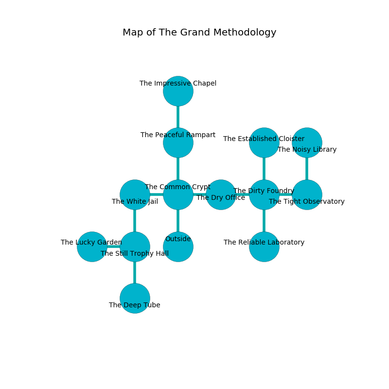

%Ruin Dogs

##The Grand Methodology
###Overview
The Grand Methodology is located under an alien city. Some rooms of The Grand Methodology are foggy. The ruin is larger on the inside than the outside. It is occupied by Goblins. Marco Martz The Quick-Tempered, a Cloud Giant is here. The Goblins are the minions of Marco Martz The Quick-Tempered. He  is trying to exploit [The Alert Salon](#The-Alert-Salon). 

###Artifact
####The Alert Salon

The Alert Salon is a powerful artifact in the shape of a hard figurine. It is a light yellow color. When held it levitates surrounding objects. 

###Locations

####the common crypt
The floor is flooded with two inch deep cold water. 

* To the west a twisted gap opens to [the white jail](#the-white-jail).
* To the east a torchlit cave opens to [the dry office](#the-dry-office).
* To the north a torchlit walkway leads to [the peaceful rampart](#the-peaceful-rampart).
* To the south is the entrance.

####the peaceful rampart
There are a Goblin and two Hobgoblin Warlords here. The mirrored walls are bloodstained. The air smells like roasted hazelnut here. One of the Goblins is pointing a ballista at the entrance. 

* To the north a flooded artery opens to [the impressive chapel](#the-impressive-chapel).
* To the south a torchlit walkway connects to [the common crypt](#the-common-crypt).

####the dry office
The air tastes like toffee here. The floor is cluttered with shells. There are a Hezrou, a Blue Dragon Wyrmling, a Giant Owl, a Githzerai Monk, a Reef Shark, and a Winged Kobold here. 

There is an engraving on a stone written in common. 

> I am powerful.
>

* To the west a torchlit cave leads to [the common crypt](#the-common-crypt).
* To the east a small hallway leads to [the dirty foundry](#the-dirty-foundry).

####the dirty foundry
The obsidion walls are scratched. 

There is an engraving on the ceiling written in common. 

> Run away.
>

* To the west a small hallway connects to [the dry office](#the-dry-office).
* To the east a dripping pathway connects to [the tight observatory](#the-tight-observatory).
* To the north a dripping hall opens to [the established cloister](#the-established-cloister).
* To the south a flooded cavern connects to [the reliable laboratory](#the-reliable-laboratory).

####the impressive chapel
There are a Nycaloth, a Dire Wolf, and a Bulette here. Gray lichens are sprouting from the walls. 

* To the south a flooded artery leads to [the peaceful rampart](#the-peaceful-rampart).

####the tight observatory
The air smells like juniper here. The floor is flooded with three inch deep cool water. There are a Gnoll Pack Lord and a Treant here. 

There is an engraving on the ceiling written in Goblins Script. 

> Dig here.
>

* [The Alert Salon](#The-Alert-Salon) is here.
* To the west a dripping pathway opens to [the dirty foundry](#the-dirty-foundry).
* To the north a twisted corridor connects to [the noisy library](#the-noisy-library).

####the reliable laboratory
There are two Hobgoblin Warlords here. The floor is sticky. The Goblins are defending this room from intruders. 

* To the north a flooded cavern leads to [the dirty foundry](#the-dirty-foundry).

####the established cloister
The floor is flooded with one inch deep hot water. There are two Hobgoblin Warlords here. The Goblins are fighting amongst themselves. 

* To the south a dripping hall leads to [the dirty foundry](#the-dirty-foundry).

####the white jail
Blue ferns are sprouting from the walls. The floor is bloodstained. 

* [Marco Martz The Quick-Tempered](#Marco-Martz-The-Quick-Tempered) is here.
* To the east a twisted gap opens to [the common crypt](#the-common-crypt).
* To the south a torchlit gap leads to [the still trophy hall](#the-still-trophy-hall).

####the still trophy hall
The air tastes like petroleum here. There are a Silver Dragon Wyrmling, a Nothic, an Ettin, a Spider, a Cloud Giant, and a Vulture here. The wooden walls are bloodstained. The floor is smooth. 

* To the west a torchlit cavern opens to [the lucky garden](#the-lucky-garden).
* To the north a torchlit gap opens to [the white jail](#the-white-jail).
* To the south a windy artery connects to [the deep tube](#the-deep-tube).

####the deep tube
The air tastes like clam here. There are a Goblin, two Hobgoblins, a Hobgoblin Captain, a Hobgoblin Warlord, and  here. If the Goblins notice the Ruin Dogs, one of them will retreat and alert [Marco Martz](#Marco-Martz). 

* To the north a windy artery connects to [the still trophy hall](#the-still-trophy-hall).

####the lucky garden
The floor is glossy. Yellow ferns are swaying in a patch on the floor. The air tastes like ginseng here. There are a Nycaloth, a Gelatinous Cube, and a Knight here. 

* There is an apple here.
* To the east a torchlit cavern leads to [the still trophy hall](#the-still-trophy-hall).

####the noisy library
The obsidion walls are scratched. There are a Blink Dog, an Imp, a Giant Boar, a Worg, a Hunter Shark, a Lamia, and a Sahuagin Priestess here. The floor is glossy. 

* To the south a twisted corridor leads to [the tight observatory](#the-tight-observatory).

