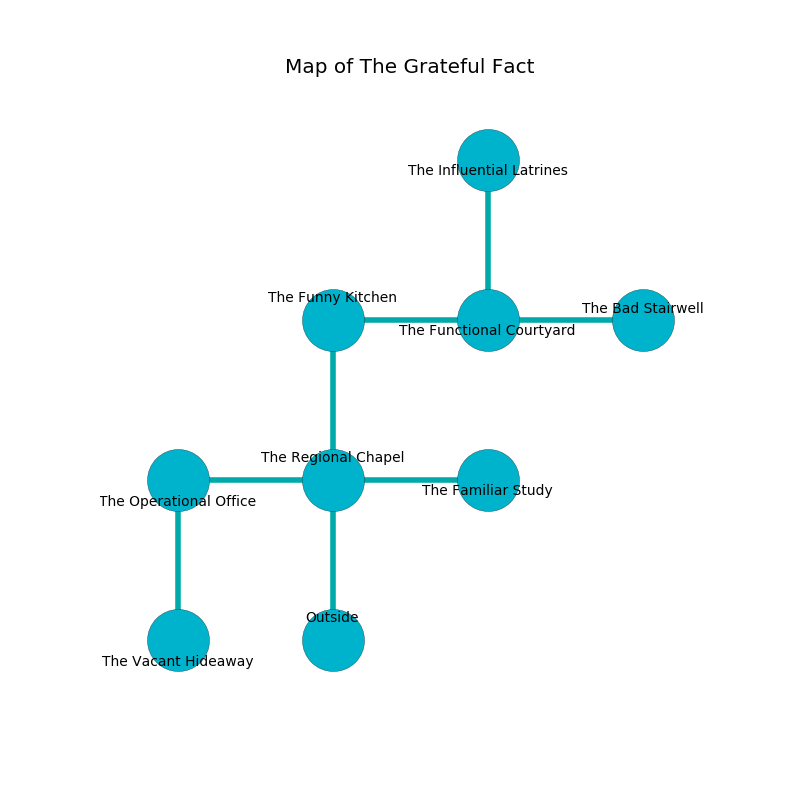

%Ruin Dogs

##The Grateful Fact
###Overview
The Grateful Fact is located in a ruined plain. Some rooms of The Grateful Fact are corrupted. The ruin is coming to life. It is occupied by Ogres. Chere Bledsoe The Obstinate, a Gladiator is here. The Ogres worship Chere Bledsoe The Obstinate. She  is founding a new religion. 

###Artifact
####Iaeccmaii

Iaeccmaii looks like a warm sphere. It is a shifting white color. When held it repels insects. 

###Locations

####the regional chapel
There are three Ogres here. The floor is glossy. The air smells like fir needle here. One of the Ogres is on watch, the rest are drunk. 

* There is a tree here.
* To the west a narrow pathway opens to [the operational office](#the-operational-office).
* To the east a dripping threshold opens to [the familiar study](#the-familiar-study).
* To the north a small hallway opens to [the funny kitchen](#the-funny-kitchen).
* To the south is the entrance.

####the operational office
Red razorgrass is swaying in broken urns. The floor is smooth. The air tastes like taco here. The metallic walls are bloodstained. 

* [Iaeccmaii](#Iaeccmaii) is here.
* To the east a narrow pathway leads to [the regional chapel](#the-regional-chapel).
* To the south a narrow walkway leads to [the vacant hideaway](#the-vacant-hideaway).

####the funny kitchen
The floor is cluttered with shells. Yellow razorgrass is sprouting in a patch on the floor. There are three Ogres here. The air tastes like chocolate here. One of the Ogres is on watch, the rest are drunk. 

* To the east a windy threshold connects to [the functional courtyard](#the-functional-courtyard).
* To the south a small hallway connects to [the regional chapel](#the-regional-chapel).

####the functional courtyard
The air smells like toast here. The wooden walls are bloodstained. The floor is cluttered with shells. 

* There is a cord here.
* To the west a windy threshold leads to [the funny kitchen](#the-funny-kitchen).
* To the east a narrow pathway leads to [the bad stairwell](#the-bad-stairwell).
* To the north a small opening opens to [the influential latrines](#the-influential-latrines).

####the bad stairwell
The floor is sticky. Yellow lichens are sprouting in a patch on the floor. 

* To the west a narrow pathway leads to [the functional courtyard](#the-functional-courtyard).

####the influential latrines
There are three Half-Ogres and an Ogre here. The floor is flooded with eight inch deep cool water. The air smells like immortelle here. The Ogres are berserk with rage. 

* There is a parcel here.
* To the south a small opening leads to [the functional courtyard](#the-functional-courtyard).

####the familiar study
The wooden walls are covered in mold. The floor is sticky. 

* To the west a dripping threshold opens to [the regional chapel](#the-regional-chapel).

####the vacant hideaway
The floor is bloodstained. There are a Half-Ogre and two Ogres here. The Ogres are berserk with rage. 

There is an engraving on a tablet written in Ogres Script. 

> All of us are damned
>
> powerful, comfortable, incongruous
>

* [Chere Bledsoe The Obstinate](#Chere-Bledsoe-The-Obstinate) is here.
* To the north a narrow walkway connects to [the operational office](#the-operational-office).

