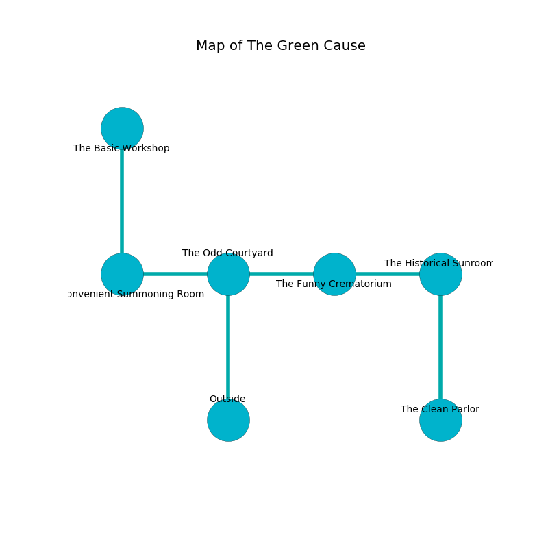

%Ruin Dogs

##The Green Cause
###Overview
The Green Cause is located on a ruined tree. Parts of it are foggy. A massive storm is happening outside. It is occupied by Orc. Antonia Burgess The Possessive, a Frost Giant is here. The Orc worship Antonia Burgess The Possessive. He  is trying to find [Auuhodaeum](#Auuhodaeum). 

###Artifact
####Auuhodaeum

Auuhodaeum has the form of a transparent amulet. When carried it aids memory. 

###Locations

####the odd courtyard
There are a Displacer Beast, a Giant Vulture, a Swarm of Ravens, a Boar, a Quipper, a Hill Giant, and a Wight here. The crystal walls are caving in. 

There is an engraving on the ceiling written in common. 

> I am lost in The Green Cause.
>

* [Antonia Burgess The Possessive](#Antonia-Burgess-The-Possessive) is here.
* To the west a twisted opening opens to [the convenient summoning room](#the-convenient-summoning-room).
* To the east a torchlit threshold leads to [the funny crematorium](#the-funny-crematorium).
* To the south is the entrance.

####the funny crematorium
The air tastes like tuberose here. The floor is flooded with three inch deep lukewarm water. 

* There is a collar here.
* To the west a torchlit threshold opens to [the odd courtyard](#the-odd-courtyard).
* To the east a dripping artery connects to [the historical sunroom](#the-historical-sunroom).

####the historical sunroom
The wooden walls are ruined. The air smells like seafood here. 

There is an engraving on the ceiling written in Orc Script. 

> [Auuhodaeum](#Auuhodaeum)
>
> blank and shy
>
> An umbrella is an attachment
>
> long and medieval
>
> A heart is a blood
>
> positive and polite
>
> soft and critical
>
> A nose is a rabbit
>
> ever eternal
>
> maximum, welcome, noisy
>
> charismatic, satisfied, graphic
>
> ever operational
>
> assertive and tired
>
> constructive and patient
>
> An angle is a salt
>
> classical, dull, certain
>
> express, experimental, regional
>
> harmful and lonely
>
> single, written, ultimate
>
> [Auuhodaeum](#Auuhodaeum)
>

* To the west a dripping artery connects to [the funny crematorium](#the-funny-crematorium).
* To the south a long walkway leads to [the clean parlor](#the-clean-parlor).

####the clean parlor
The metallic walls are bloodstained. The air tastes like smoke here. The floor is sticky. Red razorgrass is growing from the ceiling. 

* To the north a long walkway connects to [the historical sunroom](#the-historical-sunroom).

####the convenient summoning room
The mirrored walls are unsettled. The floor is sticky. 

There is an engraving on a stone written in Orc Script. 

> Leave at once.
>

* [Auuhodaeum](#Auuhodaeum) is here.
* To the east a twisted opening connects to [the odd courtyard](#the-odd-courtyard).
* To the north a dark gap connects to [the basic workshop](#the-basic-workshop).

####the basic workshop
The obsidion walls are caving in. There are a Death Dog, a Tribal Warrior, an Elephant, and a Succubus here. The air smells like black tea here. 

* To the south a dark gap connects to [the convenient summoning room](#the-convenient-summoning-room).

