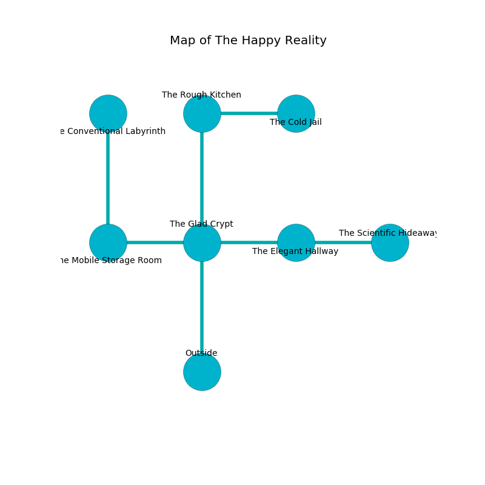

%Ruin Dogs

##The Happy Reality
###Overview
The Happy Reality is located under an obsidion mountain. Regions of it are incredibly hot. A lunar eclipse is happening outside. It is occupied by Myconids. Delmer Vitale The Dogmatic, a Frost Giant is here. The Myconids are the slaves of Delmer Vitale The Dogmatic. He  is founding a new religion. 

###Artifact
####The Dynamic Relief

The Dynamic Relief looks like a smooth sphere. It is a dark blue color. When picked up it destroys itself. 

###Locations

####the glad crypt
Green razorgrass is sprouting from the walls. 

There is an engraving on the ceiling written in common. 

> I want to find [The Dynamic Relief](#The-Dynamic-Relief).
>
> Leave now.
>

* To the west a long pathway connects to [the mobile storage room](#the-mobile-storage-room).
* To the east a windy opening leads to [the elegant hallway](#the-elegant-hallway).
* To the north a hazy hallway connects to [the rough kitchen](#the-rough-kitchen).
* To the south is the entrance.

####the elegant hallway
The air smells like root beer here. 

* There is a plow here.
* There is a sceptre here.
* There is a horse here.
* To the west a windy opening connects to [the glad crypt](#the-glad-crypt).
* To the east a dripping artery opens to [the scientific hideaway](#the-scientific-hideaway).

####the rough kitchen
There are two Myconid Sovereigns and seven Myconid Adults here. Gray razorgrass is sprouting in broken urns. The concrete walls are caving in. There is a trap here. When activated, a magical proximity detector will blast flames. The Myconids are performing a ritual. If not interrupted, a powerful monster will be summoned. 

* There is a carriage here.
* To the east a narrow cave leads to [the cold jail](#the-cold-jail).
* To the south a hazy hallway connects to [the glad crypt](#the-glad-crypt).

####the mobile storage room
Blue moss is growing from the walls. The floor is cluttered with bones. The crystal walls are ruined. There are two Myconid Sovereigns and eight Myconid Adults here. One of the Myconids is on watch, the rest are drunk. 

There is an engraving on a tablet written in common. 

> O pitiful god
>
> hilarious and fast
>
> colourful, surprised, odd
>
> sadness is past
>

* [The Dynamic Relief](#The-Dynamic-Relief) is here.
* To the east a long pathway leads to [the glad crypt](#the-glad-crypt).
* To the north a torchlit corridor connects to [the conventional labyrinth](#the-conventional-labyrinth).

####the cold jail
Red moss is sprouting in a patch on the floor. There is a trap here. When activated, a pressure plate will launch a poison dart. 

There is an engraving on a monolith written in common. 

> Dig here.
>

* There is a nail here.
* To the west a narrow cave leads to [the rough kitchen](#the-rough-kitchen).

####the scientific hideaway
The floor is flooded with seven inch deep lukewarm water. There are three Myconid Sovereigns and two Myconid Adults here. The air tastes like yuzu here. Blue lichens are sprouting in a patch on the floor. The Myconids are feasting. 

There is an engraving on the ceiling written in Myconids Script. 

> We are dying
>
> emotional, automatic, socialist
>
> vague, uniform, unanimous
>
> chronic, lucky, empirical
>
> A cat is a win
>
> ever vulnerable
>

* To the west a dripping artery leads to [the elegant hallway](#the-elegant-hallway).

####the conventional labyrinth
Blue razorgrass is decaying from the walls. 

There is an engraving on the ceiling written in common. 

> [The Dynamic Relief](#The-Dynamic-Relief)
>
> always passionate
>
> [The Dynamic Relief](#The-Dynamic-Relief)
>
> glorious and written
>
> We are envious
>
> dry and sophisticated
>
> They are love
>
> judicial, shallow, stupid
>
> A ticket is a revenge
>
> curious, passionate, fashionable
>
> reliable and aware
>
> yet never genetic
>
> bureaucratic, rough, obscure
>

* [Delmer Vitale The Dogmatic](#Delmer-Vitale-The-Dogmatic) is here.
* To the south a torchlit corridor leads to [the mobile storage room](#the-mobile-storage-room).

