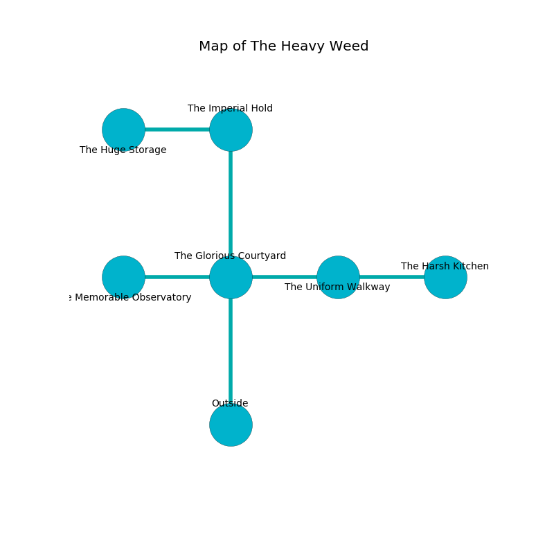

%Ruin Dogs

##The Heavy Weed
###Overview
The Heavy Weed is located in a giant tree. Some areas of it are corrupted. The ruin is coming to life. It is occupied by Kobolds. June Haywood The Bone-Idle, a Githyanki Warrior is here. The Kobolds have been charmed by June Haywood The Bone-Idle. She  is founding a new religion. 

###Artifact
####Aemdafaid Bafcmemd

Aemdafaid Bafcmemd looks like a sharp cube. It is a light yellow color. Power glows towards it. It smells like osmanthus. When gazed upon it projects energy. 

###Locations

####the glorious courtyard
Blue lichens are decaying from the ceiling. The air smells like fruit here. The obsidion walls are bloodstained. There are seven Winged Kobolds and two Kobolds here. The Kobolds are sleeping. 

* To the west a twisted cave connects to [the memorable observatory](#the-memorable-observatory).
* To the east a dark passageway connects to [the uniform walkway](#the-uniform-walkway).
* To the north a torchlit opening connects to [the imperial hold](#the-imperial-hold).
* To the south is the entrance.

####the memorable observatory
Blue moss is growing in broken urns. There is a Centaur here. The air smells like herbs here. The glass walls are scratched. The floor is smooth. 

* To the east a twisted cave opens to [the glorious courtyard](#the-glorious-courtyard).

####the imperial hold
The air smells like hyacinth here. Yellow lichens are growing in cracks in the floor. There are six Winged Kobolds and four Kobolds here. The Kobolds are willing to negotiate. 

* [Aemdafaid Bafcmemd](#Aemdafaid-Bafcmemd) is here.
* To the west a dripping path opens to [the huge storage](#the-huge-storage).
* To the south a torchlit opening leads to [the glorious courtyard](#the-glorious-courtyard).

####the uniform walkway
The wooden walls are caving in. The floor is glossy. 

There is an engraving on a stone written in Kobolds Script. 

> Try leaving.
>

* [June Haywood The Bone-Idle](#June-Haywood-The-Bone-Idle) is here.
* To the west a dark passageway connects to [the glorious courtyard](#the-glorious-courtyard).
* To the east a flooded passageway opens to [the harsh kitchen](#the-harsh-kitchen).

####the harsh kitchen
There are seven Winged Kobolds and two Kobolds here. The floor is cluttered with ashes. The Kobolds are willing to negotiate. 

* To the west a flooded passageway opens to [the uniform walkway](#the-uniform-walkway).

####the huge storage
There are a Reef Shark, a Deep Gnome, a Myconid Sprout, and a Giant Wasp here. 

* To the east a dripping path connects to [the imperial hold](#the-imperial-hold).

