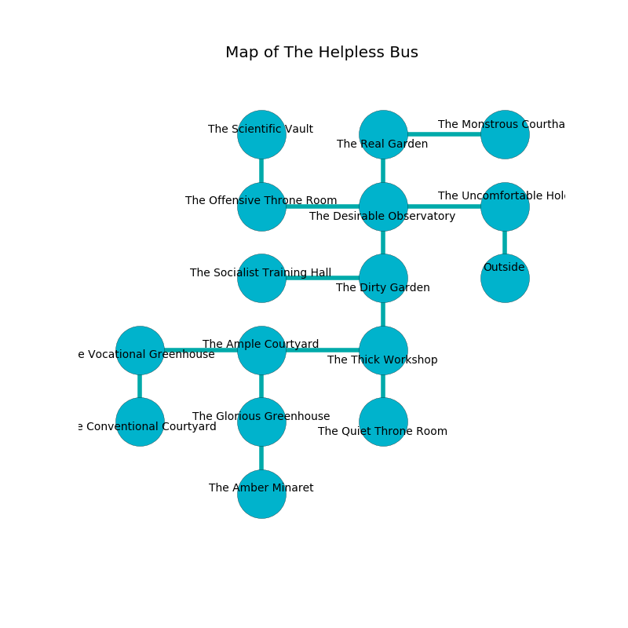

%Ruin Dogs

##The Helpless Bus
###Overview
The Helpless Bus is constructed on a volcanic city. Parts of The Helpless Bus are corrupted. A windstorm is happening outside. It is occupied by Githyanki. Les Brady The Clinging, a Hill Giant is here. The Githyanki are the soldiers of Les Brady The Clinging. He  is trying to use [The Uneasy Result](#The-Uneasy-Result). 

###Artifact
####The Uneasy Result

The Uneasy Result has the form of a smooth crystal. It is a pale red color. It smells like privet. When eaten it changes the past. 

###Locations

####the uncomfortable hold
The air smells like salt here. Gray mushrooms are sprouting from the walls. The floor is glossy. There are two Githyanki Warriors here. If the Githyanki notice the Ruin Dogs, one of them will retreat and alert the others. 

* There is a key here.
* To the west a dark threshold connects to [the desirable observatory](#the-desirable-observatory).
* To the south is the entrance.

####the desirable observatory
There are two Githyanki Warriors here. The floor is glossy. The crystal walls are ruined. Gray ferns are swaying in a patch on the floor. The Githyanki are willing to negotiate. 

There is an engraving on a tablet written in common. 

> Oh my! sorry we
>
> but ambitious
>
> positive, lost, free
>
> nothing is vicious
>

* To the west a windy artery opens to [the offensive throne room](#the-offensive-throne-room).
* To the east a dark threshold opens to [the uncomfortable hold](#the-uncomfortable-hold).
* To the north a torchlit threshold leads to [the real garden](#the-real-garden).
* To the south a small hall opens to [the dirty garden](#the-dirty-garden).

####the offensive throne room
The mirrored walls are pristine. There are two Githyanki Warriors here. The Githyanki are drunk. 

* To the east a windy artery opens to [the desirable observatory](#the-desirable-observatory).
* To the north a windy gap connects to [the scientific vault](#the-scientific-vault).

####the dirty garden
The air tastes like oak wood here. Yellow mushrooms are sprouting in cracks in the floor. 

There is an engraving on the ceiling written in Githyanki Script. 

> A net is a democracy
>
> competitive, even, addicted
>
> interesting and critical
>
> but genuine
>
> We are lost
>
> emotional and similar
>
> All of us are maddened
>
> petty, academic, odd
>

* To the west a windy corridor leads to [the socialist training hall](#the-socialist-training-hall).
* To the north a small hall opens to [the desirable observatory](#the-desirable-observatory).
* To the south a dripping path connects to [the thick workshop](#the-thick-workshop).

####the thick workshop

* There is a pendant here.
* To the west a flooded path leads to [the ample courtyard](#the-ample-courtyard).
* To the north a dripping path connects to [the dirty garden](#the-dirty-garden).
* To the south a windy hall opens to [the quiet throne room](#the-quiet-throne-room).

####the real garden
There are two Githyanki Warriors here. The mirrored walls are caving in. The Githyanki are willing to negotiate. 

* There is a pot here.
* To the east a dark gap opens to [the monstrous courthall](#the-monstrous-courthall).
* To the south a torchlit threshold connects to [the desirable observatory](#the-desirable-observatory).

####the ample courtyard
The air smells like chestnut here. 

* To the west a narrow artery opens to [the vocational greenhouse](#the-vocational-greenhouse).
* To the east a flooded path connects to [the thick workshop](#the-thick-workshop).
* To the south a twisted gap leads to [the glorious greenhouse](#the-glorious-greenhouse).

####the socialist training hall
The floor is bloodstained. 

* There is a snake here.
* To the east a windy corridor opens to [the dirty garden](#the-dirty-garden).

####the monstrous courthall
There are two Githyanki Warriors here. Gray razorgrass is swaying from the walls. The floor is cluttered with debris. The air tastes like mimosa here. The Githyanki are crazy with bloodlust. 

* [Les Brady The Clinging](#Les-Brady-The-Clinging) is here.
* To the west a dark gap leads to [the real garden](#the-real-garden).

####the scientific vault
The floor is smooth. 

* To the south a windy gap connects to [the offensive throne room](#the-offensive-throne-room).

####the glorious greenhouse
White mushrooms are swaying from the walls. 

* To the north a twisted gap opens to [the ample courtyard](#the-ample-courtyard).
* To the south a twisted hall leads to [the amber minaret](#the-amber-minaret).

####the amber minaret
There are two Githyanki Warriors here. The crystal walls are caving in. The Githyanki are berserk with rage. 

There is an engraving on the floor written in common. 

> Go away.
>

* To the north a twisted hall connects to [the glorious greenhouse](#the-glorious-greenhouse).

####the vocational greenhouse
White ferns are growing from the ceiling. There are a Carrion Crawler, a Kobold, a Githzerai Monk, and a Priest here. The air tastes like shrimp here. The floor is bloodstained. 

* There is a parcel here.
* [The Uneasy Result](#The-Uneasy-Result) is here.
* To the east a narrow artery leads to [the ample courtyard](#the-ample-courtyard).
* To the south a narrow artery opens to [the conventional courtyard](#the-conventional-courtyard).

####the quiet throne room
Blue moss is sprouting from the walls. 

* To the north a windy hall opens to [the thick workshop](#the-thick-workshop).

####the conventional courtyard
There are a Jackal, a Goat, a Scarecrow, a Giant Crocodile, and a Druid here. Yellow moss is sprouting from the ceiling. The glass walls are pristine. 

* To the north a narrow artery opens to [the vocational greenhouse](#the-vocational-greenhouse).

