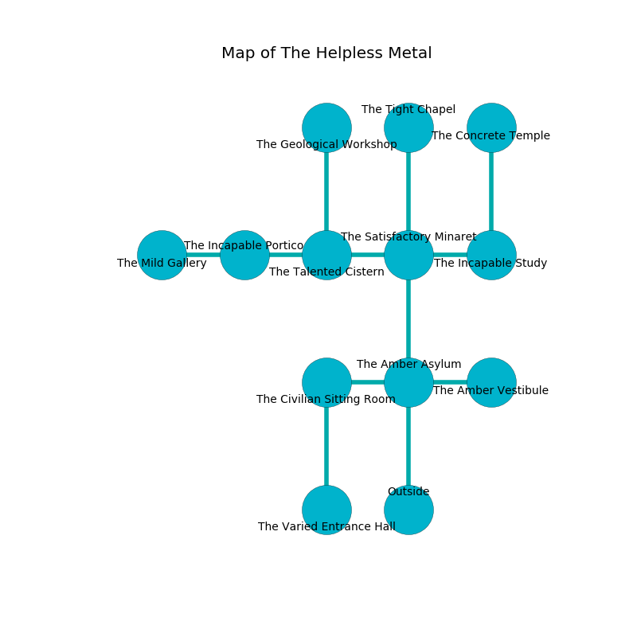

%Ruin Dogs

##The Helpless Metal
###Overview
The Helpless Metal is located under a volcanic mountain. Parts of The Helpless Metal are flooded. A lunar eclipse is happening outside. It is occupied by Lizardfolk. Nakita Tribble The Vain, a Stone Giant is here. The Lizardfolk are the minions of Nakita Tribble The Vain. She  is trying to understand [Hei](#Hei). 

###Artifact
####Hei

Hei looks like a mushy doll. When gazed upon it repels insects. 

###Locations

####the amber asylum
The floor is cluttered with shells. The brick walls are caving in. There are three Lizardfolk Shamans here. Green moss is swaying from the walls. The air tastes like buttery	cabbage here. The Lizardfolk are performing a ritual. If not interrupted, a powerful monster will be summoned. 

There is an engraving on the floor written in Lizardfolk Script. 

> I am lost in The Helpless Metal.
>
> I thought about swimming.
>

* There is a snake here.
* To the west a twisted artery opens to [the civilian sitting Room](#the-civilian-sitting-Room).
* To the east a hazy path opens to [the amber vestibule](#the-amber-vestibule).
* To the north a torchlit cavern connects to [the satisfactory minaret](#the-satisfactory-minaret).
* To the south is the entrance.

####the civilian sitting Room
There are an Azer, a Giant Badger, and a Revenant here. The air smells like oak wood here. The floor is glossy. 

* There is a whistle here.
* To the east a twisted artery connects to [the amber asylum](#the-amber-asylum).
* To the south a dripping cave connects to [the varied entrance hall](#the-varied-entrance-hall).

####the satisfactory minaret
The air smells like barley here. The brick walls are caving in. Green razorgrass is decaying from the walls. There are three Lizardfolk Shamans here. The Lizardfolk are willing to negotiate. 

* To the west a long hallway opens to [the talented cistern](#the-talented-cistern).
* To the east a dripping hall leads to [the incapable study](#the-incapable-study).
* To the north a narrow corridor connects to [the tight chapel](#the-tight-chapel).
* To the south a torchlit cavern connects to [the amber asylum](#the-amber-asylum).

####the incapable study
There are a Darkmantle, a Displacer Beast, a Githzerai Zerth, an Old Faerie Dragon, a Smoke Mephit, and a Camel here. 

There is an engraving on the floor written in Lizardfolk Script. 

> A trap ahead.
>

* To the west a dripping hall leads to [the satisfactory minaret](#the-satisfactory-minaret).
* To the north a dripping path connects to [the concrete temple](#the-concrete-temple).

####the tight chapel
Red lichens are decaying in a patch on the floor. The wooden walls are pristine. The floor is cluttered with bones. The air tastes like thyme here. 

* To the south a narrow corridor leads to [the satisfactory minaret](#the-satisfactory-minaret).

####the talented cistern
There are a Banshee, a Giant Wasp, a Goat, a Troll, and a Vulture here. The mirrored walls are unsettled. The air tastes like salt here. 

* To the west a windy passageway connects to [the incapable portico](#the-incapable-portico).
* To the east a long hallway connects to [the satisfactory minaret](#the-satisfactory-minaret).
* To the north a narrow path leads to [the geological workshop](#the-geological-workshop).

####the geological workshop
The floor is glossy. There are a Giant Wolf Spider, a Zombie, a Warhorse Skeleton, a Tridrone, a Dire Wolf, a Manes, a Needle Blight, an Owlbear, and a Giant Crab here. The air smells like dried fruit here. The metallic walls are covered in mold. 

* To the south a narrow path leads to [the talented cistern](#the-talented-cistern).

####the incapable portico
The floor is bloodstained. The metallic walls are ruined. The air smells like fougere here. Blue razorgrass is swaying in cracks in the floor. 

* [Hei](#Hei) is here.
* To the west a torchlit hall connects to [the mild gallery](#the-mild-gallery).
* To the east a windy passageway opens to [the talented cistern](#the-talented-cistern).

####the concrete temple
There are a Young Faerie Dragon and a Giant Shark here. Blue ferns are swaying from the ceiling. The obsidion walls are scratched. 

* To the south a dripping path opens to [the incapable study](#the-incapable-study).

####the amber vestibule
The air smells like marshmallow here. The metallic walls are scratched. 

* There is a spirit here.
* To the west a hazy path opens to [the amber asylum](#the-amber-asylum).

####the varied entrance hall
The floor is glossy. Gray lichens are sprouting from the ceiling. 

* To the north a dripping cave leads to [the civilian sitting Room](#the-civilian-sitting-Room).

####the mild gallery

* [Nakita Tribble The Vain](#Nakita-Tribble-The-Vain) is here.
* To the east a torchlit hall leads to [the incapable portico](#the-incapable-portico).

