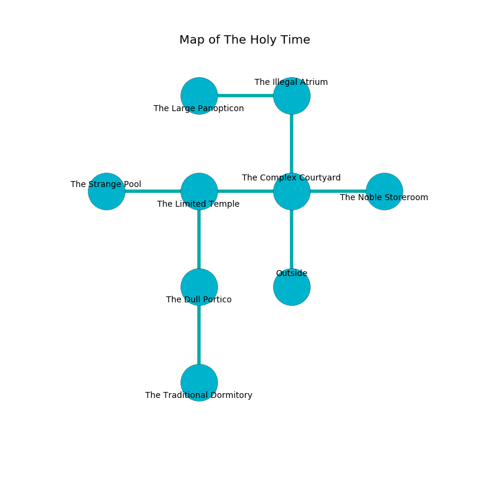

%Ruin Dogs

##The Holy Time
###Overview
The Holy Time is located under a ruined city. Some rooms of The Holy Time are incredibly cold. The ruin is coming to life. It is occupied by Sprites. Emilia Slade The Superficial, a Hill Giant is here. The Sprites are ruled by Emilia Slade The Superficial. She  is trying to use [Iaddhabamd](#Iaddhabamd). 

###Artifact
####Iaddhabamd

Iaddhabamd is a powerful artifact in the shape of a hard doll. Water flows around it. It smells like fungus. It is a medium yellow color. When picked up it grants a wish. 

###Locations

####the complex courtyard
The brick walls are pristine. There are twenty Sprites here. The air smells like rain here. White lichens are swaying in broken urns. The Sprites are drunk. 

* To the west a dark threshold opens to [the limited temple](#the-limited-temple).
* To the east a small gap opens to [the noble storeroom](#the-noble-storeroom).
* To the north a dripping passageway leads to [the illegal atrium](#the-illegal-atrium).
* To the south is the entrance.

####the limited temple
Blue lichens are growing in a patch on the floor. There is a trap here. When activated, a tripwire will extend a spring loaded spear. 

* To the west a flooded corridor connects to [the strange pool](#the-strange-pool).
* To the east a dark threshold connects to [the complex courtyard](#the-complex-courtyard).
* To the south a dark cavern opens to [the dull portico](#the-dull-portico).

####the strange pool
The floor is flooded with six inch deep lukewarm water. Green moss is sprouting in a patch on the floor. The glass walls are ruined. 

* There is a feather here.
* There is a scissors here.
* There is a rat here.
* To the east a flooded corridor opens to [the limited temple](#the-limited-temple).

####the dull portico
The air smells like cucumber skin here. Green mushrooms are decaying from the walls. 

* To the north a dark cavern opens to [the limited temple](#the-limited-temple).
* To the south a long artery leads to [the traditional dormitory](#the-traditional-dormitory).

####the traditional dormitory
There are an Azer and a Bugbear Chief here. The air smells like green apple here. Red mushrooms are swaying in a patch on the floor. The mirrored walls are scratched. 

* There is a fish here.
* To the north a long artery leads to [the dull portico](#the-dull-portico).

####the noble storeroom
The wooden walls are caving in. There is a trap here. When activated, a tripwire will make the walls close in. There are twenty Sprites here. One of the Sprites is on watch, the rest are sleeping. 

* [Emilia Slade The Superficial](#Emilia-Slade-The-Superficial) is here.
* To the west a small gap connects to [the complex courtyard](#the-complex-courtyard).

####the illegal atrium
White lichens are growing in broken urns. The air smells like chive here. There are twenty Sprites here. The Sprites are drunk. 

* [Iaddhabamd](#Iaddhabamd) is here.
* To the west a dripping hallway connects to [the large panopticon](#the-large-panopticon).
* To the south a dripping passageway opens to [the complex courtyard](#the-complex-courtyard).

####the large panopticon
The brick walls are scratched. 

* To the east a dripping hallway leads to [the illegal atrium](#the-illegal-atrium).

