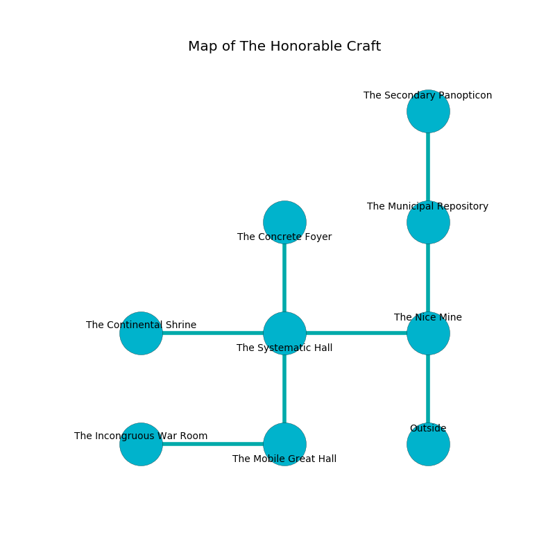

%Ruin Dogs

##The Honorable Craft
###Overview
The Honorable Craft is located in a cursed mountain. Some rooms of it are unbearably hot. The ruin is flooding. It is occupied by Gnolls. Tierra Schott The Clinging, a Fire Giant is here. The Gnolls are the slaves of Tierra Schott The Clinging. She  is founding a new religion. 

###Artifact
####The Spatial Castle

The Spatial Castle is a powerful artifact in the shape of a warm sphere. It smells like stringent. When picked up it changes probabilities. 

###Locations

####the nice mine
The air smells like currant here. 

* To the west a flooded cave leads to [the systematic hall](#the-systematic-hall).
* To the north a flooded artery opens to [the municipal repository](#the-municipal-repository).
* To the south is the entrance.

####the systematic hall
The floor is bloodstained. Blue moss is sprouting in cracks in the floor. The air smells like pear here. There are three Gnoll Fangs of Yeenoghu here. The Gnolls are fighting amongst themselves. 

There is an engraving on the ceiling written in common. 

> Maybe try swimming.
>

* [The Spatial Castle](#The-Spatial-Castle) is here.
* To the west a dark walkway connects to [the continental shrine](#the-continental-shrine).
* To the east a flooded cave leads to [the nice mine](#the-nice-mine).
* To the north a long hall opens to [the concrete foyer](#the-concrete-foyer).
* To the south a windy path connects to [the mobile great hall](#the-mobile-great-hall).

####the municipal repository
The air smells like seashore here. The obsidion walls are scratched. 

* To the north a narrow corridor opens to [the secondary panopticon](#the-secondary-panopticon).
* To the south a flooded artery leads to [the nice mine](#the-nice-mine).

####the secondary panopticon
The floor is flooded with nine inch deep scalding water. 

There is an engraving on a monolith written in Gnolls Script. 

> I thought about praying.
>

* There is a hoard here.
* To the south a narrow corridor leads to [the municipal repository](#the-municipal-repository).

####the mobile great hall
The air smells like caramel here. Red lichens are swaying from the ceiling. 

* To the west a flooded hall connects to [the incongruous war Room](#the-incongruous-war-Room).
* To the north a windy path connects to [the systematic hall](#the-systematic-hall).

####the concrete foyer
The air tastes like cranberry here. Red lichens are swaying in a patch on the floor. 

* To the south a long hall connects to [the systematic hall](#the-systematic-hall).

####the incongruous war Room

* [Tierra Schott The Clinging](#Tierra-Schott-The-Clinging) is here.
* To the east a flooded hall connects to [the mobile great hall](#the-mobile-great-hall).

####the continental shrine
There are a Guard, a Wraith, and a Githyanki Knight here. The floor is glossy. Red ferns are sprouting in broken urns. 

* To the east a dark walkway opens to [the systematic hall](#the-systematic-hall).

