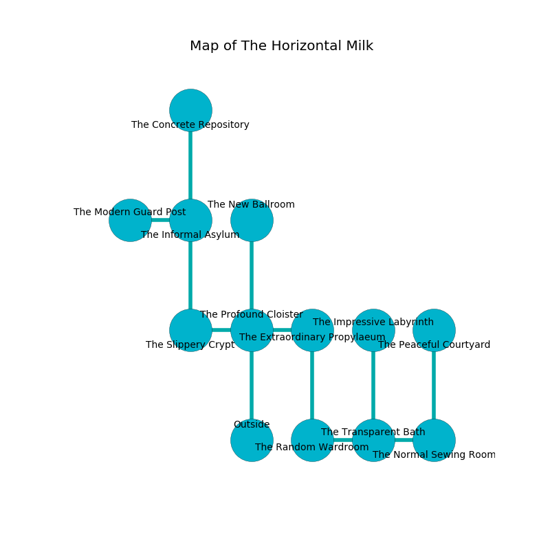

%Ruin Dogs

##The Horizontal Milk
###Overview
The Horizontal Milk is located in a flooded rift. Some areas of The Horizontal Milk are foggy. A blizzard is happening outside. It is occupied by Gnolls. Wesley Keen The Obsessive, a Mind Flayer is here. The Gnolls worship Wesley Keen The Obsessive. He  is trying to discover [Fadah Hoaela](#Fadah-Hoaela). 

###Artifact
####Fadah Hoaela

Fadah Hoaela is a powerful artifact in the shape of a smooth gem. When smelled it floats in the air. 

###Locations

####the profound cloister
The air smells like phenolic here. There is a trap here. When activated, a tripwire will launch a fusillade of darts. Gray lichens are growing from the ceiling. 

* To the west a windy threshold connects to [the slippery crypt](#the-slippery-crypt).
* To the east a hazy threshold leads to [the extraordinary propylaeum](#the-extraordinary-propylaeum).
* To the north a torchlit artery connects to [the new ballroom](#the-new-ballroom).
* To the south is the entrance.

####the extraordinary propylaeum
The floor is cluttered with broken glass. The obsidion walls are scratched. White lichens are decaying in cracks in the floor. 

There is an engraving on the ceiling written in Gnolls Script. 

> I could not try hiding.
>

* To the west a hazy threshold opens to [the profound cloister](#the-profound-cloister).
* To the south a dripping hall connects to [the random wardroom](#the-random-wardroom).

####the slippery crypt
The stone walls are covered in mold. The floor is glossy. 

There is an engraving on the ceiling written in common. 

> I am lost in The Horizontal Milk.
>

* To the east a windy threshold opens to [the profound cloister](#the-profound-cloister).
* To the north a torchlit walkway leads to [the informal asylum](#the-informal-asylum).

####the informal asylum
The metallic walls are bloodstained. The air smells like roasted coffee here. There are two Gnoll Fangs of Yeenoghu and a Gnoll Pack Lord here. One of the Gnolls is pointing a ballista at the entrance. 

* To the west a dark gap connects to [the modern guard post](#the-modern-guard-post).
* To the north a windy hallway leads to [the concrete repository](#the-concrete-repository).
* To the south a torchlit walkway connects to [the slippery crypt](#the-slippery-crypt).

####the new ballroom
There are a Gnoll Fang of Yeenoghu, two Gnolls, a Gnoll Pack Lord, and  here. The Gnolls are willing to negotiate. 

* [Wesley Keen The Obsessive](#Wesley-Keen-The-Obsessive) is here.
* To the south a torchlit artery connects to [the profound cloister](#the-profound-cloister).

####the random wardroom
Blue razorgrass is decaying from the ceiling. The metallic walls are covered in mold. 

There is an engraving on a stone written in common. 

> [Fadah Hoaela](#Fadah-Hoaela)
>
> but large
>
> sour, limited, peaceful
>
> [Fadah Hoaela](#Fadah-Hoaela)
>
> but never transparent
>
> lost and strong
>

* To the east a torchlit threshold connects to [the transparent bath](#the-transparent-bath).
* To the north a dripping hall connects to [the extraordinary propylaeum](#the-extraordinary-propylaeum).

####the concrete repository
There are an Ape, an Ochre Jelly, a Giant Owl, a Gladiator, an Orc Eye of Gruumsh, and a Will-O’-Wisp here. 

There is an engraving on the ceiling written in common. 

> We are free
>
> vicious, sensitive, ethnic
>
> implicit and satisfactory
>
> accurate and kind
>
> We are free
>

* To the south a windy hallway leads to [the informal asylum](#the-informal-asylum).

####the transparent bath
The floor is smooth. The air tastes like black currant here. The mirrored walls are ruined. Gray mushrooms are swaying from the walls. 

* To the west a torchlit threshold leads to [the random wardroom](#the-random-wardroom).
* To the east a small cave connects to [the normal sewing room](#the-normal-sewing-room).
* To the north a twisted walkway opens to [the impressive labyrinth](#the-impressive-labyrinth).

####the normal sewing room
The floor is cluttered with shells. Red mushrooms are swaying in a patch on the floor. There are a Gnoll Fang of Yeenoghu and two Gnoll Pack Lords here. The Gnolls are performing a ritual. If not interrupted, a powerful monster will be summoned. 

* [Fadah Hoaela](#Fadah-Hoaela) is here.
* To the west a small cave opens to [the transparent bath](#the-transparent-bath).
* To the north a narrow hallway leads to [the peaceful courtyard](#the-peaceful-courtyard).

####the impressive labyrinth
Green moss is decaying from the walls. The air smells like watercress here. 

* There is a spring here.
* To the south a twisted walkway opens to [the transparent bath](#the-transparent-bath).

####the modern guard post
The floor is flooded with five inch deep lukewarm water. White ferns are swaying from the ceiling. There are a Drow, a Tribal Warrior, a Hell Hound, a Hook Horror, a Spined Devil, a Winged Kobold, and a Cultist here. 

There is an engraving on the ceiling written in Gnolls Script. 

> I discovered this place.
>

* To the east a dark gap leads to [the informal asylum](#the-informal-asylum).

####the peaceful courtyard
The floor is cluttered with debris. Gray lichens are growing from the ceiling. The air smells like green bean here. 

* To the south a narrow hallway leads to [the normal sewing room](#the-normal-sewing-room).

