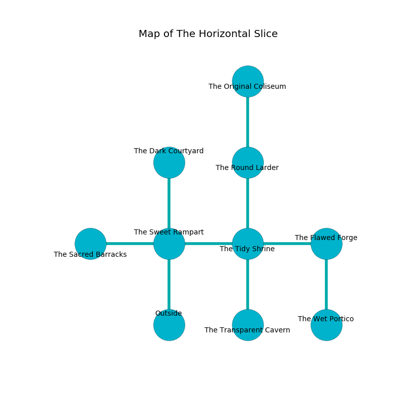

%Ruin Dogs

##The Horizontal Slice
###Overview
The Horizontal Slice is located in a poisoned rift. Some rooms of it are inaccessible. A lunar eclipse is happening outside. It is occupied by Orcs. Thresa Pulley The Vain, a Mind Flayer is here. The Orcs are the soldiers of Thresa Pulley The Vain. She  is founding a new religion. 

###Artifact
####Emmaeuafiefwi Faidumia

Emmaeuafiefwi Faidumia looks like a mushy amulet. When gazed upon it frightens children. 

###Locations

####the sweet rampart
The floor is cluttered with bones. Gray razorgrass is swaying in cracks in the floor. 

* To the west a hazy hall opens to [the sacred barracks](#the-sacred-barracks).
* To the east a small hall connects to [the tidy shrine](#the-tidy-shrine).
* To the north a long cave leads to [the dark courtyard](#the-dark-courtyard).
* To the south is the entrance.

####the sacred barracks
The floor is flooded with five inch deep hot water. The air smells like carnation here. There are three Orc Eyes of Gruumsh here. One of the Orcs is on watch, the rest are caring for babies. 

There is an engraving on the wall written in common. 

> I am a coward.
>
> I could not try swimming.
>

* To the east a hazy hall opens to [the sweet rampart](#the-sweet-rampart).

####the tidy shrine
There are an Orc War Chief and two Orc Eyes of Gruumsh here. The air tastes like wax here. The stone walls are pristine. One of the Orcs is working a mechanism that can launch acid at the Ruin Dogs. 

* To the west a small hall opens to [the sweet rampart](#the-sweet-rampart).
* To the east a narrow walkway leads to [the flawed forge](#the-flawed-forge).
* To the north a dripping hallway opens to [the round larder](#the-round-larder).
* To the south a hazy cave opens to [the transparent cavern](#the-transparent-cavern).

####the flawed forge
The floor is smooth. Green razorgrass is decaying in broken urns. 

* [Emmaeuafiefwi Faidumia](#Emmaeuafiefwi-Faidumia) is here.
* To the west a narrow walkway connects to [the tidy shrine](#the-tidy-shrine).
* To the south a twisted threshold connects to [the wet portico](#the-wet-portico).

####the dark courtyard
The floor is smooth. The air smells like brown sugar here. 

* To the south a long cave opens to [the sweet rampart](#the-sweet-rampart).

####the round larder
The air smells like caramel here. Green razorgrass is swaying from the ceiling. 

* To the north a torchlit pathway connects to [the original coliseum](#the-original-coliseum).
* To the south a dripping hallway opens to [the tidy shrine](#the-tidy-shrine).

####the transparent cavern
The concrete walls are unsettled. The floor is smooth. 

* [Thresa Pulley The Vain](#Thresa-Pulley-The-Vain) is here.
* To the north a hazy cave opens to [the tidy shrine](#the-tidy-shrine).

####the original coliseum
The metallic walls are covered in mold. Red mushrooms are swaying in a patch on the floor. 

There is an engraving on the floor written in Orcs Script. 

> Oh my! weak fate
>
> primary, quiet, great
>
> indirect, impossible, late
>
> hope is straight
>

* To the south a torchlit pathway leads to [the round larder](#the-round-larder).

####the wet portico
There is a trap here. When activated, a tripwire will launch a ceiling pendulum. The floor is cluttered with shells. White razorgrass is decaying in cracks in the floor. There are two Orc War Chiefs here. One of the Orcs is pointing a ballista at the entrance. 

* To the north a twisted threshold connects to [the flawed forge](#the-flawed-forge).

