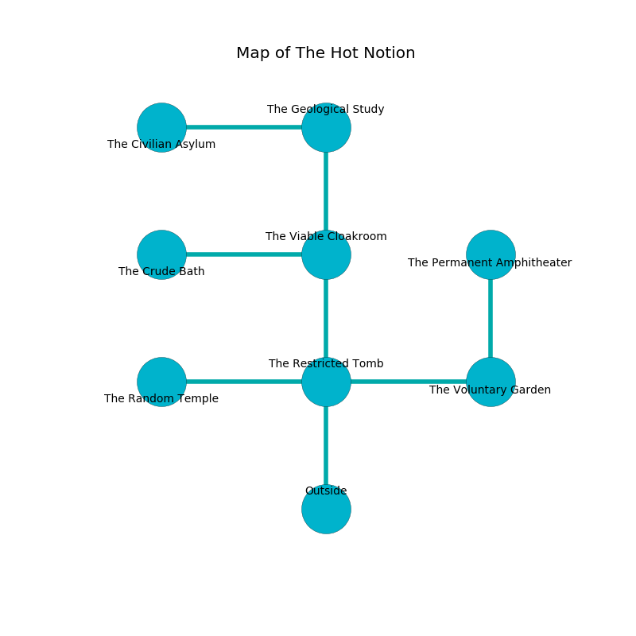

%Ruin Dogs

##The Hot Notion
###Overview
The Hot Notion is located in a flooded city. Parts of it are flooded. The ruin is coming to life. It is occupied by Deep Gnomes. Elmer Forsyth The Dishonest, a Cloud Giant is here. The Deep Gnomes are the slaves of Elmer Forsyth The Dishonest. He  is trying to understand [Udduiaedaeum](#Udduiaedaeum). 

###Artifact
####Udduiaedaeum

Udduiaedaeum is a powerful artifact in the shape of an opaque gem. It is a sickly black color. When gazed upon it shows an image of the future. 

###Locations

####the restricted tomb
There are twenty Deep Gnomes here. Red lichens are growing from the ceiling. One of the Deep Gnomes is on watch, the rest are celebrating. 

* To the west a windy passageway leads to [the random temple](#the-random-temple).
* To the east a long gap leads to [the voluntary garden](#the-voluntary-garden).
* To the north a dripping walkway opens to [the viable cloakroom](#the-viable-cloakroom).
* To the south is the entrance.

####the viable cloakroom
There are twenty Deep Gnomes here. Red razorgrass is growing in broken urns. The Deep Gnomes are drunk. 

* To the west a long opening opens to [the crude bath](#the-crude-bath).
* To the north a dripping cave leads to [the geological study](#the-geological-study).
* To the south a dripping walkway connects to [the restricted tomb](#the-restricted-tomb).

####the crude bath
The air tastes like bergamot here. Blue moss is swaying in a patch on the floor. The floor is sticky. There are a Mud Mephit, a Dust Mephit, a Duodrone, a Crocodile, a Xorn, a Young Copper Dragon, and a Black Dragon Wyrmling here. 

* [Elmer Forsyth The Dishonest](#Elmer-Forsyth-The-Dishonest) is here.
* To the east a long opening opens to [the viable cloakroom](#the-viable-cloakroom).

####the voluntary garden
Green mushrooms are growing in broken urns. The air tastes like logenberry here. 

* To the west a long gap leads to [the restricted tomb](#the-restricted-tomb).
* To the north a dark threshold leads to [the permanent amphitheater](#the-permanent-amphitheater).

####the geological study
White mushrooms are sprouting in a patch on the floor. The air tastes like chamomile here. 

* There is a board here.
* There is a tree here.
* There is a bell here.
* There is a horse here.
* [Udduiaedaeum](#Udduiaedaeum) is here.
* To the west a long hall opens to [the civilian asylum](#the-civilian-asylum).
* To the south a dripping cave opens to [the viable cloakroom](#the-viable-cloakroom).

####the random temple
The air smells like banana here. 

There is an engraving on the wall written in Deep Gnomes Script. 

> Dear me! terrible soul
>
> yet whole
>
> yet cheap
>
> life is asleep
>

* There is a bell here.
* To the east a windy passageway opens to [the restricted tomb](#the-restricted-tomb).

####the permanent amphitheater
The wooden walls are pristine. There are a Drow Mage, a Beholder Zombie, and an Orc Eye of Gruumsh here. The floor is glossy. Blue ferns are sprouting in a patch on the floor. 

* To the south a dark threshold opens to [the voluntary garden](#the-voluntary-garden).

####the civilian asylum
Blue ferns are sprouting in a patch on the floor. There are a Young Gold Dragon, a Bugbear Chief, a Giant Wasp, and a Xorn here. The floor is glossy. 

There is an engraving on a tablet written in common. 

> O weak god
>
> commercial, clear, gregarious
>
> junior, regular, odd
>
> sadness is hilarious
>

* To the east a long hall connects to [the geological study](#the-geological-study).

