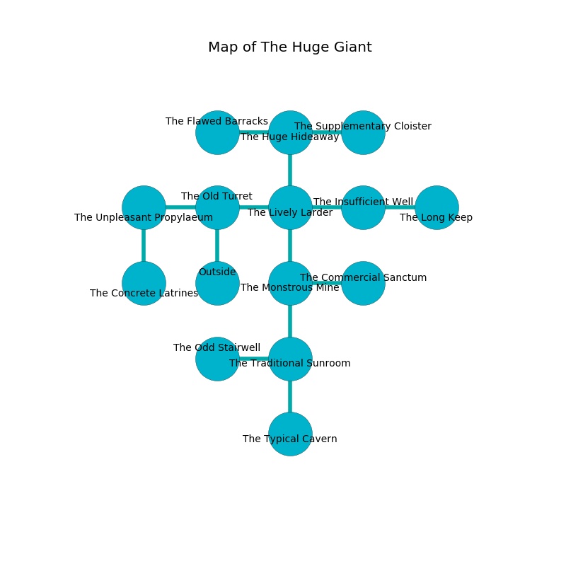

%Ruin Dogs

##The Huge Giant
###Overview
The Huge Giant is located on a crystal rift. Regions of it are unbearably hot. A lunar eclipse is happening outside. It is occupied by Sprites. Tonja Spaulding The Timid, a Quaggoth is here. The Sprites are the soldiers of Tonja Spaulding The Timid. She  is trying to exploit [Dehhuum Uefaeedaeum](#Dehhuum-Uefaeedaeum). 

###Artifact
####Dehhuum Uefaeedaeum

Dehhuum Uefaeedaeum looks like a soft sphere. It smells like labdanum. When smelled it flies into the air. 

###Locations

####the old turret
Red ferns are growing from the walls. The floor is smooth. 

There is an engraving on the floor written in common. 

> A monkey is a colour
>
> conservative, hungry, rich
>
> respectable and dark
>
> but harsh
>
> A monkey is a colour
>

* To the west a flooded cavern leads to [the unpleasant propylaeum](#the-unpleasant-propylaeum).
* To the east a torchlit path connects to [the lively larder](#the-lively-larder).
* To the south is the entrance.

####the lively larder
The air tastes like paper here. The brick walls are caving in. Blue moss is swaying in a patch on the floor. There are a Quasit, a Sahuagin, a Swarm of Quippers, a Mule, and a Sea Hag here. 

* To the west a torchlit path leads to [the old turret](#the-old-turret).
* To the east a small hallway leads to [the insufficient well](#the-insufficient-well).
* To the north a small cave opens to [the huge hideaway](#the-huge-hideaway).
* To the south a narrow hallway leads to [the monstrous mine](#the-monstrous-mine).

####the insufficient well
There are a Phase Spider, an Ankheg, a Giant Weasel, a Shrieker, and a Flying Sword here. The floor is smooth. The air smells like cashew here. 

* To the west a small hallway opens to [the lively larder](#the-lively-larder).
* To the east a flooded passageway leads to [the long keep](#the-long-keep).

####the huge hideaway
There is a trap here. When activated, a magical sound detector will cast a curse. White ferns are swaying in broken urns. 

* To the west a dark path leads to [the flawed barracks](#the-flawed-barracks).
* To the east a flooded pathway connects to [the supplementary cloister](#the-supplementary-cloister).
* To the south a small cave leads to [the lively larder](#the-lively-larder).

####the monstrous mine
Blue ferns are sprouting from the walls. The metallic walls are ruined. The air smells like toasted grain here. 

* To the east a dripping path connects to [the commercial sanctum](#the-commercial-sanctum).
* To the north a narrow hallway connects to [the lively larder](#the-lively-larder).
* To the south a small path opens to [the traditional sunroom](#the-traditional-sunroom).

####the commercial sanctum

* To the west a dripping path leads to [the monstrous mine](#the-monstrous-mine).

####the traditional sunroom
There are a Sprite, a Weretiger, and a Blue Dragon Wyrmling here. The air tastes like sandalwood here. 

* There is a bucket here.
* [Dehhuum Uefaeedaeum](#Dehhuum-Uefaeedaeum) is here.
* [Tonja Spaulding The Timid](#Tonja-Spaulding-The-Timid) is here.
* To the west a long opening leads to [the odd stairwell](#the-odd-stairwell).
* To the north a small path leads to [the monstrous mine](#the-monstrous-mine).
* To the south a flooded hallway connects to [the typical cavern](#the-typical-cavern).

####the flawed barracks
Red ferns are growing from the ceiling. The air tastes like metal here. There are sixteen Sprites here. The floor is glossy. The Sprites are willing to negotiate. 

There is an engraving on a monolith written in Sprites Script. 

> [Dehhuum Uefaeedaeum](#Dehhuum-Uefaeedaeum)
>
> presidential, mathematical, current
>
> concrete and possible
>
> always unexpected
>
> [Dehhuum Uefaeedaeum](#Dehhuum-Uefaeedaeum)
>
> stable, conservative, honest
>
> you will be returned
>

* To the east a dark path opens to [the huge hideaway](#the-huge-hideaway).

####the unpleasant propylaeum
The floor is bloodstained. The air smells like acacia here. 

There is an engraving on the wall written in common. 

> I am lost in The Huge Giant.
>

* There is a fork here.
* To the east a flooded cavern connects to [the old turret](#the-old-turret).
* To the south a twisted threshold connects to [the concrete latrines](#the-concrete-latrines).

####the odd stairwell
The obsidion walls are covered in mold. The floor is sticky. There are a Giant Octopus, a Phase Spider, a Giant fire beetle, a Jackalwere, and a Vulture here. 

* To the east a long opening leads to [the traditional sunroom](#the-traditional-sunroom).

####the supplementary cloister
White razorgrass is sprouting from the ceiling. The concrete walls are caving in. The air tastes like chestnut here. 

* To the west a flooded pathway leads to [the huge hideaway](#the-huge-hideaway).

####the concrete latrines
The floor is glossy. The brick walls are caving in. White moss is growing from the walls. The air tastes like beef here. 

* To the north a twisted threshold leads to [the unpleasant propylaeum](#the-unpleasant-propylaeum).

####the long keep
The air tastes like pear here. The floor is smooth. There are a Sprite, a Gnoll, a Thri-Kreen, a Half-Ogre, and a Pegasus here. 

* To the west a flooded passageway connects to [the insufficient well](#the-insufficient-well).

####the typical cavern
The air tastes like red currant here. 

* There is a hammer here.
* To the north a flooded hallway leads to [the traditional sunroom](#the-traditional-sunroom).

