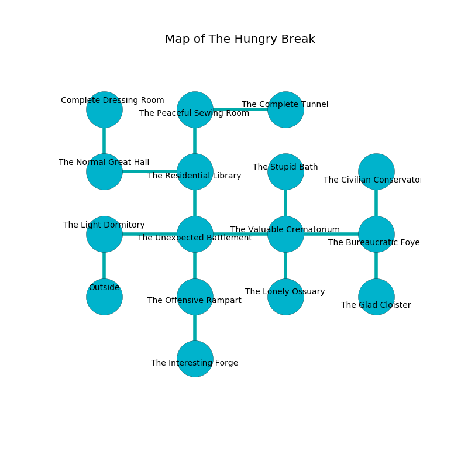

%Ruin Dogs

##The Hungry Break
###Overview
The Hungry Break is located under a flooded mountain. Parts of The Hungry Break are flooded. A lunar eclipse is happening outside. It is occupied by Harpies. Dell Lira The Quarrelsome, a Sahuagin Baron is here. The Harpies are the minions of Dell Lira The Quarrelsome. She  is trying to understand [Cuudafedaeum](#Cuudafedaeum). 

###Artifact
####Cuudafedaeum

Cuudafedaeum is a powerful artifact in the shape of a broken rock. It is a medium orange color. It smells like acetone. When touched it becomes lost. 

###Locations

####the light dormitory
Gray lichens are swaying in cracks in the floor. There are five Harpies here. The floor is cluttered with debris. One of the Harpies is working a mechanism that can engulf the room in a fiery blaze. 

* To the east a narrow corridor opens to [the unexpected battlement](#the-unexpected-battlement).
* To the south is the entrance.

####the unexpected battlement
The floor is bloodstained. The air tastes like graham cracker here. 

* There is a wheel here.
* To the west a narrow corridor connects to [the light dormitory](#the-light-dormitory).
* To the east a long cave leads to [the valuable crematorium](#the-valuable-crematorium).
* To the north a dark passageway connects to [the residential library](#the-residential-library).
* To the south a hazy walkway opens to [the offensive rampart](#the-offensive-rampart).

####the valuable crematorium
Yellow ferns are swaying in a patch on the floor. The obsidion walls are covered in mold. There is a trap here. When activated, a magical rune will collapse a column. 

There is an engraving on the wall written in common. 

> Run away.
>

* There is a pin here.
* To the west a long cave leads to [the unexpected battlement](#the-unexpected-battlement).
* To the east a dark cave leads to [the bureaucratic foyer](#the-bureaucratic-foyer).
* To the north a dark walkway opens to [the stupid bath](#the-stupid-bath).
* To the south a long cavern opens to [the lonely ossuary](#the-lonely-ossuary).

####the residential library
Blue moss is growing in broken urns. 

* There is a whip here.
* There is a fish here.
* There is a spoon here.
* To the west a torchlit artery opens to [the normal great hall](#the-normal-great-hall).
* To the north a torchlit corridor leads to [the peaceful sewing room](#the-peaceful-sewing-room).
* To the south a dark passageway opens to [the unexpected battlement](#the-unexpected-battlement).

####the offensive rampart
The air tastes like cardamom here. 

There is an engraving on a stone written in common. 

> Poor me! sad we
>
> random and free
>
> always sad
>
> death is bad
>

* To the north a hazy walkway connects to [the unexpected battlement](#the-unexpected-battlement).
* To the south a long cave opens to [the interesting forge](#the-interesting-forge).

####the normal great hall
The floor is smooth. There are five Harpies here. The mirrored walls are caving in. The Harpies are crazy with bloodlust. 

* There is a bee here.
* There is a drake here.
* To the east a torchlit artery leads to [the residential library](#the-residential-library).
* To the north a small opening leads to [the complete dressing room](#the-complete-dressing-room).

####the interesting forge
There are five Harpies here. The Harpies are willing to negotiate. 

* To the north a long cave leads to [the offensive rampart](#the-offensive-rampart).

####the peaceful sewing room
The glass walls are ruined. Yellow razorgrass is swaying from the walls. The floor is sticky. 

* To the east a torchlit artery opens to [the complete tunnel](#the-complete-tunnel).
* To the south a torchlit corridor leads to [the residential library](#the-residential-library).

####the complete dressing room
There is a trap here. When activated, a pressure plate will swing a tripping chain. There are a Water Elemental and a Giant Centipede here. The floor is glossy. The brick walls are ruined. 

* There is a screw here.
* To the south a small opening leads to [the normal great hall](#the-normal-great-hall).

####the complete tunnel
The floor is cluttered with debris. There are five Harpies here. Yellow mushrooms are swaying in a patch on the floor. One of the Harpies is pointing a ballista at the entrance. 

* To the west a torchlit artery leads to [the peaceful sewing room](#the-peaceful-sewing-room).

####the lonely ossuary
The stone walls are covered in mold. There are five Harpies here. One of the Harpies is on watch, the rest are caring for babies. 

* To the north a long cavern opens to [the valuable crematorium](#the-valuable-crematorium).

####the bureaucratic foyer
The brick walls are covered in mold. The air smells like white rose here. The floor is sticky. Green ferns are decaying in broken urns. 

* [Cuudafedaeum](#Cuudafedaeum) is here.
* To the west a dark cave connects to [the valuable crematorium](#the-valuable-crematorium).
* To the north a twisted hall opens to [the civilian conservatory](#the-civilian-conservatory).
* To the south a narrow corridor connects to [the glad cloister](#the-glad-cloister).

####the glad cloister
The glass walls are scratched. Blue lichens are sprouting in cracks in the floor. The air smells like menthol here. 

There is an engraving on a monolith written in common. 

> I am lost in The Hungry Break.
>
> A trap ahead.
>

* [Dell Lira The Quarrelsome](#Dell-Lira-The-Quarrelsome) is here.
* To the north a narrow corridor leads to [the bureaucratic foyer](#the-bureaucratic-foyer).

####the stupid bath
The air smells like tamarind here. 

* To the south a dark walkway connects to [the valuable crematorium](#the-valuable-crematorium).

####the civilian conservatory
There are a Quipper and a Beholder Zombie here. The mirrored walls are ruined. 

* To the south a twisted hall connects to [the bureaucratic foyer](#the-bureaucratic-foyer).

