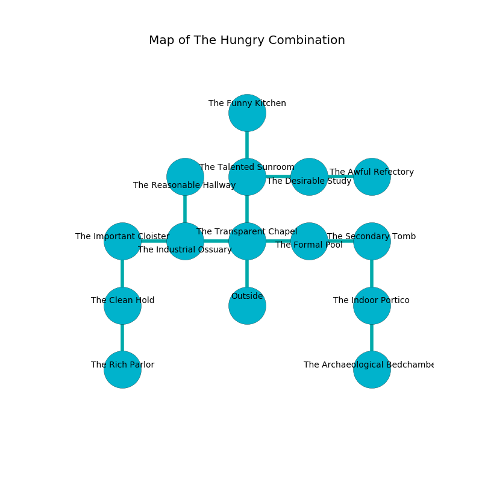

%Ruin Dogs

##The Hungry Combination
###Overview
The Hungry Combination is constructed on a spikey mountain. Regions of The Hungry Combination are cursed. A blizzard is happening outside. It is occupied by Satyrs. Miranda Calderon The Stupid, a Drow Mage is here. The Satyrs worship Miranda Calderon The Stupid. She  is founding a new religion. 

###Artifact
####Dfugaiiaeum

Dfugaiiaeum is a powerful artifact in the shape of a sharp blade. Cacophony slips around it. It smells like zedoary. When touched it becomes a deadly projectile. 

###Locations

####the transparent chapel
There are fourteen Satyrs here. The Satyrs are meditating. 

There is an engraving on a stone written in common. 

> I tried fighting.
>

* To the west a torchlit artery leads to [the industrial ossuary](#the-industrial-ossuary).
* To the east a hazy cavern connects to [the formal pool](#the-formal-pool).
* To the north a windy gap connects to [the talented sunroom](#the-talented-sunroom).
* To the south is the entrance.

####the talented sunroom
The concrete walls are covered in mold. 

* To the east a long cavern connects to [the desirable study](#the-desirable-study).
* To the north a small pathway opens to [the funny kitchen](#the-funny-kitchen).
* To the south a windy gap leads to [the transparent chapel](#the-transparent-chapel).

####the industrial ossuary
The air smells like sugar here. Blue moss is swaying from the walls. 

* To the west a narrow artery opens to [the important cloister](#the-important-cloister).
* To the east a torchlit artery leads to [the transparent chapel](#the-transparent-chapel).
* To the north a hazy hallway opens to [the reasonable hallway](#the-reasonable-hallway).

####the formal pool
There are a Grick Alpha and a Hobgoblin here. The floor is cluttered with shells. 

* To the west a hazy cavern opens to [the transparent chapel](#the-transparent-chapel).
* To the east a small corridor leads to [the secondary tomb](#the-secondary-tomb).

####the desirable study
Yellow ferns are growing in cracks in the floor. The stone walls are ruined. 

* To the west a long cavern leads to [the talented sunroom](#the-talented-sunroom).
* To the east a torchlit gap opens to [the awful refectory](#the-awful-refectory).

####the important cloister
The air tastes like ozone here. There are a Young White Dragon, an Allosaurus, a Green Hag, and a Panther here. Red ferns are sprouting from the walls. 

* To the east a narrow artery leads to [the industrial ossuary](#the-industrial-ossuary).
* To the south a dark pathway leads to [the clean hold](#the-clean-hold).

####the funny kitchen
The floor is flooded with one inch deep lukewarm water. Green razorgrass is swaying in cracks in the floor. 

There is an engraving on the floor written in common. 

> I found this place.
>

* [Miranda Calderon The Stupid](#Miranda-Calderon-The-Stupid) is here.
* To the south a small pathway opens to [the talented sunroom](#the-talented-sunroom).

####the reasonable hallway

* To the south a hazy hallway leads to [the industrial ossuary](#the-industrial-ossuary).

####the awful refectory
There are an Otyugh, a Swarm of Ravens, a Hawk, a Half-Ogre, and a Shadow Demon here. The air tastes like dill here. White mushrooms are swaying from the walls. 

* There is a gold coin here.
* To the west a torchlit gap opens to [the desirable study](#the-desirable-study).

####the clean hold

* [Dfugaiiaeum](#Dfugaiiaeum) is here.
* To the north a dark pathway connects to [the important cloister](#the-important-cloister).
* To the south a dripping walkway opens to [the rich parlor](#the-rich-parlor).

####the secondary tomb
There are a Hill Giant and an Earth Elemental here. The air tastes like lamb here. 

* To the west a small corridor connects to [the formal pool](#the-formal-pool).
* To the south a narrow gap opens to [the indoor portico](#the-indoor-portico).

####the indoor portico
The floor is bloodstained. The air tastes like lychee here. The crystal walls are unsettled. Green lichens are swaying in cracks in the floor. 

There is an engraving on a tablet written in Satyrs Script. 

> I tried praying.
>

* To the north a narrow gap opens to [the secondary tomb](#the-secondary-tomb).
* To the south a flooded corridor opens to [the archaeological bedchamber](#the-archaeological-bedchamber).

####the archaeological bedchamber
The mirrored walls are caving in. Blue ferns are sprouting in broken urns. 

* To the north a flooded corridor leads to [the indoor portico](#the-indoor-portico).

####the rich parlor
The glass walls are scratched. 

* To the north a dripping walkway opens to [the clean hold](#the-clean-hold).

