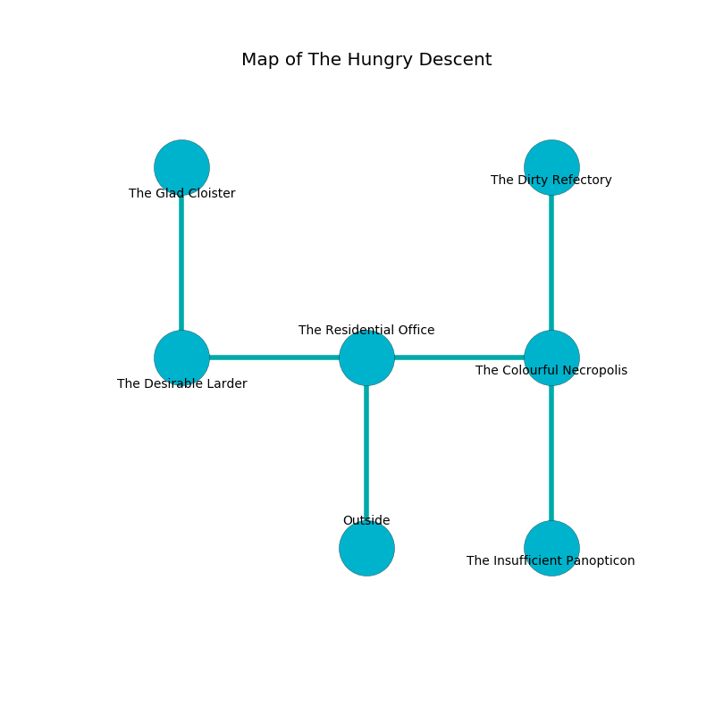

%Ruin Dogs

##The Hungry Descent
###Overview
The Hungry Descent is located under a broken mountain. Some areas of The Hungry Descent are somewhat cold. A windstorm is happening outside. It is occupied by Yuan-Ti. Brunilda Carver The Jealous, an Ogre is here. The Yuan-Ti worship Brunilda Carver The Jealous. She  is trying to understand [The Harmful Tunnel](#The-Harmful-Tunnel). 

###Artifact
####The Harmful Tunnel

The Harmful Tunnel is a powerful artifact in the shape of a warm doll. It is a dark white color. When held it glows with an eerie light. 

###Locations

####the residential office
Green mushrooms are growing in broken urns. The air tastes like water here. 

* There is a blade here.
* To the west a twisted pathway opens to [the desirable larder](#the-desirable-larder).
* To the east a dripping corridor opens to [the colourful necropolis](#the-colourful-necropolis).
* To the south is the entrance.

####the colourful necropolis
The floor is sticky. The stone walls are covered in mold. 

* There is a diamond here.
* [The Harmful Tunnel](#The-Harmful-Tunnel) is here.
* To the west a dripping corridor leads to [the residential office](#the-residential-office).
* To the north a windy hallway connects to [the dirty refectory](#the-dirty-refectory).
* To the south a flooded hallway leads to [the insufficient panopticon](#the-insufficient-panopticon).

####the desirable larder
The wooden walls are covered in mold. There are a Kuo-Toa Whip, a Lizardfolk, a Monodrone, a Fire Snake, and a Boar here. The floor is sticky. The air smells like anise here. 

* To the east a twisted pathway opens to [the residential office](#the-residential-office).
* To the north a dark threshold leads to [the glad cloister](#the-glad-cloister).

####the insufficient panopticon
The metallic walls are pristine. The air tastes like roasted peanut here. 

* [Brunilda Carver The Jealous](#Brunilda-Carver-The-Jealous) is here.
* To the north a flooded hallway connects to [the colourful necropolis](#the-colourful-necropolis).

####the glad cloister
There are a Black Bear, a Half-Ogre, and a Magmin here. The floor is flooded with two inch deep scalding water. The wooden walls are scratched. The air tastes like roasted chicken here. 

* There is a rat here.
* To the south a dark threshold opens to [the desirable larder](#the-desirable-larder).

####the dirty refectory
The concrete walls are caving in. 

There is an engraving on a stone written in common. 

> Dear me! weak soul
>
> aggressive and tired
>
> but whole
>
> life is retired
>

* To the south a windy hallway connects to [the colourful necropolis](#the-colourful-necropolis).

