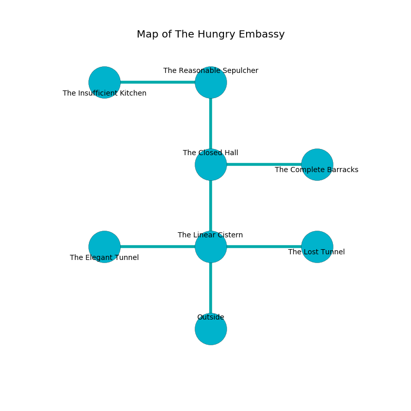

%Ruin Dogs

##The Hungry Embassy
###Overview
The Hungry Embassy is located under a crystal mountain. Some rooms of The Hungry Embassy are flooded. A massive storm is happening outside. It is occupied by Sprites. Fidela Rich The Obsessive, a Cloud Giant is here. The Sprites worship Fidela Rich The Obsessive. She  is founding a new religion. 

###Artifact
####Iuhaelefaedwi

Iuhaelefaedwi has the form of an opaque meteorite. It smells like fruit. Power slips away from it. When smelled it becomes hot. 

###Locations

####the linear cistern
The concrete walls are caving in. The air tastes like paper here. Yellow razorgrass is decaying in a patch on the floor. There are a Riding Horse, a Ghast, an Ochre Jelly, a Stone Giant, and a Panther here. 

* To the west a long opening opens to [the elegant tunnel](#the-elegant-tunnel).
* To the east a dripping opening opens to [the lost tunnel](#the-lost-tunnel).
* To the north a windy pathway opens to [the closed hall](#the-closed-hall).
* To the south is the entrance.

####the elegant tunnel
The floor is glossy. Yellow lichens are growing from the ceiling. 

There is an engraving on the ceiling written in Sprites Script. 

> I discovered The Hungry Embassy.
>
> A trap ahead.
>

* To the east a long opening opens to [the linear cistern](#the-linear-cistern).

####the closed hall
Gray mushrooms are swaying in a patch on the floor. The floor is sticky. The glass walls are covered in mold. 

* To the east a torchlit corridor opens to [the complete barracks](#the-complete-barracks).
* To the north a twisted cavern connects to [the reasonable sepulcher](#the-reasonable-sepulcher).
* To the south a windy pathway connects to [the linear cistern](#the-linear-cistern).

####the complete barracks
The floor is smooth. Red moss is growing in a patch on the floor. 

There is an engraving on the wall written in common. 

> I am lost in The Hungry Embassy.
>
> Try leaving.
>

* To the west a torchlit corridor opens to [the closed hall](#the-closed-hall).

####the lost tunnel
White mushrooms are growing from the walls. The floor is sticky. 

* To the west a dripping opening leads to [the linear cistern](#the-linear-cistern).

####the reasonable sepulcher
The glass walls are bloodstained. The floor is smooth. There are forty Sprites here. The air smells like pear here. The Sprites are feasting. 

* [Iuhaelefaedwi](#Iuhaelefaedwi) is here.
* To the west a small gap leads to [the insufficient kitchen](#the-insufficient-kitchen).
* To the south a twisted cavern opens to [the closed hall](#the-closed-hall).

####the insufficient kitchen
There are a Hobgoblin Warlord, a Grick, and a Clay Golem here. The crystal walls are ruined. 

* [Fidela Rich The Obsessive](#Fidela-Rich-The-Obsessive) is here.
* To the east a small gap connects to [the reasonable sepulcher](#the-reasonable-sepulcher).

