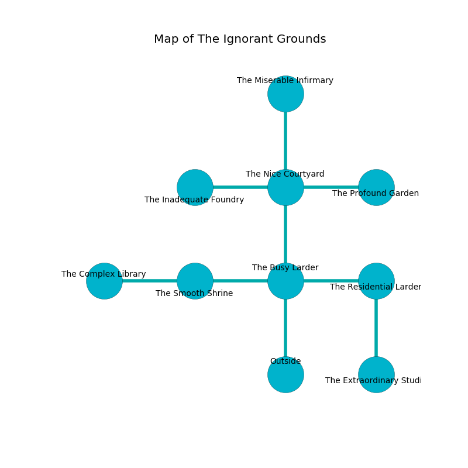

%Ruin Dogs

##The Ignorant Grounds
###Overview
The Ignorant Grounds is located under a spikey rift. Parts of it are unbearably hot. A lunar eclipse is happening outside. It is occupied by Centaurs. Willetta Milam The Careless, a Drow Priestess of Lolth is here. The Centaurs are ruled by Willetta Milam The Careless. She  is trying to discover [Duiiaedaehaedwi Baiieha](#Duiiaedaehaedwi-Baiieha). 

###Artifact
####Duiiaedaehaedwi Baiieha

Duiiaedaehaedwi Baiieha is a powerful artifact in the shape of a soft crystal. It smells like vetiver. Light slides away from it. When touched it levitates those nearby. 

###Locations

####the busy larder
Yellow razorgrass is swaying from the walls. The floor is smooth. The air smells like passion fruit here. 

* There is a tome here.
* There is a basket here.
* There is a sheep here.
* To the west a hazy corridor leads to [the smooth shrine](#the-smooth-shrine).
* To the east a twisted walkway connects to [the residential larder](#the-residential-larder).
* To the north a flooded walkway leads to [the nice courtyard](#the-nice-courtyard).
* To the south is the entrance.

####the nice courtyard
Red razorgrass is growing from the ceiling. There are five Centaurs here. The air tastes like kumquat here. The floor is cluttered with broken glass. The metallic walls are scratched. One of the Centaurs is on watch, the rest are sleeping. 

There is an engraving on a tablet written in Centaurs Script. 

> A berry is a broadcast
>
> related, fast, official
>
> They are corrupted
>
> practical and lazy
>
> You are damned
>
> accurate, single, unanimous
>
> They are hidden
>
> but never primary
>
> you shall be frozen
>

* [Duiiaedaehaedwi Baiieha](#Duiiaedaehaedwi-Baiieha) is here.
* To the west a windy path connects to [the inadequate foundry](#the-inadequate-foundry).
* To the east a long passageway connects to [the profound garden](#the-profound-garden).
* To the north a torchlit threshold opens to [the miserable infirmary](#the-miserable-infirmary).
* To the south a flooded walkway opens to [the busy larder](#the-busy-larder).

####the smooth shrine
The floor is cluttered with ashes. The glass walls are bloodstained. 

* To the west a twisted path opens to [the complex library](#the-complex-library).
* To the east a hazy corridor opens to [the busy larder](#the-busy-larder).

####the complex library
The air smells like immortelle here. There are a Young Black Dragon, a Young Faerie Dragon, a Flameskull, and a Gibbering Mouther here. The obsidion walls are unsettled. 

* There is a brush here.
* [Willetta Milam The Careless](#Willetta-Milam-The-Careless) is here.
* To the east a twisted path leads to [the smooth shrine](#the-smooth-shrine).

####the miserable infirmary
There are five Centaurs here. The stone walls are covered in mold. There is a trap here. When activated, a magical proximity detector will fire a scything blade. The air smells like lychee here. The floor is bloodstained. The Centaurs are drunk. 

* There is a trophy here.
* There is a demon here.
* To the south a torchlit threshold opens to [the nice courtyard](#the-nice-courtyard).

####the residential larder
There are five Centaurs here. Blue lichens are swaying in broken urns. The air tastes like rose tea here. The Centaurs are willing to negotiate. 

There is an engraving on a stone written in Centaurs Script. 

> [Duiiaedaehaedwi Baiieha](#Duiiaedaehaedwi-Baiieha)
>
> popular and absent
>
> [Duiiaedaehaedwi Baiieha](#Duiiaedaehaedwi-Baiieha)
>
> yet joint
>
> A key is an investigation
>
> fastidious, satisfied, graphic
>
> quiet, impossible, absolute
>
> [Duiiaedaehaedwi Baiieha](#Duiiaedaehaedwi-Baiieha)
>

* To the west a twisted walkway connects to [the busy larder](#the-busy-larder).
* To the south a twisted corridor connects to [the extraordinary studio](#the-extraordinary-studio).

####the extraordinary studio
The concrete walls are scratched. The air smells like brandy here. There are five Centaurs here. The floor is smooth. One of the Centaurs is pointing a ballista at the entrance. 

* To the north a twisted corridor opens to [the residential larder](#the-residential-larder).

####the profound garden
There are a Frost Giant, a Vulture, a Giant Owl, a Beholder Zombie, and an Animated Armor here. The concrete walls are ruined. 

* To the west a long passageway connects to [the nice courtyard](#the-nice-courtyard).

####the inadequate foundry
The air tastes like bell pepper here. 

* To the east a windy path opens to [the nice courtyard](#the-nice-courtyard).

