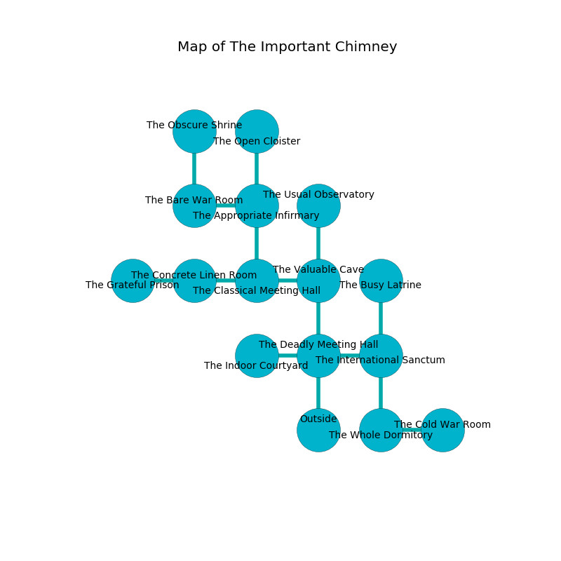

%Ruin Dogs

##The Important Chimney
###Overview
The Important Chimney is located on a poisoned tree. Some rooms of The Important Chimney are foggy. The ruin is flooding. It is occupied by Duergars. Victor Bonilla The Superficial, a Kuo-Toa Archpriest is here. The Duergars are battling Victor Bonilla The Superficial. He  is trying to research [The Vacant Jazz](#The-Vacant-Jazz). 

###Artifact
####The Vacant Jazz

The Vacant Jazz is a powerful artifact in the shape of a mushy meteorite. Light pours away from it. It smells like cardamom. It is a medium green color. When picked up it destroys others. 

###Locations

####the deadly meeting hall
There are five Duergars here. If the Duergars notice the Ruin Dogs, one of them will retreat and alert the others. 

There is an engraving on the floor written in common. 

> Dig here.
>

* To the west a dark cavern opens to [the indoor courtyard](#the-indoor-courtyard).
* To the east a dark hall connects to [the international sanctum](#the-international-sanctum).
* To the north a narrow passageway leads to [the valuable cave](#the-valuable-cave).
* To the south is the entrance.

####the indoor courtyard
The floor is cluttered with debris. There are five Duergars here. The metallic walls are scratched. The air tastes like gasoline here. White mushrooms are growing from the ceiling. One of the Duergars is working a mechanism that can flood the room. 

* To the east a dark cavern connects to [the deadly meeting hall](#the-deadly-meeting-hall).

####the international sanctum
There is a trap here. When activated, a magical sound detector will blast flames. The floor is sticky. The air smells like blackberry here. The brick walls are pristine. 

There is an engraving on the ceiling written in common. 

> All of us are free
>
> normal, neutral, dependent
>
> you are not punished
>

* There is a spring here.
* There is a hoard here.
* To the west a dark hall leads to [the deadly meeting hall](#the-deadly-meeting-hall).
* To the north a dripping opening leads to [the busy latrine](#the-busy-latrine).
* To the south a torchlit opening opens to [the whole dormitory](#the-whole-dormitory).

####the valuable cave
Yellow razorgrass is swaying from the walls. There are five Duergars here. The Duergars are willing to fight to the death. 

There is an engraving on a tablet written in Duergars Script. 

> [The Vacant Jazz](#The-Vacant-Jazz)
>
> yet never healthy
>
> unlawful and hostile
>
> you are destroyed
>

* There is a board here.
* To the west a dark hall opens to [the classical meeting hall](#the-classical-meeting-hall).
* To the north a hazy hall leads to [the usual observatory](#the-usual-observatory).
* To the south a narrow passageway opens to [the deadly meeting hall](#the-deadly-meeting-hall).

####the classical meeting hall
Yellow moss is sprouting in broken urns. 

* There is a map here.
* There is a shirt here.
* To the west a flooded threshold opens to [the concrete linen room](#the-concrete-linen-room).
* To the east a dark hall connects to [the valuable cave](#the-valuable-cave).
* To the north a torchlit hall opens to [the appropriate infirmary](#the-appropriate-infirmary).

####the busy latrine
The air smells like egg nog here. The floor is smooth. The obsidion walls are unsettled. 

* There is a stocking here.
* There is a treasure here.
* [Victor Bonilla The Superficial](#Victor-Bonilla-The-Superficial) is here.
* To the south a dripping opening leads to [the international sanctum](#the-international-sanctum).

####the appropriate infirmary
There is a Revenant here. The floor is smooth. 

* To the west a flooded hallway leads to [the bare war Room](#the-bare-war-Room).
* To the north a flooded cave leads to [the open cloister](#the-open-cloister).
* To the south a torchlit hall opens to [the classical meeting hall](#the-classical-meeting-hall).

####the concrete linen room
The floor is sticky. There are five Duergars here. The air smells like honeydew here. Blue razorgrass is decaying in cracks in the floor. The Duergars are willing to negotiate. 

* To the west a torchlit hallway leads to [the grateful prison](#the-grateful-prison).
* To the east a flooded threshold leads to [the classical meeting hall](#the-classical-meeting-hall).

####the open cloister
The floor is smooth. White ferns are decaying in broken urns. The air tastes like green bean here. There is a trap here. When activated, a magical sound detector will launch stone blocks from the ceiling. The metallic walls are covered in mold. 

There is an engraving on a stone written in common. 

> Oh my! my life is woe
>
> military and closed
>
> old and low
>
> hope is opposed
>

* To the south a flooded cave leads to [the appropriate infirmary](#the-appropriate-infirmary).

####the bare war Room
The air smells like whiskey here. There are five Duergars here. Red moss is swaying in a patch on the floor. One of the Duergars is working a mechanism that can launch acid at the Ruin Dogs. 

* There is a glove here.
* [The Vacant Jazz](#The-Vacant-Jazz) is here.
* To the east a flooded hallway leads to [the appropriate infirmary](#the-appropriate-infirmary).
* To the north a windy opening leads to [the obscure shrine](#the-obscure-shrine).

####the whole dormitory
The concrete walls are bloodstained. The floor is sticky. 

* To the east a narrow threshold opens to [the cold war Room](#the-cold-war-Room).
* To the north a torchlit opening connects to [the international sanctum](#the-international-sanctum).

####the cold war Room
There are a Helmed Horror and a Duergar here. The floor is smooth. The air smells like eucalyptus here. 

* To the west a narrow threshold leads to [the whole dormitory](#the-whole-dormitory).

####the usual observatory
There are a Rhinoceros, a Plesiosaurus, a Needle Blight, a Bearded Devil, and a Rat here. The floor is bloodstained. The air tastes like meat here. Gray moss is swaying in a patch on the floor. 

* To the south a hazy hall leads to [the valuable cave](#the-valuable-cave).

####the grateful prison
The floor is smooth. There is a trap here. When activated, a magical rune will launch an arrow. Gray ferns are decaying from the ceiling. 

* There is a demon here.
* To the east a torchlit hallway leads to [the concrete linen room](#the-concrete-linen-room).

####the obscure shrine
There are five Duergars here. The air smells like rancid butter here. The floor is sticky. The Duergars are sleeping. 

There is an engraving on a stone written in Duergars Script. 

> I thought about jumping.
>

* To the south a windy opening leads to [the bare war Room](#the-bare-war-Room).

