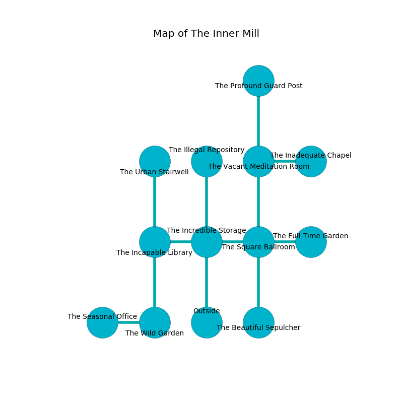

%Ruin Dogs

##The Inner Mill
###Overview
The Inner Mill is located in a poisoned plain. Some rooms of it are flooded. A massive storm is happening outside. It is occupied by Sahuagins. Sara Bostick The Boastful, a Frost Giant is here. The Sahuagins are the soldiers of Sara Bostick The Boastful. She  is trying to recover [Aehha Demh](#Aehha-Demh). 

###Artifact
####Aehha Demh

Aehha Demh looks like a mushy crystal. It smells like grape skin. When worn it repels insects. 

###Locations

####the incredible storage
The floor is cluttered with shells. Red lichens are sprouting in cracks in the floor. The stone walls are covered in mold. 

* To the west a long opening connects to [the incapable library](#the-incapable-library).
* To the east a dark hall connects to [the square ballroom](#the-square-ballroom).
* To the north a flooded passageway connects to [the illegal repository](#the-illegal-repository).
* To the south is the entrance.

####the square ballroom
There are a Giant Wolf Spider, an Orog, a Giant Sea Horse, a Xorn, a Twig Blight, a Rat, and a Mezzoloth here. The air tastes like roast beef here. 

* To the west a dark hall leads to [the incredible storage](#the-incredible-storage).
* To the east a hazy cavern opens to [the full-time garden](#the-full-time-garden).
* To the north a small cave leads to [the vacant meditation room](#the-vacant-meditation-room).
* To the south a torchlit opening leads to [the beautiful sepulcher](#the-beautiful-sepulcher).

####the illegal repository
The air tastes like gardenia here. There are five Sahuagin Priestesses here. The stone walls are unsettled. The Sahuagins are sleeping. 

* There is a fly here.
* To the south a flooded passageway opens to [the incredible storage](#the-incredible-storage).

####the incapable library
There are a Hobgoblin Warlord, a Yuan-Ti Malison, a Sea Hag, a Cat, and a Rust Monster here. The air smells like amber here. The glass walls are covered in mold. 

* To the east a long opening connects to [the incredible storage](#the-incredible-storage).
* To the north a hazy passageway opens to [the urban stairwell](#the-urban-stairwell).
* To the south a twisted corridor opens to [the wild garden](#the-wild-garden).

####the urban stairwell
The obsidion walls are pristine. The air smells like rose here. 

* There is a trousers here.
* To the south a hazy passageway opens to [the incapable library](#the-incapable-library).

####the full-time garden
The brick walls are ruined. There are five Sahuagin Priestesses here. One of the Sahuagins is on watch, the rest are meditating. 

* To the west a hazy cavern connects to [the square ballroom](#the-square-ballroom).

####the wild garden
Gray ferns are decaying from the ceiling. The crystal walls are unsettled. 

* To the west a small hallway opens to [the seasonal office](#the-seasonal-office).
* To the north a twisted corridor opens to [the incapable library](#the-incapable-library).

####the beautiful sepulcher
The air smells like nut here. Red moss is swaying from the walls. The mirrored walls are unsettled. The floor is sticky. There are five Sahuagin Priestesses here. One of the Sahuagins is on watch, the rest are caring for babies. 

* [Sara Bostick The Boastful](#Sara-Bostick-The-Boastful) is here.
* To the north a torchlit opening opens to [the square ballroom](#the-square-ballroom).

####the vacant meditation room
Gray mushrooms are sprouting in a patch on the floor. 

* [Aehha Demh](#Aehha-Demh) is here.
* To the east a torchlit corridor connects to [the inadequate chapel](#the-inadequate-chapel).
* To the north a dark threshold leads to [the profound guard post](#the-profound-guard-post).
* To the south a small cave opens to [the square ballroom](#the-square-ballroom).

####the seasonal office
The air smells like buttery	cabbage here. The floor is flooded with seven inch deep cold water. Yellow moss is decaying in a patch on the floor. There are a Triceratops, a Giant Crab, a Flying Sword, an Ettercap, and a Young White Dragon here. 

* There is a stocking here.
* To the east a small hallway opens to [the wild garden](#the-wild-garden).

####the profound guard post
The floor is cluttered with debris. There are five Sahuagin Priestesses here. Red razorgrass is swaying in broken urns. The glass walls are covered in mold. If the Sahuagins notice the Ruin Dogs, one of them will retreat and alert [Sara Bostick](#Sara-Bostick). 

* To the south a dark threshold leads to [the vacant meditation room](#the-vacant-meditation-room).

####the inadequate chapel
Green mushrooms are growing in cracks in the floor. The air tastes like macadamia here. The mirrored walls are scratched. 

* To the west a torchlit corridor leads to [the vacant meditation room](#the-vacant-meditation-room).

