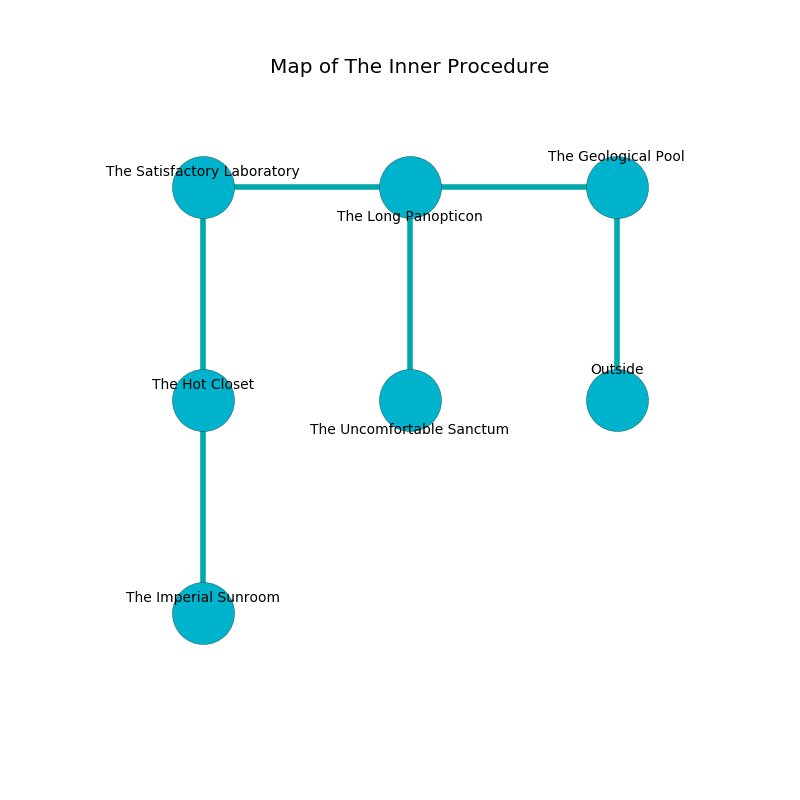

%Ruin Dogs

##The Inner Procedure
###Overview
The Inner Procedure is located on a volcanic mountain. Parts of The Inner Procedure are somewhat hot. The ruin is flooding. It is occupied by Pixies. Stacey Reynolds The Aloof, an Orc War Chief is here. The Pixies are ruled by Stacey Reynolds The Aloof. He  is trying to exploit [Damiaeum](#Damiaeum). 

###Artifact
####Damiaeum

Damiaeum is a powerful artifact in the shape of a broken monument. It is a medium gray color. When touched it repels insects. 

###Locations

####the geological pool
There are an Eagle, a Spectator, a Gargoyle, and an Awakened Tree here. 

* There is a boat here.
* To the west a narrow pathway opens to [the long panopticon](#the-long-panopticon).
* To the south is the entrance.

####the long panopticon
Green mushrooms are decaying from the walls. The floor is smooth. There are a Giant Scorpion and a Swarm of Poisonous Snakes here. 

* To the west a hazy cave opens to [the satisfactory laboratory](#the-satisfactory-laboratory).
* To the east a narrow pathway opens to [the geological pool](#the-geological-pool).
* To the south a dark opening opens to [the uncomfortable sanctum](#the-uncomfortable-sanctum).

####the uncomfortable sanctum
The air smells like bitter orange here. The floor is glossy. The crystal walls are bloodstained. 

There is an engraving on the floor written in common. 

> Treasure here.
>

* [Stacey Reynolds The Aloof](#Stacey-Reynolds-The-Aloof) is here.
* To the north a dark opening leads to [the long panopticon](#the-long-panopticon).

####the satisfactory laboratory
The air smells like malt here. There are a Monodrone, a Giant Crab, a Harpy, a Centaur, a Giant Elk, and a Deer here. 

* There is a worm here.
* To the east a hazy cave connects to [the long panopticon](#the-long-panopticon).
* To the south a hazy corridor connects to [the hot closet](#the-hot-closet).

####the hot closet
The air tastes like sweet pea here. The floor is smooth. The metallic walls are bloodstained. 

There is an engraving on the wall written in common. 

> Poor me! cruel fate
>
> romantic and new
>
> yet great
>
> death is true
>

* [Damiaeum](#Damiaeum) is here.
* To the north a hazy corridor leads to [the satisfactory laboratory](#the-satisfactory-laboratory).
* To the south a flooded pathway leads to [the imperial sunroom](#the-imperial-sunroom).

####the imperial sunroom
There are twenty Pixies here. The floor is sticky. Red moss is swaying from the walls. The Pixies are defending this room from intruders. 

There is an engraving on a tablet written in common. 

> A store is a visitor
>
> but never organic
>

* There is a chest here.
* To the north a flooded pathway leads to [the hot closet](#the-hot-closet).

