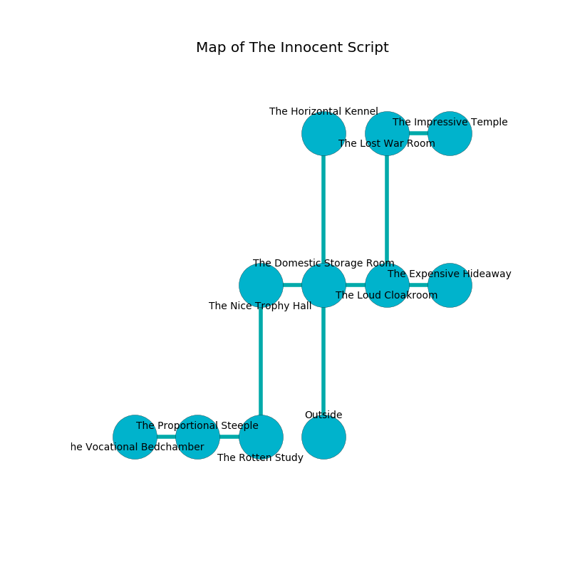

%Ruin Dogs

##The Innocent Script
###Overview
The Innocent Script is constructed on a broken city. Regions of it are flooded. A blizzard is happening outside. It is occupied by Orcs. Kimberly Whitaker The Detached, an Incubus is here. The Orcs are battling Kimberly Whitaker The Detached. She  is trying to hide [Cubdadaedaeum](#Cubdadaedaeum). 

###Artifact
####Cubdadaedaeum

Cubdadaedaeum is a powerful artifact in the shape of a smooth cube. Cacophony slides towards it. It smells like garlic. When cradled it curses all nearby. 

###Locations

####the domestic storage room
There are an Orc War Chief and an Orc Eye of Gruumsh here. The obsidion walls are caving in. The air smells like oakmoss here. The floor is cluttered with rocks. One of the Orcs is working a mechanism that can pour bees from the ceiling. 

* To the west a dark walkway connects to [the nice trophy hall](#the-nice-trophy-hall).
* To the east a twisted corridor leads to [the loud cloakroom](#the-loud-cloakroom).
* To the north a long gap leads to [the horizontal kennel](#the-horizontal-kennel).
* To the south is the entrance.

####the horizontal kennel
The floor is bloodstained. 

* There is a finger here.
* To the south a long gap connects to [the domestic storage room](#the-domestic-storage-room).

####the loud cloakroom
There are two Orc War Chiefs here. The air tastes like marshmallow here. The Orcs are performing a ritual. If not interrupted, the Orcs will become more powerful. 

There is an engraving on the ceiling written in common. 

> A curtain is a minister
>
> but provincial
>
> [Cubdadaedaeum](#Cubdadaedaeum)
>
> strange and noisy
>
> They are envious
>
> ever cautious
>
> ever huge
>
> dominant, optional, dynamic
>
> available, efficient, finished
>

* [Kimberly Whitaker The Detached](#Kimberly-Whitaker-The-Detached) is here.
* To the west a twisted corridor leads to [the domestic storage room](#the-domestic-storage-room).
* To the east a dripping walkway connects to [the expensive hideaway](#the-expensive-hideaway).
* To the north a twisted corridor leads to [the lost war Room](#the-lost-war-Room).

####the expensive hideaway
There are an Orc War Chief and two Orc Eyes of Gruumsh here. Green moss is swaying from the walls. The air smells like berry here. One of the Orcs is working a mechanism that can flood the room. 

There is an engraving on a monolith written in common. 

> Hide here.
>

* To the west a dripping walkway opens to [the loud cloakroom](#the-loud-cloakroom).

####the nice trophy hall
There are an Azer and a Young Remorhaz here. The air tastes like gas here. The floor is cluttered with bones. 

* There is a frame here.
* To the east a dark walkway leads to [the domestic storage room](#the-domestic-storage-room).
* To the south a dark hall opens to [the rotten study](#the-rotten-study).

####the rotten study
Gray mushrooms are swaying from the ceiling. The floor is flooded with seven inch deep hot water. 

There is an engraving on the floor written in common. 

> [Cubdadaedaeum](#Cubdadaedaeum)
>
> fastidious, present, content
>
> always tropical
>
> personal, tidy, philosophical
>
> ever fat
>
> A brush is a widow
>
> passive and basic
>
> military and impressive
>
> A parcel is a middle
>
> civic and alive
>
> [Cubdadaedaeum](#Cubdadaedaeum)
>
> pleasant and effective
>
> A finger is a clue
>
> abundant, accessible, tough
>
> broken and cautious
>
> flat, supplementary, typical
>
> wise, full-time, obscure
>
> liquid and live
>
> you must never be hidden
>

* To the west a hazy artery connects to [the proportional steeple](#the-proportional-steeple).
* To the north a dark hall connects to [the nice trophy hall](#the-nice-trophy-hall).

####the proportional steeple
The air tastes like eggs here. There are an Orc War Chief and an Orc Eye of Gruumsh here. The floor is smooth. If the Orcs notice the Ruin Dogs, one of them will retreat and alert [Kimberly Whitaker](#Kimberly-Whitaker). 

* There is a whistle here.
* To the west a small cavern leads to [the vocational bedchamber](#the-vocational-bedchamber).
* To the east a hazy artery connects to [the rotten study](#the-rotten-study).

####the lost war Room
The floor is sticky. There are a Giant Vulture, a Swarm of Bats, a Spectator, a Hyena, a Copper Dragon Wyrmling, a Hobgoblin, and a Kobold here. 

* There is a knot here.
* There is a nail here.
* There is a sponge here.
* [Cubdadaedaeum](#Cubdadaedaeum) is here.
* To the east a dark pathway opens to [the impressive temple](#the-impressive-temple).
* To the south a twisted corridor connects to [the loud cloakroom](#the-loud-cloakroom).

####the vocational bedchamber
There are a Githyanki Warrior and an Old Faerie Dragon here. The air tastes like peanut here. The floor is sticky. The brick walls are unsettled. 

* There is a horse here.
* To the east a small cavern connects to [the proportional steeple](#the-proportional-steeple).

####the impressive temple
The air tastes like cucumber here. The crystal walls are unsettled. 

* To the west a dark pathway leads to [the lost war Room](#the-lost-war-Room).

