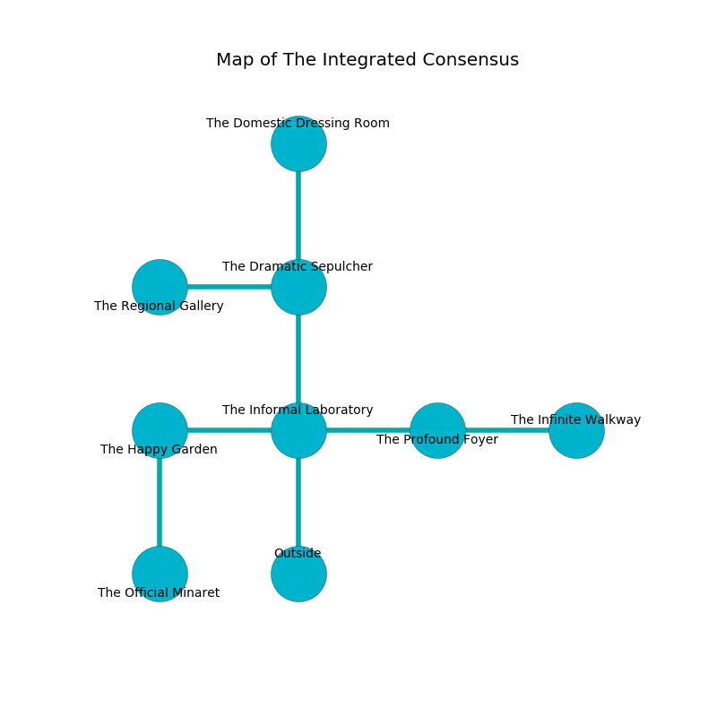

%Ruin Dogs

##The Integrated Consensus
###Overview
The Integrated Consensus is constructed on a spikey plain. Parts of The Integrated Consensus are incredibly cold. A blizzard is happening outside. It is occupied by Vampires. Evie Stackhouse The Vulgar, a Hill Giant is here. The Vampires have been charmed by Evie Stackhouse The Vulgar. She  is founding a new religion. 

###Artifact
####Asacodaeum Baadaemh

Asacodaeum Baadaemh looks like an opaque prism. It smells like calamus. It is a pale brown color. Psychic energy slips from it. When worshipped it becomes a shielding force. 

###Locations

####the informal laboratory
There are two Vampire Spawns here. If the Vampires notice the Ruin Dogs, one of them will retreat and alert [Evie Stackhouse](#Evie-Stackhouse). 

* There is a sceptre here.
* To the west a dark walkway leads to [the happy garden](#the-happy-garden).
* To the east a flooded cave connects to [the profound foyer](#the-profound-foyer).
* To the north a dripping opening connects to [the dramatic sepulcher](#the-dramatic-sepulcher).
* To the south is the entrance.

####the profound foyer
There are a Peryton, a Kenku, and a Xorn here. Yellow mushrooms are swaying in cracks in the floor. The glass walls are covered in mold. 

* [Asacodaeum Baadaemh](#Asacodaeum-Baadaemh) is here.
* To the west a flooded cave connects to [the informal laboratory](#the-informal-laboratory).
* To the east a windy hallway leads to [the infinite walkway](#the-infinite-walkway).

####the happy garden
The glass walls are ruined. There are a Winter Wolf and a Flesh Golem here. 

* To the east a dark walkway connects to [the informal laboratory](#the-informal-laboratory).
* To the south a torchlit gap opens to [the official minaret](#the-official-minaret).

####the dramatic sepulcher
Blue lichens are decaying in a patch on the floor. The floor is flooded with nine inch deep hot water. There are a Ghoul and a Chimera here. 

* [Evie Stackhouse The Vulgar](#Evie-Stackhouse-The-Vulgar) is here.
* To the west a dark cavern leads to [the regional gallery](#the-regional-gallery).
* To the north a dark gap leads to [the domestic dressing room](#the-domestic-dressing-room).
* To the south a dripping opening connects to [the informal laboratory](#the-informal-laboratory).

####the domestic dressing room
There is a trap here. When activated, a magical proximity detector will open a large pit in the floor. The air smells like lilac here. The metallic walls are scratched. 

* There is a cheese here.
* There is a jewel here.
* To the south a dark gap leads to [the dramatic sepulcher](#the-dramatic-sepulcher).

####the regional gallery
White ferns are sprouting from the walls. The air smells like spinach here. The crystal walls are caving in. 

* To the east a dark cavern leads to [the dramatic sepulcher](#the-dramatic-sepulcher).

####the official minaret
The floor is flooded with two inch deep hot water. 

* To the north a torchlit gap connects to [the happy garden](#the-happy-garden).

####the infinite walkway
There are two Vampire Spawns here. The metallic walls are ruined. Red mushrooms are swaying in broken urns. There is a trap here. When activated, a magical proximity detector will launch a ceiling pendulum. The Vampires are crazy with bloodlust. 

* To the west a windy hallway connects to [the profound foyer](#the-profound-foyer).

