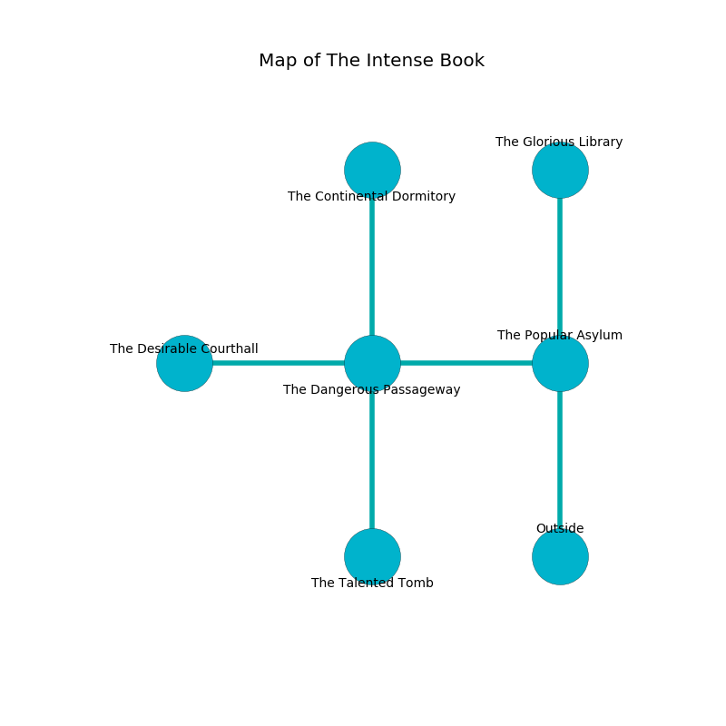

%Ruin Dogs

##The Intense Book
###Overview
The Intense Book is located under a poisoned rift. Parts of The Intense Book are inaccessible. A massive flood is happening outside. It is occupied by Lizardfolk. Branda Farnsworth The Sneaky, a Bearded Devil is here. The Lizardfolk are the minions of Branda Farnsworth The Sneaky. She  is founding a new religion. 

###Artifact
####Dhoa Amafhwi

Dhoa Amafhwi looks like a transparent blade. When eaten it curses all nearby. 

###Locations

####the popular asylum
The mirrored walls are pristine. The air smells like toffee here. The floor is cluttered with broken glass. 

There is an engraving on the wall written in common. 

> I am cruel.
>
> I tried running.
>

* To the west a small corridor leads to [the dangerous passageway](#the-dangerous-passageway).
* To the north a twisted artery opens to [the glorious library](#the-glorious-library).
* To the south is the entrance.

####the glorious library
There are a Red Dragon Wyrmling, a Yeti, and a Gas Spore here. The glass walls are unsettled. The floor is flooded with three inch deep cold water. Gray ferns are swaying from the ceiling. 

* To the south a twisted artery connects to [the popular asylum](#the-popular-asylum).

####the dangerous passageway
The metallic walls are caving in. The air tastes like turmeric here. 

* [Dhoa Amafhwi](#Dhoa-Amafhwi) is here.
* [Branda Farnsworth The Sneaky](#Branda-Farnsworth-The-Sneaky) is here.
* To the west a torchlit cave opens to [the desirable courthall](#the-desirable-courthall).
* To the east a small corridor opens to [the popular asylum](#the-popular-asylum).
* To the north a long threshold opens to [the continental dormitory](#the-continental-dormitory).
* To the south a dark cave leads to [the talented tomb](#the-talented-tomb).

####the continental dormitory
There are two Lizardfolk Shamans and three Lizardfolk here. Green moss is swaying from the walls. The Lizardfolk are performing a ritual. If not interrupted, a powerful monster will be summoned. 

There is an engraving on the ceiling written in Lizardfolk Script. 

> Run away.
>

* There is a specter here.
* To the south a long threshold connects to [the dangerous passageway](#the-dangerous-passageway).

####the talented tomb
The concrete walls are pristine. Red lichens are swaying in cracks in the floor. The air smells like melon here. 

* To the north a dark cave connects to [the dangerous passageway](#the-dangerous-passageway).

####the desirable courthall
Blue lichens are growing from the ceiling. There are two Lizardfolk Shamans and three Lizardfolk here. The air tastes like huckleberry here. The floor is glossy. The Lizardfolk are performing a ritual. If not interrupted, the Lizardfolk will become more powerful. 

* To the east a torchlit cave connects to [the dangerous passageway](#the-dangerous-passageway).

