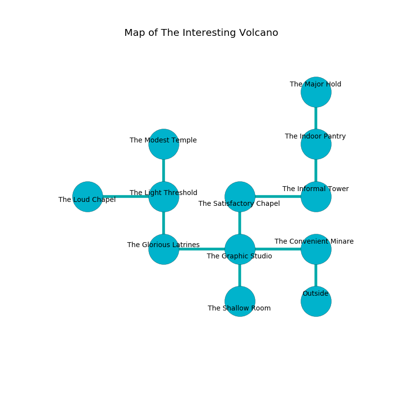

%Ruin Dogs

##The Interesting Volcano
###Overview
The Interesting Volcano is located on an obsidion mountain. Some rooms of The Interesting Volcano are foggy. The ruin is sinking into the earth. It is occupied by Harpies. Vashti Kearney The Dishonest, an Ogre is here. The Harpies are the slaves of Vashti Kearney The Dishonest. She  is trying to steal [The Religious Leadership](#The-Religious-Leadership). 

###Artifact
####The Religious Leadership

The Religious Leadership looks like a glassy cube. Power shifts towards it. When gazed upon it grants psychic powers. 

###Locations

####the convenient minaret
The stone walls are scratched. There are three Harpies here. The Harpies are performing a ritual. If not interrupted, [Vashti Kearney](#Vashti-Kearney) will be magically alarmed. 

There is an engraving on the wall written in Harpies Script. 

> You are damned
>
> archaeological and impressive
>

* To the west a hazy threshold connects to [the graphic studio](#the-graphic-studio).
* To the south is the entrance.

####the graphic studio
The floor is smooth. The air tastes like graham cracker here. There is a Killer Whale here. 

* [The Religious Leadership](#The-Religious-Leadership) is here.
* To the west a dripping opening connects to [the glorious latrines](#the-glorious-latrines).
* To the east a hazy threshold connects to [the convenient minaret](#the-convenient-minaret).
* To the north a small walkway opens to [the satisfactory chapel](#the-satisfactory-chapel).
* To the south a twisted cave opens to [the shallow room](#the-shallow-room).

####the satisfactory chapel
The mirrored walls are caving in. Yellow mushrooms are growing from the walls. 

There is an engraving on a monolith written in common. 

> I could not try giving up.
>

* To the east a dark passageway leads to [the informal tower](#the-informal-tower).
* To the south a small walkway leads to [the graphic studio](#the-graphic-studio).

####the glorious latrines
The air smells like spinach here. There are three Harpies here. The Harpies are willing to negotiate. 

* To the east a dripping opening connects to [the graphic studio](#the-graphic-studio).
* To the north a dripping artery opens to [the light threshold](#the-light-threshold).

####the informal tower
There are three Harpies here. The floor is flooded with nine inch deep hot water. The air tastes like rancid butter here. The Harpies are willing to negotiate. 

* To the west a dark passageway opens to [the satisfactory chapel](#the-satisfactory-chapel).
* To the north a flooded hall opens to [the indoor pantry](#the-indoor-pantry).

####the light threshold
There are a Giant Eagle and an Ogre here. 

* To the west a dark walkway leads to [the loud chapel](#the-loud-chapel).
* To the north a dark opening leads to [the modest temple](#the-modest-temple).
* To the south a dripping artery connects to [the glorious latrines](#the-glorious-latrines).

####the indoor pantry
The floor is sticky. Gray moss is swaying in a patch on the floor. 

* To the north a hazy corridor opens to [the major hold](#the-major-hold).
* To the south a flooded hall opens to [the informal tower](#the-informal-tower).

####the modest temple
Red lichens are sprouting in a patch on the floor. There are a Tiger, a Duodrone, a Panther, a Goblin, a Gnoll, and a Bandit Captain here. 

There is an engraving on a stone written in common. 

> [The Religious Leadership](#The-Religious-Leadership)
>
> cold and tolerant
>

* To the south a dark opening opens to [the light threshold](#the-light-threshold).

####the loud chapel
Yellow razorgrass is swaying from the ceiling. 

* There is a sponge here.
* [Vashti Kearney The Dishonest](#Vashti-Kearney-The-Dishonest) is here.
* To the east a dark walkway opens to [the light threshold](#the-light-threshold).

####the major hold
There are a Giant Rat, a Flumph, a Raven, an Ettercap, a Saber-Toothed Tiger, a Lizardfolk, a Hawk, and a Flying Snake here. The air tastes like tobacco here. Green mushrooms are growing in cracks in the floor. 

There is an engraving on the wall written in Harpies Script. 

> I tried jumping.
>

* To the south a hazy corridor opens to [the indoor pantry](#the-indoor-pantry).

####the shallow room
The floor is glossy. There is a Yeti here. 

* To the north a twisted cave connects to [the graphic studio](#the-graphic-studio).

