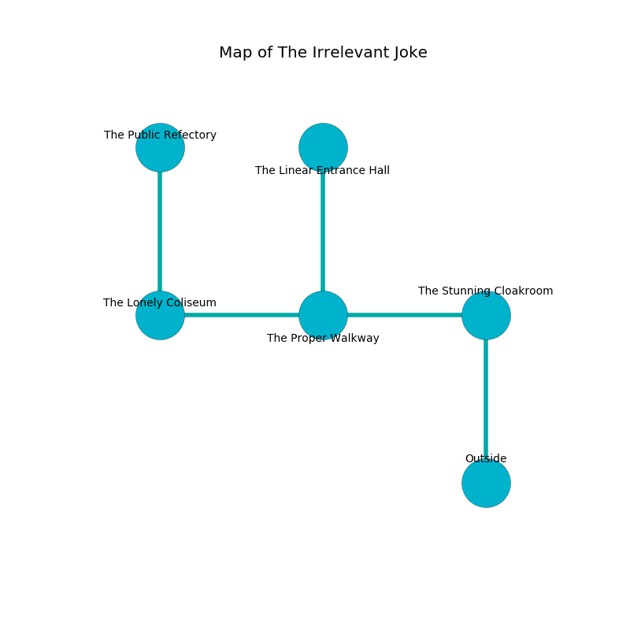

%Ruin Dogs

##The Irrelevant Joke
###Overview
The Irrelevant Joke is located in a haunted plain. Some rooms of it are corrupted. The ruin is sinking into the earth. It is occupied by Duergars. Jodi Moreau The Foolhardy, a Kuo-Toa Archpriest is here. The Duergars are the minions of Jodi Moreau The Foolhardy. She  is trying to destroy [The Indoor Health](#The-Indoor-Health). 

###Artifact
####The Indoor Health

The Indoor Health looks like a mushy sphere. It smells like unripe banana. It is a shifting red color. When gazed upon it burns the mind. 

###Locations

####the stunning cloakroom
There are a Mud Mephit, a Drow, a Nightmare, a Shadow, a Kuo-Toa, an Ice Mephit, a Warhorse, a Hawk, and a Quaggoth here. The air smells like strawberry here. 

There is an engraving on the ceiling written in common. 

> I was injured in this place.
>

* To the west a windy hallway opens to [the proper walkway](#the-proper-walkway).
* To the south is the entrance.

####the proper walkway
Red razorgrass is sprouting in broken urns. The air tastes like smoked sausage here. 

* [The Indoor Health](#The-Indoor-Health) is here.
* To the west a long passageway leads to [the lonely coliseum](#the-lonely-coliseum).
* To the east a windy hallway connects to [the stunning cloakroom](#the-stunning-cloakroom).
* To the north a hazy corridor opens to [the linear entrance hall](#the-linear-entrance-hall).

####the lonely coliseum
Blue lichens are sprouting in broken urns. The mirrored walls are covered in mold. The air tastes like stringent here. 

There is an engraving on the floor written in common. 

> Poor me! dire you
>
> but due
>
> but cute
>
> the world is acute
>

* There is a match here.
* There is a flag here.
* To the east a long passageway opens to [the proper walkway](#the-proper-walkway).
* To the north a flooded hall connects to [the public refectory](#the-public-refectory).

####the public refectory
The floor is sticky. The air tastes like sausage here. 

* To the south a flooded hall connects to [the lonely coliseum](#the-lonely-coliseum).

####the linear entrance hall
The floor is flooded with one inch deep lukewarm water. The air smells like buttermilk here. Blue razorgrass is decaying from the walls. There are a Giant Sea Horse, a Green Hag, a Thug, a Pegasus, a Winged Kobold, and a Commoner here. 

* [Jodi Moreau The Foolhardy](#Jodi-Moreau-The-Foolhardy) is here.
* To the south a hazy corridor leads to [the proper walkway](#the-proper-walkway).

