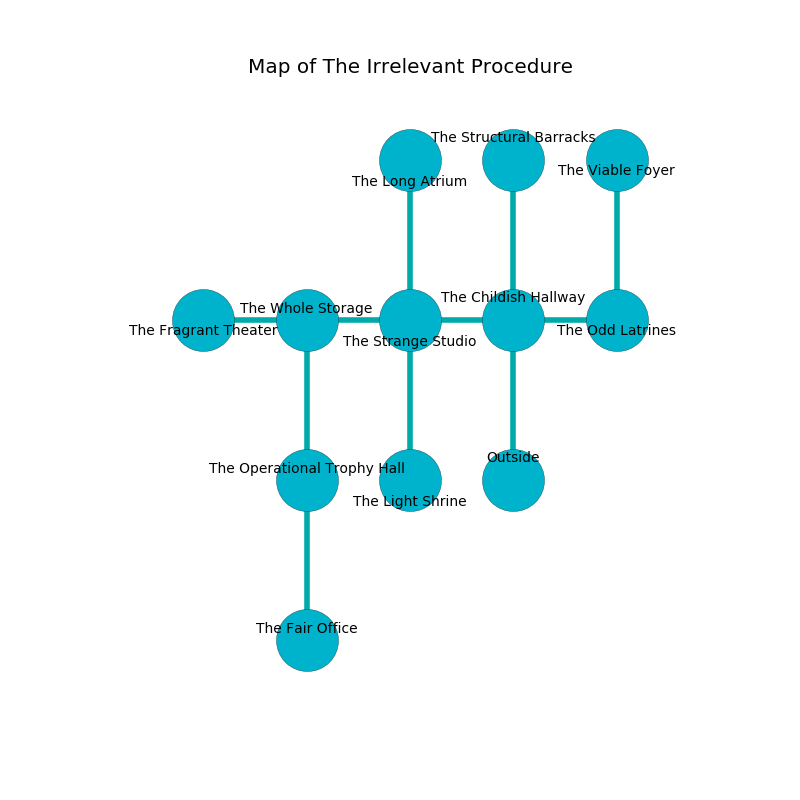

%Ruin Dogs

##The Irrelevant Procedure
###Overview
The Irrelevant Procedure is located under a poisoned plain. Some rooms of it are inaccessible. A lunar eclipse is happening outside. It is occupied by Dryads. Moises Rodriguez The Self-Indulgent, a Barbed Devil is here. The Dryads are the minions of Moises Rodriguez The Self-Indulgent. He  is founding a new religion. 

###Artifact
####The National Responsibility

The National Responsibility looks like a smooth spear. It smells like old wood. Psychic energy slips near it. When worshipped it flies into the air. 

###Locations

####the childish hallway
The metallic walls are ruined. There are six Dryads here. One of the Dryads is on watch, the rest are sleeping. 

There is an engraving on the floor written in common. 

> They are envious
>
> sad, reliable, straight
>
> A  is a twist
>
> socialist and desirable
>

* To the west a long cave opens to [the strange studio](#the-strange-studio).
* To the east a torchlit path opens to [the odd latrines](#the-odd-latrines).
* To the north a dark artery leads to [the structural barracks](#the-structural-barracks).
* To the south is the entrance.

####the strange studio

* There is a carriage here.
* There is a jewel here.
* [The National Responsibility](#The-National-Responsibility) is here.
* [Moises Rodriguez The Self-Indulgent](#Moises-Rodriguez-The-Self-Indulgent) is here.
* To the west a dark gap opens to [the whole storage](#the-whole-storage).
* To the east a long cave leads to [the childish hallway](#the-childish-hallway).
* To the north a torchlit cavern connects to [the long atrium](#the-long-atrium).
* To the south a twisted cavern connects to [the light shrine](#the-light-shrine).

####the whole storage
There are a Galeb Duhr and a Giant Elk here. The crystal walls are bloodstained. The floor is bloodstained. 

* To the west a small pathway leads to [the fragrant theater](#the-fragrant-theater).
* To the east a dark gap opens to [the strange studio](#the-strange-studio).
* To the south a windy threshold leads to [the operational trophy hall](#the-operational-trophy-hall).

####the structural barracks
There is a trap here. When activated, a magical sound detector will ring a bell. 

* To the south a dark artery leads to [the childish hallway](#the-childish-hallway).

####the odd latrines
The air smells like oats here. White mushrooms are swaying in a patch on the floor. The floor is smooth. 

* There is a pin here.
* To the west a torchlit path connects to [the childish hallway](#the-childish-hallway).
* To the north a torchlit corridor connects to [the viable foyer](#the-viable-foyer).

####the light shrine
There are a Drow Elite Warrior, a Helmed Horror, and an Animated Armor here. The obsidion walls are ruined. The floor is flooded with nine inch deep cool water. 

* To the north a twisted cavern connects to [the strange studio](#the-strange-studio).

####the operational trophy hall
The obsidion walls are covered in mold. There are a Steam Mephit, a Spider, and a Mage here. Red razorgrass is sprouting from the walls. 

* To the north a windy threshold connects to [the whole storage](#the-whole-storage).
* To the south a flooded threshold leads to [the fair office](#the-fair-office).

####the fair office
The floor is glossy. The air tastes like petroleum here. 

* There is a finger here.
* To the north a flooded threshold leads to [the operational trophy hall](#the-operational-trophy-hall).

####the fragrant theater
The floor is cluttered with rocks. Gray ferns are swaying in a patch on the floor. The brick walls are ruined. The air smells like dried apple here. 

There is an engraving on a monolith written in common. 

> All of us are frozen
>
> cheerful and pregnant
>
> but never plain
>
> you are consumed
>

* To the east a small pathway leads to [the whole storage](#the-whole-storage).

####the viable foyer
The mirrored walls are bloodstained. Gray lichens are decaying from the walls. There is a trap here. When activated, a magical rune will launch a poison needle. 

* To the south a torchlit corridor connects to [the odd latrines](#the-odd-latrines).

####the long atrium
There are six Dryads here. If the Dryads notice the Ruin Dogs, one of them will retreat and alert the others. 

* There is a hat here.
* To the south a torchlit cavern opens to [the strange studio](#the-strange-studio).

