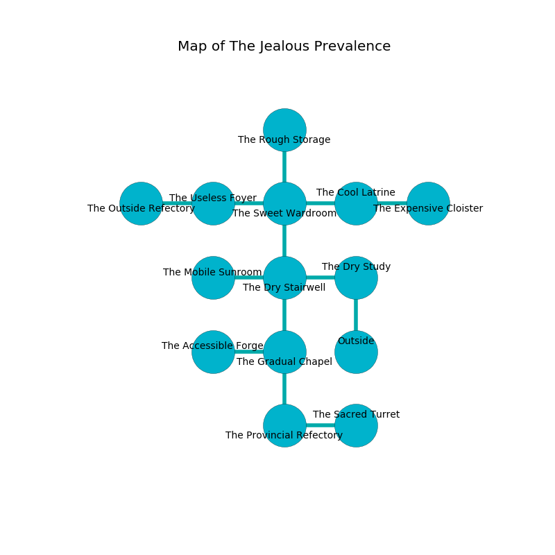

%Ruin Dogs

##The Jealous Prevalence
###Overview
The Jealous Prevalence is located under an obsidion mountain. Some rooms of it are corrupted. The ruin is flooding. It is occupied by Kobolds. Donny Mosier The Boring, a Mind Flayer Arcanist is here. The Kobolds are ruled by Donny Mosier The Boring. He  is trying to hide [The Provincial Memorandum](#The-Provincial-Memorandum). 

###Artifact
####The Provincial Memorandum

The Provincial Memorandum looks like a smooth doll. Gravity flows from it. It is a dark white color. When eaten it makes its owner invisible. 

###Locations

####the dry study
The air smells like coumarinic here. There are a Red Slaad, a Pseudodragon, an Old Faerie Dragon, and a Yuan-Ti Malison here. 

* To the west a dark corridor leads to [the dry stairwell](#the-dry-stairwell).
* To the south is the entrance.

####the dry stairwell
There are twenty eight Winged Kobolds and sixteen Kobolds here. There is a trap here. When activated, a pressure plate will launch an arrow. The air tastes like mold here. The floor is flooded with one inch deep lukewarm water. The Kobolds are caring for babies. 

* To the west a flooded path opens to [the mobile sunroom](#the-mobile-sunroom).
* To the east a dark corridor opens to [the dry study](#the-dry-study).
* To the north a hazy artery leads to [the sweet wardroom](#the-sweet-wardroom).
* To the south a long cave opens to [the gradual chapel](#the-gradual-chapel).

####the gradual chapel
The obsidion walls are unsettled. Gray moss is growing in a patch on the floor. There are twenty nine Winged Kobolds and fifteen Kobolds here. The Kobolds are meditating. 

* To the west a hazy cave connects to [the accessible forge](#the-accessible-forge).
* To the north a long cave leads to [the dry stairwell](#the-dry-stairwell).
* To the south a hazy opening connects to [the provincial refectory](#the-provincial-refectory).

####the sweet wardroom
Yellow ferns are swaying in broken urns. The air smells like rubber here. The brick walls are caving in. 

* To the west a torchlit pathway opens to [the useless foyer](#the-useless-foyer).
* To the east a windy opening opens to [the cool latrine](#the-cool-latrine).
* To the north a flooded hallway connects to [the rough storage](#the-rough-storage).
* To the south a hazy artery leads to [the dry stairwell](#the-dry-stairwell).

####the mobile sunroom
The stone walls are covered in mold. 

There is an engraving on a tablet written in Kobolds Script. 

> They are sorrowful
>
> talented, bloody, delicate
>
> trivial, fat, dirty
>
> yet never dominant
>

* [Donny Mosier The Boring](#Donny-Mosier-The-Boring) is here.
* To the east a flooded path connects to [the dry stairwell](#the-dry-stairwell).

####the cool latrine
Green lichens are growing from the ceiling. The air tastes like acorn here. 

* There is a bottle here.
* To the west a windy opening opens to [the sweet wardroom](#the-sweet-wardroom).
* To the east a dripping cavern opens to [the expensive cloister](#the-expensive-cloister).

####the rough storage
The floor is smooth. 

* To the south a flooded hallway opens to [the sweet wardroom](#the-sweet-wardroom).

####the accessible forge
The air smells like mustard here. The floor is sticky. 

* There is a bowl here.
* There is a carriage here.
* To the east a hazy cave connects to [the gradual chapel](#the-gradual-chapel).

####the useless foyer
There are a Manticore, a Yuan-Ti Pureblood, a Fomorian, a Killer Whale, and a Worg here. The floor is bloodstained. 

* There is a head here.
* [The Provincial Memorandum](#The-Provincial-Memorandum) is here.
* To the west a small passageway opens to [the outside refectory](#the-outside-refectory).
* To the east a torchlit pathway opens to [the sweet wardroom](#the-sweet-wardroom).

####the provincial refectory
Yellow mushrooms are growing in broken urns. The obsidion walls are bloodstained. There are seventeen Winged Kobolds and thirty eight Kobolds here. The Kobolds are fighting amongst themselves. 

* To the east a narrow gap opens to [the sacred turret](#the-sacred-turret).
* To the north a hazy opening leads to [the gradual chapel](#the-gradual-chapel).

####the sacred turret
The air tastes like peanut butter here. The floor is flooded with three inch deep hot water. There are twenty eight Winged Kobolds and seventeen Kobolds here. Gray ferns are growing in broken urns. The Kobolds are fighting amongst themselves. 

* To the west a narrow gap opens to [the provincial refectory](#the-provincial-refectory).

####the expensive cloister
The air tastes like privet here. The floor is sticky. Gray lichens are growing from the walls. There are a Chuul, a Hezrou, a Half-Ogre, and a Frog here. The metallic walls are unsettled. 

* There is a cart here.
* There is a church here.
* To the west a dripping cavern connects to [the cool latrine](#the-cool-latrine).

####the outside refectory
There are twenty three Winged Kobolds and twenty six Kobolds here. The air tastes like cloth here. The Kobolds are willing to negotiate. 

* To the east a small passageway connects to [the useless foyer](#the-useless-foyer).

