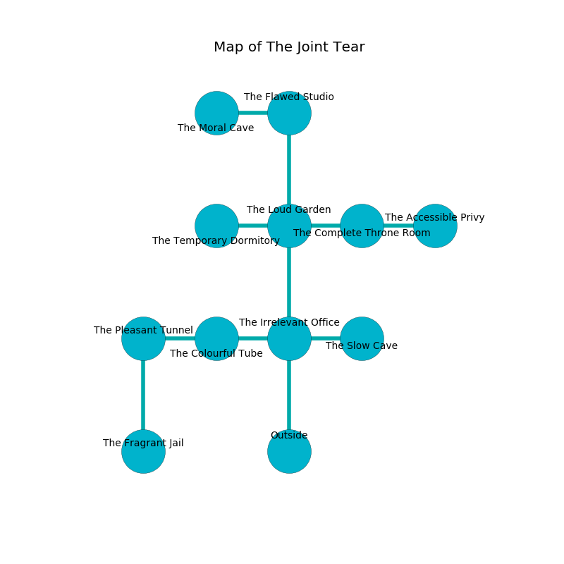

%Ruin Dogs

##The Joint Tear
###Overview
The Joint Tear is constructed on a cursed tree. Some areas of it are flooded. The ruin is burning. It is occupied by Dryads. Ed Wolfe The Big-Headed, a Hobgoblin Warlord is here. The Dryads worship Ed Wolfe The Big-Headed. He  is founding a new religion. 

###Artifact
####The Accessible Pan

The Accessible Pan looks like a wet prism. It is a shifting brown color. Cacophony slips around it. When eaten it levitates those nearby. 

###Locations

####the irrelevant office
The floor is flooded with three inch deep scalding water. 

* There is a boat here.
* There is a chest here.
* To the west a torchlit path leads to [the colourful tube](#the-colourful-tube).
* To the east a twisted hallway opens to [the slow cave](#the-slow-cave).
* To the north a small cave opens to [the loud garden](#the-loud-garden).
* To the south is the entrance.

####the slow cave
The obsidion walls are pristine. There are a Killer Whale and a Xorn here. 

There is an engraving on the ceiling written in Dryads Script. 

> Oh meak soul
>
> enthusiastic and whole
>
> but assertive
>
> death is whole
>

* To the west a twisted hallway connects to [the irrelevant office](#the-irrelevant-office).

####the loud garden
The air smells like geranium here. There are a Duodrone, a Mammoth, a Mimic, and a Rust Monster here. 

* To the west a long cave connects to [the temporary dormitory](#the-temporary-dormitory).
* To the east a flooded corridor leads to [the complete throne room](#the-complete-throne-room).
* To the north a dark opening opens to [the flawed studio](#the-flawed-studio).
* To the south a small cave connects to [the irrelevant office](#the-irrelevant-office).

####the colourful tube
The floor is glossy. There are a Ghast, a Ghoul, a Shadow, a Blood Hawk, a Chasme, a Lemure, a Phase Spider, a Needle Blight, and a Bat here. 

* To the west a small gap connects to [the pleasant tunnel](#the-pleasant-tunnel).
* To the east a torchlit path connects to [the irrelevant office](#the-irrelevant-office).

####the flawed studio
The floor is cluttered with ashes. There are a Bulette and a Griffon here. The concrete walls are bloodstained. 

* To the west a dark opening connects to [the moral cave](#the-moral-cave).
* To the south a dark opening opens to [the loud garden](#the-loud-garden).

####the temporary dormitory
There are a Pony, a Gnoll, a Night Hag, a Tridrone, and a Quadrone here. Blue ferns are sprouting in broken urns. The glass walls are pristine. There is a trap here. When activated, a tripwire will swing a tripping chain. 

* [Ed Wolfe The Big-Headed](#Ed-Wolfe-The-Big-Headed) is here.
* To the east a long cave opens to [the loud garden](#the-loud-garden).

####the complete throne room
Yellow moss is growing from the walls. The brick walls are pristine. The air smells like cantaloupe here. The floor is cluttered with rocks. 

* To the west a flooded corridor connects to [the loud garden](#the-loud-garden).
* To the east a hazy artery leads to [the accessible privy](#the-accessible-privy).

####the accessible privy
The floor is bloodstained. 

There is an engraving on a monolith written in Dryads Script. 

> Dear me! sorry fate
>
> it is always late
>
> excited and basic
>
> the world is late
>

* To the west a hazy artery opens to [the complete throne room](#the-complete-throne-room).

####the pleasant tunnel
Yellow ferns are decaying in a patch on the floor. The floor is bloodstained. 

There is an engraving on a monolith written in common. 

> They are cursed
>
> separate, different, elegant
>
> but never pure
>

* [The Accessible Pan](#The-Accessible-Pan) is here.
* To the east a small gap connects to [the colourful tube](#the-colourful-tube).
* To the south a small hall connects to [the fragrant jail](#the-fragrant-jail).

####the moral cave
The floor is sticky. The stone walls are caving in. There are seven Dryads here. The Dryads are fighting amongst themselves. 

There is an engraving on the wall written in Dryads Script. 

> Oh life is poor
>
> but never cultural
>
> it is never premature
>
> fate is agricultural
>

* To the east a dark opening connects to [the flawed studio](#the-flawed-studio).

####the fragrant jail
The obsidion walls are covered in mold. Blue moss is sprouting in cracks in the floor. There are a Myconid Sprout, a Swarm of Insects, a Drow Mage, and a Priest here. 

* There is a rail here.
* There is a cart here.
* To the north a small hall leads to [the pleasant tunnel](#the-pleasant-tunnel).

