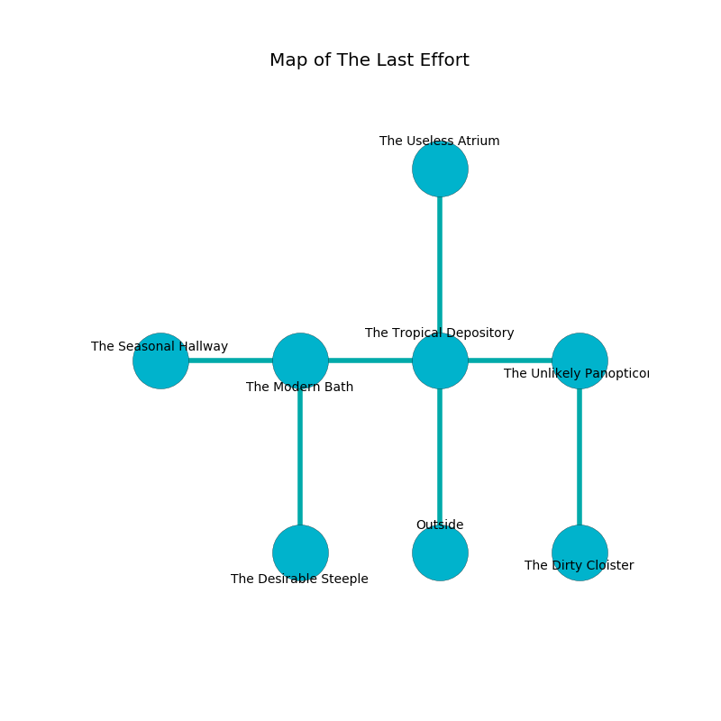

%Ruin Dogs

##The Last Effort
###Overview
The Last Effort is located on a broken rift. Some areas of it are foggy. The ruin is coming to life. It is occupied by Ogres. Buford Frye The Inconsistent, a Yuan-Ti Abomination is here. The Ogres are battling Buford Frye The Inconsistent. He  is trying to destroy [The Experienced Silence](#The-Experienced-Silence). 

###Artifact
####The Experienced Silence

The Experienced Silence is a powerful artifact in the shape of a wet spear. Air bends from it. It smells like smoked sausage. It is a medium yellow color. When carried it makes its owner invisible. 

###Locations

####the tropical depository
There are a Thug, a Grick Alpha, a Berserker, a Mezzoloth, and a Flying Sword here. The air smells like cucumber skin here. 

* To the west a narrow gap leads to [the modern bath](#the-modern-bath).
* To the east a small corridor opens to [the unlikely panopticon](#the-unlikely-panopticon).
* To the north a small pathway opens to [the useless atrium](#the-useless-atrium).
* To the south is the entrance.

####the modern bath
Gray ferns are decaying in a patch on the floor. There are three Half-Ogres and three Ogres here. The air smells like molasses here. If the Ogres notice the Ruin Dogs, one of them will retreat and alert the others. 

* To the west a dark hallway leads to [the seasonal hallway](#the-seasonal-hallway).
* To the east a narrow gap opens to [the tropical depository](#the-tropical-depository).
* To the south a long gap leads to [the desirable steeple](#the-desirable-steeple).

####the desirable steeple
The floor is smooth. The brick walls are bloodstained. 

There is an engraving on the ceiling written in Ogres Script. 

> O! the world is inhumane
>
> steep and tall
>
> blank, moving, plain
>
> all is small
>

* There is a stamp here.
* There is a card here.
* To the north a long gap opens to [the modern bath](#the-modern-bath).

####the seasonal hallway
The glass walls are ruined. 

There is an engraving on the ceiling written in common. 

> O! the world is inhumane
>
> but vain
>
> noble, immune, social
>
> sadness is vain
>

* To the east a dark hallway leads to [the modern bath](#the-modern-bath).

####the useless atrium
The glass walls are unsettled. There are six Half-Ogres and an Ogre here. The floor is cluttered with ashes. Green ferns are growing from the ceiling. The Ogres are fighting amongst themselves. 

There is an engraving on a tablet written in common. 

> [The Experienced Silence](#The-Experienced-Silence)
>
> yet blonde
>
> A plate is a guerrilla
>
> powerful and elegant
>
> An apple is a script
>
> commercial and presidential
>
> [The Experienced Silence](#The-Experienced-Silence)
>

* [Buford Frye The Inconsistent](#Buford-Frye-The-Inconsistent) is here.
* To the south a small pathway leads to [the tropical depository](#the-tropical-depository).

####the unlikely panopticon
Red mushrooms are decaying from the ceiling. The air smells like green tea here. The floor is smooth. 

There is an engraving on a tablet written in common. 

> I discovered [The Experienced Silence](#The-Experienced-Silence).
>

* [The Experienced Silence](#The-Experienced-Silence) is here.
* To the west a small corridor leads to [the tropical depository](#the-tropical-depository).
* To the south a windy artery leads to [the dirty cloister](#the-dirty-cloister).

####the dirty cloister
The crystal walls are bloodstained. The floor is smooth. 

* To the north a windy artery leads to [the unlikely panopticon](#the-unlikely-panopticon).

