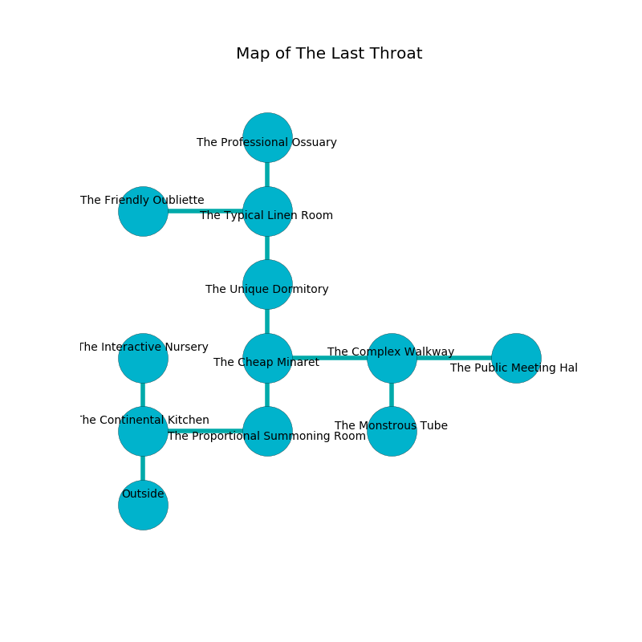

%Ruin Dogs

##The Last Throat
###Overview
The Last Throat is constructed on a poisoned tree. Parts of The Last Throat are cursed. A windstorm is happening outside. It is occupied by Sprites. Delbert Deleon The Rude, a Mind Flayer Arcanist is here. The Sprites are the minions of Delbert Deleon The Rude. He  is trying to steal [The Neutral Employee](#The-Neutral-Employee). 

###Artifact
####The Neutral Employee

The Neutral Employee looks like an opaque meteorite. Magic incinerates around it. It is a sickly black color. When cradled it floats in the air. 

###Locations

####the continental kitchen
Yellow ferns are sprouting in broken urns. The obsidion walls are caving in. The air tastes like cedar here. The floor is cluttered with broken glass. There are thirty six Sprites here. The Sprites are willing to negotiate. 

* There is a baby here.
* There is a tome here.
* To the east a windy opening opens to [the proportional summoning room](#the-proportional-summoning-room).
* To the north a small pathway connects to [the interactive nursery](#the-interactive-nursery).
* To the south is the entrance.

####the proportional summoning room
The air smells like cereal here. Blue ferns are growing in a patch on the floor. The wooden walls are scratched. The floor is cluttered with ashes. 

* To the west a windy opening leads to [the continental kitchen](#the-continental-kitchen).
* To the north a dark threshold connects to [the cheap minaret](#the-cheap-minaret).

####the cheap minaret
The floor is smooth. 

* There is a wight here.
* There is a belt here.
* There is a chest here.
* To the east a twisted threshold opens to [the complex walkway](#the-complex-walkway).
* To the north a twisted hall leads to [the unique dormitory](#the-unique-dormitory).
* To the south a dark threshold opens to [the proportional summoning room](#the-proportional-summoning-room).

####the complex walkway
Red moss is decaying from the walls. 

There is an engraving on the floor written in common. 

> O! weak fate
>
> national, traditional, great
>
> still and residential
>
> hope is presidential
>

* [The Neutral Employee](#The-Neutral-Employee) is here.
* To the west a twisted threshold opens to [the cheap minaret](#the-cheap-minaret).
* To the east a windy cavern connects to [the public meeting hall](#the-public-meeting-hall).
* To the south a narrow cavern leads to [the monstrous tube](#the-monstrous-tube).

####the unique dormitory
The floor is smooth. There are thirty six Sprites here. If the Sprites notice the Ruin Dogs, one of them will retreat and alert the others. 

* There is a hook here.
* There is a knot here.
* To the north a flooded hall opens to [the typical linen room](#the-typical-linen-room).
* To the south a twisted hall connects to [the cheap minaret](#the-cheap-minaret).

####the typical linen room
The air tastes like black currant here. The floor is smooth. The obsidion walls are bloodstained. 

There is an engraving on the ceiling written in common. 

> Oh cruel we
>
> sexual and free
>
> fast, eloquent, mature
>
> the world is free
>

* There is a knot here.
* To the west a twisted cave connects to [the friendly oubliette](#the-friendly-oubliette).
* To the north a torchlit threshold opens to [the professional ossuary](#the-professional-ossuary).
* To the south a flooded hall connects to [the unique dormitory](#the-unique-dormitory).

####the professional ossuary
The air smells like frying here. The wooden walls are unsettled. The floor is flooded with seven inch deep scalding water. 

* To the south a torchlit threshold opens to [the typical linen room](#the-typical-linen-room).

####the interactive nursery
The brick walls are bloodstained. There are a Giant Wolf Spider, an Imp, a Badger, a Nightmare, a Manes, a Berserker, and a Gold Dragon Wyrmling here. 

There is an engraving on the wall written in Sprites Script. 

> They are hidden
>
> paralyzed and awake
>
> [The Neutral Employee](#The-Neutral-Employee)
>
> early, interesting, exact
>
> [The Neutral Employee](#The-Neutral-Employee)
>
> productive, supplementary, fair
>
> enthusiastic, typical, temporary
>
> violent and decisive
>
> A hair is a hallway
>
> yet never sufficient
>
> agricultural, clear, decorative
>
> They are hidden
>

* To the south a small pathway connects to [the continental kitchen](#the-continental-kitchen).

####the monstrous tube
There are a Green Slaad and a Young Green Dragon here. The floor is sticky. The wooden walls are pristine. The air tastes like tagette here. 

* To the north a narrow cavern opens to [the complex walkway](#the-complex-walkway).

####the friendly oubliette
The floor is sticky. The air smells like baked potato here. 

* There is a leaf here.
* [Delbert Deleon The Rude](#Delbert-Deleon-The-Rude) is here.
* To the east a twisted cave opens to [the typical linen room](#the-typical-linen-room).

####the public meeting hall
There are a Dryad, a Barbed Devil, a Kenku, a Treant, and a Druid here. The air smells like cologne here. Gray ferns are decaying from the ceiling. The stone walls are covered in mold. 

* To the west a windy cavern connects to [the complex walkway](#the-complex-walkway).

