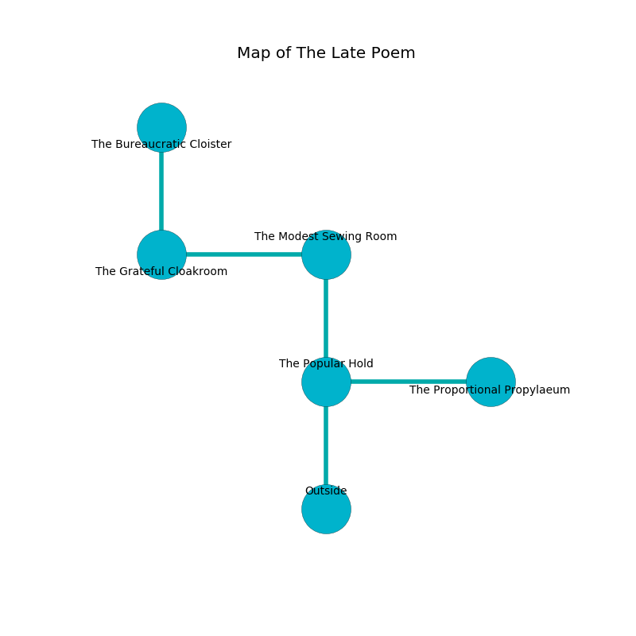

%Ruin Dogs

##The Late Poem
###Overview
The Late Poem is located under an alien city. Some areas of it are flooded. The ruin is larger on the inside than the outside. It is occupied by Orcs. Bibi Felder The Deceitful, a Yuan-Ti Abomination is here. The Orcs have been charmed by Bibi Felder The Deceitful. She  is trying to destroy [Bwidm Cubbaedbamd](#Bwidm-Cubbaedbamd). 

###Artifact
####Bwidm Cubbaedbamd

Bwidm Cubbaedbamd looks like a broken gem. When eaten it becomes hot. 

###Locations

####the popular hold
The air tastes like lavender here. The concrete walls are pristine. Gray razorgrass is swaying from the ceiling. 

* To the east a dripping pathway leads to [the proportional propylaeum](#the-proportional-propylaeum).
* To the north a twisted cave leads to [the modest sewing room](#the-modest-sewing-room).
* To the south is the entrance.

####the modest sewing room
The floor is cluttered with rocks. There are two Orc War Chiefs here. The stone walls are pristine. One of the Orcs is working a mechanism that can flood the room. 

There is an engraving on a tablet written in Orcs Script. 

> Oh pitiful soul
>
> joint and whole
>
> yet never impressive
>
> cruelty is whole
>

* To the west a windy walkway opens to [the grateful cloakroom](#the-grateful-cloakroom).
* To the south a twisted cave connects to [the popular hold](#the-popular-hold).

####the grateful cloakroom
The air smells like valerian root here. There is a trap here. When activated, a tripwire will open a trapdoor in the floor. The floor is sticky. 

* [Bwidm Cubbaedbamd](#Bwidm-Cubbaedbamd) is here.
* To the east a windy walkway leads to [the modest sewing room](#the-modest-sewing-room).
* To the north a twisted artery connects to [the bureaucratic cloister](#the-bureaucratic-cloister).

####the proportional propylaeum
The floor is smooth. The air tastes like cilantro here. 

* [Bibi Felder The Deceitful](#Bibi-Felder-The-Deceitful) is here.
* To the west a dripping pathway opens to [the popular hold](#the-popular-hold).

####the bureaucratic cloister
There are four Orc Eyes of Gruumsh here. The concrete walls are pristine. One of the Orcs is on watch, the rest are caring for babies. 

* To the south a twisted artery leads to [the grateful cloakroom](#the-grateful-cloakroom).

