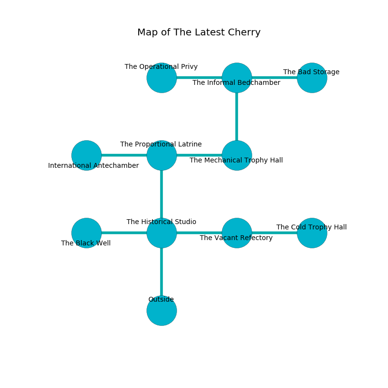

%Ruin Dogs

##The Latest Cherry
###Overview
The Latest Cherry is located on a poisoned city. Regions of The Latest Cherry are corrupted. A massive flood is happening outside. It is occupied by Yuan-Ti. Patrice James The Flirtatious, a Githyanki Warrior is here. The Yuan-Ti are the slaves of Patrice James The Flirtatious. She  is trying to destroy [The Mechanical Commission](#The-Mechanical-Commission). 

###Artifact
####The Mechanical Commission

The Mechanical Commission is a powerful artifact in the shape of a wet prism. Water bends around it. When carried it grants power to its owner. 

###Locations

####the historical studio
There are a Drow, an Owl, a Giant Wasp, a Lizardfolk, a Bandit, a Mule, an Octopus, and a Giant Elk here. White ferns are swaying from the ceiling. The metallic walls are bloodstained. The floor is glossy. 

* [Patrice James The Flirtatious](#Patrice-James-The-Flirtatious) is here.
* To the west a flooded cavern opens to [the black well](#the-black-well).
* To the east a windy artery leads to [the vacant refectory](#the-vacant-refectory).
* To the north a hazy cave opens to [the proportional latrine](#the-proportional-latrine).
* To the south is the entrance.

####the vacant refectory
The air smells like weed here. The floor is smooth. 

There is an engraving on the ceiling written in Yuan-Ti Script. 

> Oh pitiful soul
>
> active and whole
>
> but never generous
>
> hope is whole
>

* To the west a windy artery leads to [the historical studio](#the-historical-studio).
* To the east a flooded threshold opens to [the cold trophy hall](#the-cold-trophy-hall).

####the black well
Gray mushrooms are growing in a patch on the floor. The floor is sticky. There is a trap here. When activated, a pressure plate will collapse a column. 

There is an engraving on the floor written in Yuan-Ti Script. 

> I thought about leaving.
>

* To the east a flooded cavern opens to [the historical studio](#the-historical-studio).

####the proportional latrine
The concrete walls are caving in. 

* [The Mechanical Commission](#The-Mechanical-Commission) is here.
* To the west a flooded threshold connects to [the international antechamber](#the-international-antechamber).
* To the east a dripping pathway opens to [the mechanical trophy hall](#the-mechanical-trophy-hall).
* To the south a hazy cave connects to [the historical studio](#the-historical-studio).

####the mechanical trophy hall
The brick walls are ruined. The floor is bloodstained. Gray moss is decaying from the ceiling. There are a Yuan-Ti Malison and a Yuan-Ti Pureblood here. One of the Yuan-Ti is on watch, the rest are sleeping. 

* To the west a dripping pathway connects to [the proportional latrine](#the-proportional-latrine).
* To the north a windy hall leads to [the informal bedchamber](#the-informal-bedchamber).

####the informal bedchamber
The air smells like spruce here. Yellow mushrooms are swaying from the ceiling. The floor is sticky. 

* To the west a torchlit corridor leads to [the operational privy](#the-operational-privy).
* To the east a dark cave connects to [the bad storage](#the-bad-storage).
* To the south a windy hall leads to [the mechanical trophy hall](#the-mechanical-trophy-hall).

####the cold trophy hall
The floor is cluttered with bones. The brick walls are pristine. The air smells like lovage here. 

* To the west a flooded threshold leads to [the vacant refectory](#the-vacant-refectory).

####the bad storage
The air smells like rose here. The floor is glossy. There are a Kuo-Toa Whip and a Wereboar here. The glass walls are ruined. 

* To the west a dark cave opens to [the informal bedchamber](#the-informal-bedchamber).

####the operational privy
There are four Yuan-Ti Purebloods here. The air smells like pear here. White razorgrass is sprouting from the ceiling. The Yuan-Ti are celebrating. 

There is an engraving on a monolith written in Yuan-Ti Script. 

> Poor me! sorry god
>
> it is always residential
>
> but odd
>
> sadness is essential
>

* To the east a torchlit corridor connects to [the informal bedchamber](#the-informal-bedchamber).

####the international antechamber
The air tastes like starch here. The mirrored walls are ruined. There are four Yuan-Ti Purebloods here. The floor is flooded with four inch deep hot water. One of the Yuan-Ti is on watch, the rest are drunk. 

There is an engraving on the floor written in Yuan-Ti Script. 

> A trousers is an extreme
>
> but appropriate
>

* To the east a flooded threshold connects to [the proportional latrine](#the-proportional-latrine).

