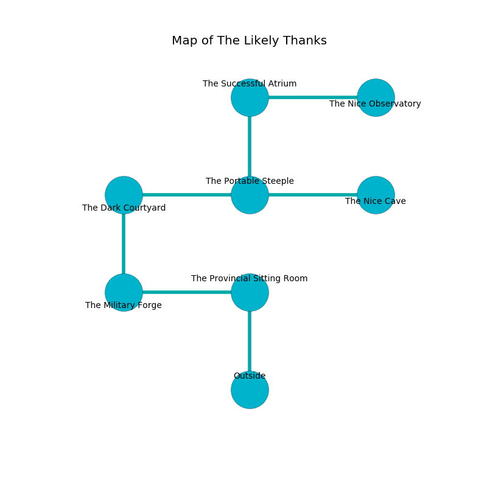

%Ruin Dogs

##The Likely Thanks
###Overview
The Likely Thanks is located under a cursed rift. Some areas of it are frozen. The ruin is sinking into the earth. It is occupied by Kuo-Toa. Tad Chance The Sarcastic, a Priest is here. The Kuo-Toa are ruled by Tad Chance The Sarcastic. He  is founding a new religion. 

###Artifact
####Uem

Uem is a powerful artifact in the shape of a broken monument. Magic slips around it. It smells like resin. When cradled it become energized with a powerful vibration. 

###Locations

####the provincial sitting Room
The air smells like pine here. The floor is sticky. The mirrored walls are covered in mold. 

There is an engraving on the wall written in common. 

> Oh my! dire we
>
> it is never free
>
> exact and mild
>
> fate is wild
>

* To the west a dripping opening opens to [the military forge](#the-military-forge).
* To the south is the entrance.

####the military forge
There are a Kuo-Toa Whip and a Kuo-Toa Monitor here. There is a trap here. When activated, a tripwire will collapse a column. Gray mushrooms are growing from the ceiling. The floor is flooded with three inch deep scalding water. The Kuo-Toa are defending this room from intruders. 

* There is a lyre here.
* There is an egg here.
* [Tad Chance The Sarcastic](#Tad-Chance-The-Sarcastic) is here.
* To the east a dripping opening leads to [the provincial sitting Room](#the-provincial-sitting-Room).
* To the north a torchlit corridor connects to [the dark courtyard](#the-dark-courtyard).

####the dark courtyard
White moss is decaying from the ceiling. The floor is glossy. There is a Kuo-Toa Monitor here. The Kuo-Toa Monitor is willing to negotiate. 

There is an engraving on the wall written in common. 

> A street is an injury
>
> interactive and clear
>
> vacant, delicate, arrogant
>
> You are lost
>
> but genetic
>
> you must never be crystalized
>

* There is a shield here.
* To the east a twisted hallway opens to [the portable steeple](#the-portable-steeple).
* To the south a torchlit corridor connects to [the military forge](#the-military-forge).

####the portable steeple
Blue mushrooms are swaying from the ceiling. The floor is flooded with four inch deep scalding water. 

* There is a fly here.
* To the west a twisted hallway leads to [the dark courtyard](#the-dark-courtyard).
* To the east a narrow path leads to [the nice cave](#the-nice-cave).
* To the north a narrow artery leads to [the successful atrium](#the-successful-atrium).

####the successful atrium
The air tastes like beeswax here. The stone walls are scratched. Red moss is swaying in cracks in the floor. There are a Kuo-Toa Monitor and two Kuo-Toa here. The floor is glossy. The Kuo-Toa are willing to negotiate. 

* [Uem](#Uem) is here.
* To the east a windy corridor opens to [the nice observatory](#the-nice-observatory).
* To the south a narrow artery connects to [the portable steeple](#the-portable-steeple).

####the nice cave
The floor is cluttered with rocks. There is a Kuo-Toa Monitor here. One of the Kuo-Toa Monitor is working a mechanism that can lock the exits. 

* There is a wall here.
* There is a wall here.
* To the west a narrow path leads to [the portable steeple](#the-portable-steeple).

####the nice observatory
The glass walls are pristine. The floor is glossy. 

* To the west a windy corridor opens to [the successful atrium](#the-successful-atrium).

