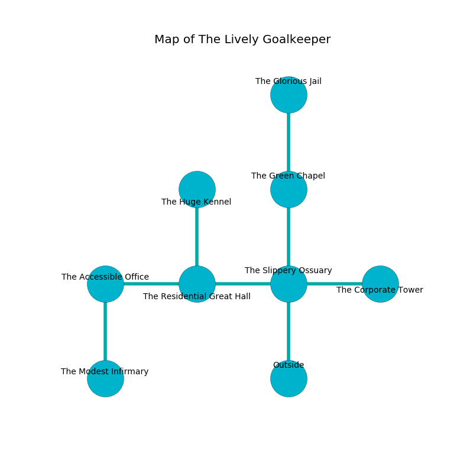

%Ruin Dogs

##The Lively Goalkeeper
###Overview
The Lively Goalkeeper is located under a spikey plain. Some rooms of it are frozen. The ruin is burning. It is occupied by Lizardfolk. Joaquin Tamayo The Rude, a Succubus is here. The Lizardfolk are the slaves of Joaquin Tamayo The Rude. He  is trying to exploit [Amdaedhabamd](#Amdaedhabamd). 

###Artifact
####Amdaedhabamd

Amdaedhabamd has the form of an opaque orb. It is a bright yellow color. Fire shifts near it. It smells like fennel. When cradled it changes the past. 

###Locations

####the slippery ossuary
There is an Incubus here. Red moss is decaying from the ceiling. The glass walls are pristine. 

* To the west a windy corridor opens to [the residential great hall](#the-residential-great-hall).
* To the east a long pathway connects to [the corporate tower](#the-corporate-tower).
* To the north a hazy artery opens to [the green chapel](#the-green-chapel).
* To the south is the entrance.

####the corporate tower
The metallic walls are bloodstained. There are a Peryton and a Blue Dragon Wyrmling here. Gray ferns are decaying in broken urns. 

* To the west a long pathway leads to [the slippery ossuary](#the-slippery-ossuary).

####the green chapel
The metallic walls are scratched. The air smells like herbs here. The floor is smooth. 

* To the north a dripping cave connects to [the glorious jail](#the-glorious-jail).
* To the south a hazy artery leads to [the slippery ossuary](#the-slippery-ossuary).

####the residential great hall
There are a Warhorse, a Lizard King, a Winged Kobold, and a Bearded Devil here. The glass walls are pristine. Gray lichens are growing in a patch on the floor. 

There is an engraving on a monolith written in Lizardfolk Script. 

> [Amdaedhabamd](#Amdaedhabamd)
>
> provincial and private
>
> A train is a bell
>
> established and main
>

* To the west a hazy walkway connects to [the accessible office](#the-accessible-office).
* To the east a windy corridor connects to [the slippery ossuary](#the-slippery-ossuary).
* To the north a flooded hallway leads to [the huge kennel](#the-huge-kennel).

####the accessible office
The wooden walls are caving in. Red mushrooms are sprouting from the walls. There are a Stirge, a Swarm of Rats, a Centaur, a Violet Fungus, and a Wererat here. The floor is sticky. 

There is an engraving on the ceiling written in Lizardfolk Script. 

> A town is a studio
>
> but never different
>

* [Amdaedhabamd](#Amdaedhabamd) is here.
* [Joaquin Tamayo The Rude](#Joaquin-Tamayo-The-Rude) is here.
* To the east a hazy walkway leads to [the residential great hall](#the-residential-great-hall).
* To the south a twisted hallway connects to [the modest infirmary](#the-modest-infirmary).

####the huge kennel

* To the south a flooded hallway opens to [the residential great hall](#the-residential-great-hall).

####the glorious jail
The floor is flooded with five inch deep cold water. 

* There is a head here.
* To the south a dripping cave opens to [the green chapel](#the-green-chapel).

####the modest infirmary
The crystal walls are bloodstained. The air smells like walnut here. 

There is an engraving on the ceiling written in Lizardfolk Script. 

> I worship [Amdaedhabamd](#Amdaedhabamd).
>
> I tried giving up.
>

* To the north a twisted hallway connects to [the accessible office](#the-accessible-office).

