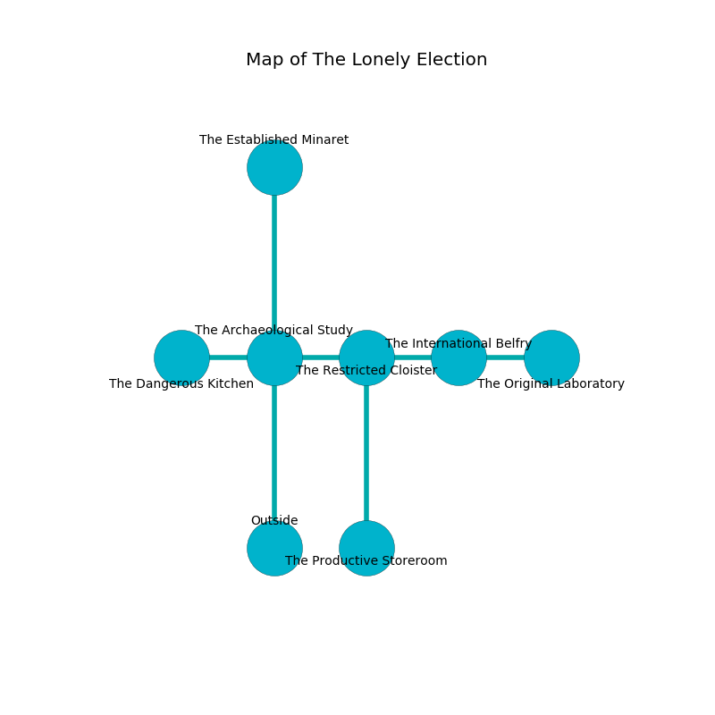

%Ruin Dogs

##The Lonely Election
###Overview
The Lonely Election is located under a haunted tree. Parts of The Lonely Election are cursed. A lunar eclipse is happening outside. It is occupied by Ogres. Rowena Tovar The Self-Indulgent, an Assassin is here. The Ogres are ruled by Rowena Tovar The Self-Indulgent. She  is founding a new religion. 

###Artifact
####Geuuof

Geuuof looks like a sharp prism. It is a bright yellow color. When rubbed it destroys others. 

###Locations

####the archaeological study
Blue lichens are decaying in a patch on the floor. There is a trap here. When activated, a magical rune will launch a poison needle. The air smells like candy here. 

* [Rowena Tovar The Self-Indulgent](#Rowena-Tovar-The-Self-Indulgent) is here.
* To the west a hazy artery connects to [the dangerous kitchen](#the-dangerous-kitchen).
* To the east a windy cavern connects to [the restricted cloister](#the-restricted-cloister).
* To the north a small cave connects to [the established minaret](#the-established-minaret).
* To the south is the entrance.

####the established minaret
The floor is sticky. The concrete walls are caving in. There are seven Half-Ogres and an Ogre here. The Ogres are crazy with bloodlust. 

* To the south a small cave opens to [the archaeological study](#the-archaeological-study).

####the restricted cloister
Red razorgrass is decaying in cracks in the floor. The air tastes like paper here. The floor is cluttered with rocks. 

* [Geuuof](#Geuuof) is here.
* To the west a windy cavern connects to [the archaeological study](#the-archaeological-study).
* To the east a dark corridor connects to [the international belfry](#the-international-belfry).
* To the south a hazy threshold leads to [the productive storeroom](#the-productive-storeroom).

####the international belfry
The crystal walls are caving in. The air smells like asparagus here. The floor is smooth. Gray lichens are sprouting in a patch on the floor. 

There is an engraving on a tablet written in common. 

> We are envious
>
> but never responsible
>
> [Geuuof](#Geuuof)
>
> deadly, sticky, valid
>
> stable and convenient
>

* There is an orb here.
* To the west a dark corridor leads to [the restricted cloister](#the-restricted-cloister).
* To the east a dripping gap opens to [the original laboratory](#the-original-laboratory).

####the original laboratory
The concrete walls are unsettled. The air smells like must here. 

* To the west a dripping gap leads to [the international belfry](#the-international-belfry).

####the dangerous kitchen
There are a Githyanki Warrior, a Manticore, a Myconid Adult, a Brown Bear, an Octopus, and a Polar Bear here. The floor is glossy. The stone walls are ruined. 

* To the east a hazy artery connects to [the archaeological study](#the-archaeological-study).

####the productive storeroom
The air tastes like grass here. Yellow mushrooms are sprouting from the walls. There are a Death Dog, a Dretch, a Carrion Crawler, a Lemure, a Rat, a Scarecrow, and a Wyvern here. 

* To the north a hazy threshold leads to [the restricted cloister](#the-restricted-cloister).

