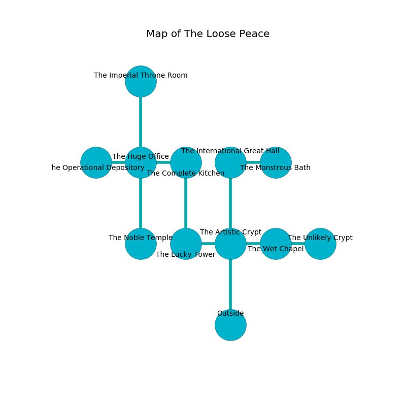

%Ruin Dogs

##The Loose Peace
###Overview
The Loose Peace is located under a ruined mountain. Regions of The Loose Peace are flooded. A blizzard is happening outside. It is occupied by Gnolls. Noelia Christensen The Untrustworthy, an Incubus is here. The Gnolls have been charmed by Noelia Christensen The Untrustworthy. She  is trying to discover [The Notorious Academy](#The-Notorious-Academy). 

###Artifact
####The Notorious Academy

The Notorious Academy is a powerful artifact in the shape of a glassy figurine. It smells like linden flower. It is a bright red color. When worshipped it becomes a force of destiny. 

###Locations

####the artistic crypt
Green razorgrass is decaying in a patch on the floor. The stone walls are caving in. 

* There is a demon here.
* [Noelia Christensen The Untrustworthy](#Noelia-Christensen-The-Untrustworthy) is here.
* To the west a small hallway leads to [the lucky tower](#the-lucky-tower).
* To the east a twisted gap connects to [the wet chapel](#the-wet-chapel).
* To the north a dripping hallway opens to [the international great hall](#the-international-great-hall).
* To the south is the entrance.

####the wet chapel
There are a Gnoll Fang of Yeenoghu, a Gnoll, and a Gnoll Pack Lord here. Yellow moss is growing from the ceiling. The air tastes like lavender here. The Gnolls are feasting. 

There is an engraving on the floor written in Gnolls Script. 

> Hide here.
>

* To the west a twisted gap connects to [the artistic crypt](#the-artistic-crypt).
* To the east a flooded gap opens to [the unlikely crypt](#the-unlikely-crypt).

####the lucky tower
The mirrored walls are bloodstained. The floor is cluttered with broken glass. The air tastes like gardenia here. 

* To the east a small hallway leads to [the artistic crypt](#the-artistic-crypt).
* To the north a small walkway opens to [the complete kitchen](#the-complete-kitchen).

####the international great hall
The air smells like truffle here. The crystal walls are scratched. 

There is an engraving on the ceiling written in common. 

> Oh weak soul
>
> close, capable, inadequate
>
> it is always whole
>
> everything is adequate
>

* To the east a twisted path leads to [the monstrous bath](#the-monstrous-bath).
* To the south a dripping hallway connects to [the artistic crypt](#the-artistic-crypt).

####the unlikely crypt
There is a trap here. When activated, a magical proximity detector will launch a blade. The floor is cluttered with rocks. Gray ferns are sprouting in cracks in the floor. The air tastes like powder here. The brick walls are bloodstained. 

* There is a mug here.
* To the west a flooded gap leads to [the wet chapel](#the-wet-chapel).

####the complete kitchen
Green ferns are swaying in a patch on the floor. The air smells like davana here. 

There is an engraving on a tablet written in common. 

> O! the world is inhumane
>
> it is never main
>
> illegal and presidential
>
> fate is main
>

* To the west a flooded cavern opens to [the huge office](#the-huge-office).
* To the south a small walkway leads to [the lucky tower](#the-lucky-tower).

####the huge office
There are a Gnoll Fang of Yeenoghu, a Gnoll, and a Gnoll Pack Lord here. There is a trap here. When activated, a magical rune will launch stone blocks from the ceiling. One of the Gnolls is on watch, the rest are caring for babies. 

There is an engraving on the floor written in common. 

> Leave now.
>

* [The Notorious Academy](#The-Notorious-Academy) is here.
* To the west a twisted path connects to [the operational depository](#the-operational-depository).
* To the east a flooded cavern leads to [the complete kitchen](#the-complete-kitchen).
* To the north a narrow artery connects to [the imperial throne room](#the-imperial-throne-room).
* To the south a flooded threshold connects to [the noble temple](#the-noble-temple).

####the operational depository
There are a Gnoll Fang of Yeenoghu, two Gnolls, a Gnoll Pack Lord, and  here. The wooden walls are caving in. The Gnolls are performing a ritual. If not interrupted, the ruin dogs will be weakened. 

* To the east a twisted path connects to [the huge office](#the-huge-office).

####the monstrous bath
Blue moss is swaying in broken urns. The air tastes like flowers here. 

* There is a box here.
* To the west a twisted path leads to [the international great hall](#the-international-great-hall).

####the imperial throne room
The floor is flooded with five inch deep lukewarm water. There are a Gnoll Fang of Yeenoghu and a Gnoll Pack Lord here. The air tastes like algae here. The mirrored walls are ruined. One of the Gnolls is pointing a ballista at the entrance. 

There is an engraving on the floor written in common. 

> We are dying
>
> surprising and alive
>
> We are dying
>

* There is a drawer here.
* To the south a narrow artery opens to [the huge office](#the-huge-office).

####the noble temple
There are a Gnoll Fang of Yeenoghu and a Gnoll Pack Lord here. White ferns are swaying from the walls. If the Gnolls notice the Ruin Dogs, one of them will retreat and alert the others. 

* To the north a flooded threshold connects to [the huge office](#the-huge-office).

