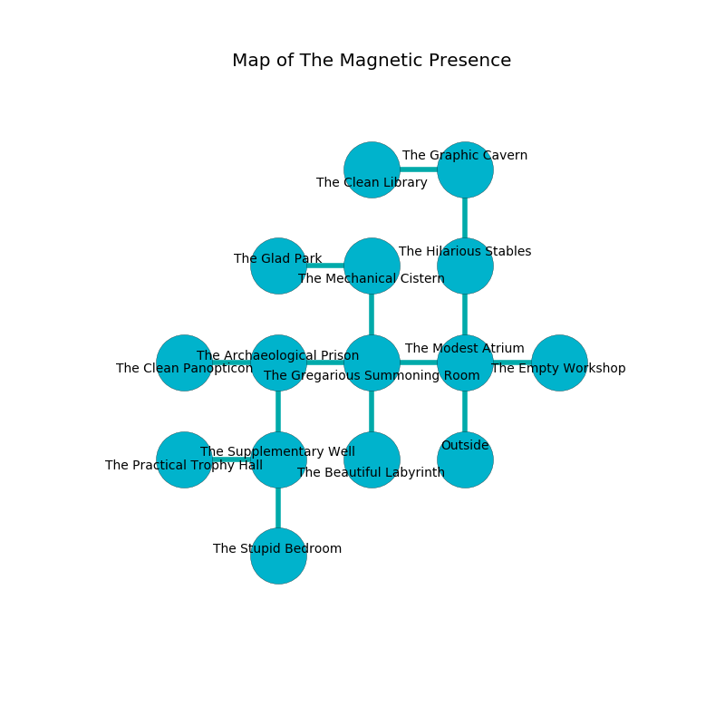

%Ruin Dogs

##The Magnetic Presence
###Overview
The Magnetic Presence is located on a cursed tree. Regions of The Magnetic Presence are unbearably cold. The ruin is collapsing slowly. It is occupied by Yuan-Ti. Lettie Irvin The Tactless, a Bandit is here. The Yuan-Ti are battling Lettie Irvin The Tactless. She  is trying to research [Bedfaes](#Bedfaes). 

###Artifact
####Bedfaes

Bedfaes is a powerful artifact in the shape of a transparent cube. Water slides around it. When rubbed it destroys itself. 

###Locations

####the modest atrium
The air smells like egg nog here. 

* To the west a long pathway opens to [the gregarious summoning room](#the-gregarious-summoning-room).
* To the east a dripping cavern connects to [the empty workshop](#the-empty-workshop).
* To the north a twisted cave opens to [the hilarious stables](#the-hilarious-stables).
* To the south is the entrance.

####the hilarious stables
The floor is bloodstained. Green mushrooms are swaying from the ceiling. The crystal walls are pristine. 

* There is a tree here.
* There is a bag here.
* To the north a twisted threshold opens to [the graphic cavern](#the-graphic-cavern).
* To the south a twisted cave leads to [the modest atrium](#the-modest-atrium).

####the gregarious summoning room
The air smells like feces here. 

* To the west a dark artery opens to [the archaeological prison](#the-archaeological-prison).
* To the east a long pathway opens to [the modest atrium](#the-modest-atrium).
* To the north a dark threshold leads to [the mechanical cistern](#the-mechanical-cistern).
* To the south a hazy artery opens to [the beautiful labyrinth](#the-beautiful-labyrinth).

####the archaeological prison

There is an engraving on the ceiling written in common. 

> Leave now.
>

* To the west a dripping gap leads to [the clean panopticon](#the-clean-panopticon).
* To the east a dark artery opens to [the gregarious summoning room](#the-gregarious-summoning-room).
* To the south a hazy gap connects to [the supplementary well](#the-supplementary-well).

####the mechanical cistern
There are a Silver Dragon Wyrmling, an Orc, and a Boar here. The air smells like acerola here. 

* To the west a flooded gap leads to [the glad park](#the-glad-park).
* To the south a dark threshold leads to [the gregarious summoning room](#the-gregarious-summoning-room).

####the clean panopticon
Green ferns are swaying in broken urns. The floor is sticky. The wooden walls are unsettled. There are a Magma Mephit, a Mastiff, a Kenku, and a Giant Boar here. 

* To the east a dripping gap connects to [the archaeological prison](#the-archaeological-prison).

####the graphic cavern
There are a Stirge, a Will-O’-Wisp, a Giant Sea Horse, and a Scout here. 

There is an engraving on a stone written in common. 

> O dire we
>
> but never married
>
> valid, mathematical, free
>
> nothing is varied
>

* To the west a windy path opens to [the clean library](#the-clean-library).
* To the south a twisted threshold opens to [the hilarious stables](#the-hilarious-stables).

####the supplementary well
The floor is sticky. Blue moss is sprouting from the ceiling. The air tastes like whiskey here. 

* [Bedfaes](#Bedfaes) is here.
* To the west a flooded walkway connects to [the practical trophy hall](#the-practical-trophy-hall).
* To the north a hazy gap connects to [the archaeological prison](#the-archaeological-prison).
* To the south a flooded passageway connects to [the stupid bedroom](#the-stupid-bedroom).

####the clean library

* To the east a windy path leads to [the graphic cavern](#the-graphic-cavern).

####the practical trophy hall
The air tastes like vegetables here. There are an Ogre, a Smoke Mephit, and a Piercer here. 

* To the east a flooded walkway opens to [the supplementary well](#the-supplementary-well).

####the beautiful labyrinth
The air tastes like dill here. There are two Yuan-Ti Purebloods here. One of the Yuan-Ti is working a mechanism that can lock the exits. 

* There is a hook here.
* There is a cart here.
* There is an eye here.
* [Lettie Irvin The Tactless](#Lettie-Irvin-The-Tactless) is here.
* To the north a hazy artery opens to [the gregarious summoning room](#the-gregarious-summoning-room).

####the empty workshop
There are two Yuan-Ti Purebloods here. The stone walls are caving in. The floor is bloodstained. Red moss is sprouting in a patch on the floor. The Yuan-Ti are willing to negotiate. 

* To the west a dripping cavern connects to [the modest atrium](#the-modest-atrium).

####the glad park
The mirrored walls are pristine. The air tastes like boysenberry here. 

* To the east a flooded gap connects to [the mechanical cistern](#the-mechanical-cistern).

####the stupid bedroom
There is an Old Faerie Dragon here. The floor is glossy. Green moss is decaying in a patch on the floor. 

There is an engraving on a tablet written in common. 

> I am lost in The Magnetic Presence.
>
> I thought about cowering.
>

* To the north a flooded passageway opens to [the supplementary well](#the-supplementary-well).

