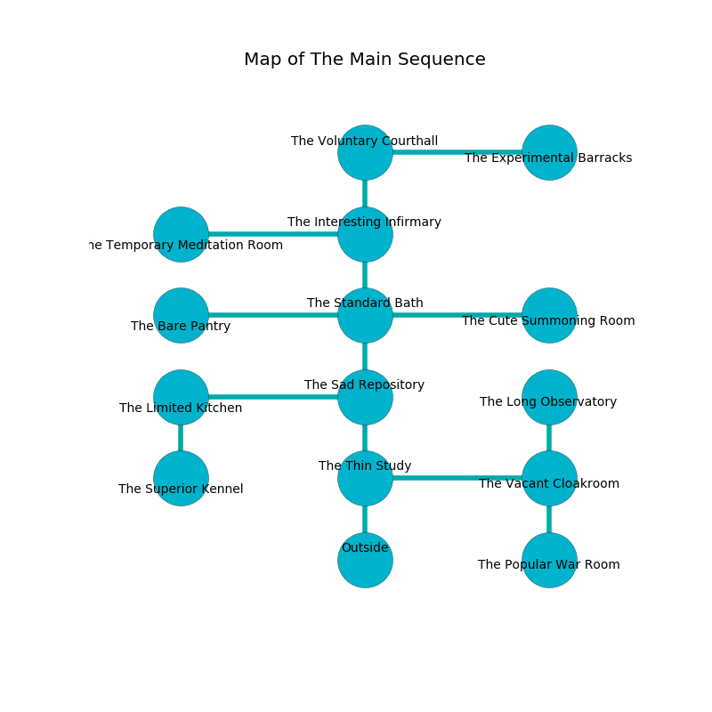

%Ruin Dogs

##The Main Sequence
###Overview
The Main Sequence is located on an alien city. Regions of The Main Sequence are cursed. The ruin is sinking into the earth. It is occupied by Humans. Bobbie Abernathy The Compulsive, a Fire Giant is here. The Humans are the slaves of Bobbie Abernathy The Compulsive. He  is founding a new religion. 

###Artifact
####Ellaedaeum Cumgoiaeum

Ellaedaeum Cumgoiaeum is a powerful artifact in the shape of a smooth spear. It is a sickly brown color. It smells like tomato leaf. Air bends from it. When smelled it frightens children. 

###Locations

####the thin study
The crystal walls are scratched. There are a Cult Fanatic, a Veteran, a Knight, and a Priest here. One of the Humans is on watch, the rest are drunk. 

* To the east a dripping opening leads to [the vacant cloakroom](#the-vacant-cloakroom).
* To the north a long hallway opens to [the sad repository](#the-sad-repository).
* To the south is the entrance.

####the sad repository
The floor is glossy. The air smells like paint here. 

There is an engraving on the wall written in common. 

> I could not try running.
>

* There is a breastplate here.
* To the west a hazy cave connects to [the limited kitchen](#the-limited-kitchen).
* To the north a hazy passageway connects to [the standard bath](#the-standard-bath).
* To the south a long hallway connects to [the thin study](#the-thin-study).

####the standard bath
The floor is sticky. 

There is an engraving on the wall written in Humans Script. 

> O our fate is inhumane
>
> official and cheap
>
> financial and main
>
> death is steep
>

* There is a bottle here.
* To the west a long hall leads to [the bare pantry](#the-bare-pantry).
* To the east a torchlit gap connects to [the cute summoning room](#the-cute-summoning-room).
* To the north a dripping corridor connects to [the interesting infirmary](#the-interesting-infirmary).
* To the south a hazy passageway leads to [the sad repository](#the-sad-repository).

####the interesting infirmary
The brick walls are pristine. 

* To the west a narrow pathway connects to [the temporary meditation room](#the-temporary-meditation-room).
* To the north a torchlit corridor opens to [the voluntary courthall](#the-voluntary-courthall).
* To the south a dripping corridor leads to [the standard bath](#the-standard-bath).

####the voluntary courthall
White ferns are growing from the walls. The floor is flooded with three inch deep cool water. 

* [Ellaedaeum Cumgoiaeum](#Ellaedaeum-Cumgoiaeum) is here.
* To the east a windy artery connects to [the experimental barracks](#the-experimental-barracks).
* To the south a torchlit corridor opens to [the interesting infirmary](#the-interesting-infirmary).

####the cute summoning room
The floor is smooth. The air tastes like hay here. Yellow razorgrass is swaying in a patch on the floor. 

* To the west a torchlit gap leads to [the standard bath](#the-standard-bath).

####the vacant cloakroom
Blue ferns are growing in cracks in the floor. The mirrored walls are scratched. 

* To the west a dripping opening opens to [the thin study](#the-thin-study).
* To the north a dark gap opens to [the long observatory](#the-long-observatory).
* To the south a twisted cave opens to [the popular war Room](#the-popular-war-Room).

####the long observatory
The air smells like cauliflower here. 

* To the south a dark gap opens to [the vacant cloakroom](#the-vacant-cloakroom).

####the temporary meditation room
The floor is glossy. The air tastes like cashew here. Blue ferns are sprouting in broken urns. 

There is an engraving on the wall written in common. 

> I am seeking [Ellaedaeum Cumgoiaeum](#Ellaedaeum-Cumgoiaeum).
>
> I thought about cowering.
>

* There is a door here.
* To the east a narrow pathway opens to [the interesting infirmary](#the-interesting-infirmary).

####the popular war Room

* To the north a twisted cave connects to [the vacant cloakroom](#the-vacant-cloakroom).

####the bare pantry
Gray mushrooms are growing in cracks in the floor. The obsidion walls are caving in. 

* [Bobbie Abernathy The Compulsive](#Bobbie-Abernathy-The-Compulsive) is here.
* To the east a long hall connects to [the standard bath](#the-standard-bath).

####the limited kitchen
There is a trap here. When activated, a magical rune will fire an acid arrow. The obsidion walls are ruined. 

* To the east a hazy cave connects to [the sad repository](#the-sad-repository).
* To the south a long gap connects to [the superior kennel](#the-superior-kennel).

####the superior kennel
White ferns are swaying from the ceiling. The floor is cluttered with ashes. The air tastes like seed here. There are a Mage, a Tribal Warrior, a Knight, two Acolytes, and  here. The Humans are willing to negotiate. 

There is an engraving on a tablet written in Humans Script. 

> I am young.
>

* To the north a long gap opens to [the limited kitchen](#the-limited-kitchen).

####the experimental barracks
There are a Cultist, a Mage, two Bandit Captains, a Commoner, and  here. The floor is sticky. The air smells like watermelon here. The stone walls are pristine. White moss is growing in a patch on the floor. The Humans are defending this room from intruders. 

There is an engraving on a monolith written in Humans Script. 

> Maybe try running.
>

* To the west a windy artery opens to [the voluntary courthall](#the-voluntary-courthall).

