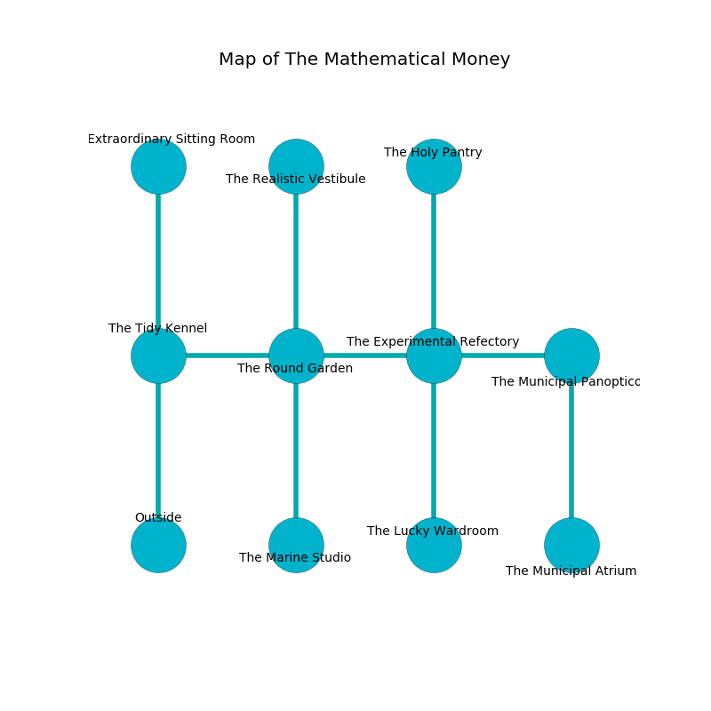

%Ruin Dogs

##The Mathematical Money
###Overview
The Mathematical Money is located in a haunted rift. Some rooms of The Mathematical Money are inaccessible. The ruin is larger on the inside than the outside. It is occupied by Githyanki. Deloris Seaton The Jealous, a Veteran is here. The Githyanki are the minions of Deloris Seaton The Jealous. She  is founding a new religion. 

###Artifact
####Huehcaadaf Aemcfaeia

Huehcaadaf Aemcfaeia looks like a transparent prism. It is a sickly green color. When thrown it becomes a shielding force. 

###Locations

####the tidy kennel
There are an Ogre Zombie and a Priest here. 

* To the east a hazy gap opens to [the round garden](#the-round-garden).
* To the north a small cave leads to [the extraordinary sitting Room](#the-extraordinary-sitting-Room).
* To the south is the entrance.

####the extraordinary sitting Room
Red ferns are growing in cracks in the floor. There are two Githyanki Warriors here. If the Githyanki notice the Ruin Dogs, one of them will retreat and alert [Deloris Seaton](#Deloris-Seaton). 

There is an engraving on a stone written in Githyanki Script. 

> A card is a pool
>
> marine, classical, married
>
> parental, musical, mutual
>
> A cushion is a mutation
>
> vigorous and peaceful
>
> A ring is a labour
>
> civic, cultural, privileged
>

* To the south a small cave opens to [the tidy kennel](#the-tidy-kennel).

####the round garden
The air tastes like mahogany here. The metallic walls are bloodstained. 

* There is a board here.
* To the west a hazy gap opens to [the tidy kennel](#the-tidy-kennel).
* To the east a twisted passageway connects to [the experimental refectory](#the-experimental-refectory).
* To the north a long passageway leads to [the realistic vestibule](#the-realistic-vestibule).
* To the south a hazy cavern leads to [the marine studio](#the-marine-studio).

####the experimental refectory
The air smells like acai here. There are two Githyanki Warriors here. Red ferns are growing from the ceiling. One of the Githyanki is working a mechanism that can launch acid at the Ruin Dogs. 

* [Huehcaadaf Aemcfaeia](#Huehcaadaf-Aemcfaeia) is here.
* To the west a twisted passageway opens to [the round garden](#the-round-garden).
* To the east a hazy corridor leads to [the municipal panopticon](#the-municipal-panopticon).
* To the north a windy hall opens to [the holy pantry](#the-holy-pantry).
* To the south a torchlit walkway connects to [the lucky wardroom](#the-lucky-wardroom).

####the realistic vestibule
The air smells like sandalwood here. 

* To the south a long passageway leads to [the round garden](#the-round-garden).

####the marine studio
The concrete walls are caving in. The air tastes like lily here. 

* To the north a hazy cavern opens to [the round garden](#the-round-garden).

####the holy pantry
The air tastes like rose here. The floor is glossy. Blue lichens are growing in broken urns. 

* To the south a windy hall connects to [the experimental refectory](#the-experimental-refectory).

####the municipal panopticon
The obsidion walls are covered in mold. The air tastes like molasses here. 

* To the west a hazy corridor connects to [the experimental refectory](#the-experimental-refectory).
* To the south a dripping cavern opens to [the municipal atrium](#the-municipal-atrium).

####the municipal atrium
The brick walls are caving in. The air tastes like mushroom here. The floor is smooth. 

* [Deloris Seaton The Jealous](#Deloris-Seaton-The-Jealous) is here.
* To the north a dripping cavern connects to [the municipal panopticon](#the-municipal-panopticon).

####the lucky wardroom
The floor is glossy. 

* To the north a torchlit walkway leads to [the experimental refectory](#the-experimental-refectory).

