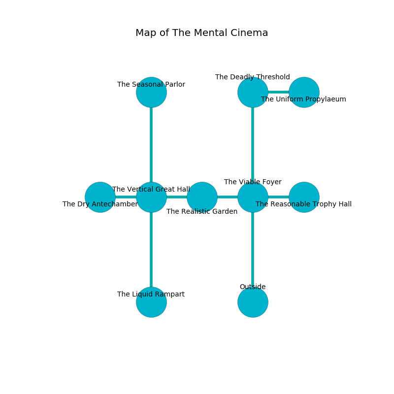

%Ruin Dogs

##The Mental Cinema
###Overview
The Mental Cinema is located in an obsidion city. Some rooms of it are somewhat cold. The ruin is larger on the inside than the outside. It is occupied by Demons. Alfonso Layne The Moody, a Mind Flayer Arcanist is here. The Demons worship Alfonso Layne The Moody. He  is trying to research [Efbcmeaef Eocdaeum](#Efbcmeaef-Eocdaeum). 

###Artifact
####Efbcmeaef Eocdaeum

Efbcmeaef Eocdaeum is a powerful artifact in the shape of a cold spear. It is a light blue color. It smells like roasted hazelnut. When touched it changes the past. 

###Locations

####the viable foyer
The air smells like sulfur here. The floor is sticky. 

* [Alfonso Layne The Moody](#Alfonso-Layne-The-Moody) is here.
* To the west a torchlit walkway connects to [the realistic garden](#the-realistic-garden).
* To the east a twisted cave connects to [the reasonable trophy hall](#the-reasonable-trophy-hall).
* To the north a dripping walkway leads to [the deadly threshold](#the-deadly-threshold).
* To the south is the entrance.

####the realistic garden
The floor is glossy. There are an Incubus, a Succubus, and a Bearded Devil here. The metallic walls are bloodstained. One of the Demons is on watch, the rest are meditating. 

There is an engraving on the ceiling written in Demons Script. 

> I tried running.
>

* To the west a flooded hall opens to [the vertical great hall](#the-vertical-great-hall).
* To the east a torchlit walkway opens to [the viable foyer](#the-viable-foyer).

####the vertical great hall
There are an Ettin, a Blue Dragon Wyrmling, a Kenku, and a Priest here. 

* There is a bottle here.
* There is a scissors here.
* [Efbcmeaef Eocdaeum](#Efbcmeaef-Eocdaeum) is here.
* To the west a flooded cave connects to [the dry antechamber](#the-dry-antechamber).
* To the east a flooded hall opens to [the realistic garden](#the-realistic-garden).
* To the north a windy gap leads to [the seasonal parlor](#the-seasonal-parlor).
* To the south a twisted walkway leads to [the liquid rampart](#the-liquid-rampart).

####the seasonal parlor
Yellow moss is sprouting in a patch on the floor. The glass walls are unsettled. 

* To the south a windy gap leads to [the vertical great hall](#the-vertical-great-hall).

####the reasonable trophy hall
The floor is bloodstained. The mirrored walls are scratched. 

* There is a finger here.
* To the west a twisted cave opens to [the viable foyer](#the-viable-foyer).

####the deadly threshold
The floor is glossy. Green razorgrass is swaying in cracks in the floor. 

* To the east a hazy hall leads to [the uniform propylaeum](#the-uniform-propylaeum).
* To the south a dripping walkway connects to [the viable foyer](#the-viable-foyer).

####the liquid rampart
White razorgrass is sprouting from the ceiling. 

There is an engraving on a stone written in common. 

> I thought about dying.
>

* To the north a twisted walkway connects to [the vertical great hall](#the-vertical-great-hall).

####the uniform propylaeum
Red moss is decaying in a patch on the floor. The crystal walls are covered in mold. The air tastes like gardenia here. There are an Awakened Tree, a Minotaur, a Myconid Sovereign, a Blood Hawk, and a Dire Wolf here. 

* There is a scissors here.
* To the west a hazy hall leads to [the deadly threshold](#the-deadly-threshold).

####the dry antechamber
The floor is smooth. Green mushrooms are sprouting in cracks in the floor. 

There is an engraving on the ceiling written in common. 

> O! meak fate
>
> incredible, religious, late
>
> it is always spatial
>
> death is racial
>

* To the east a flooded cave connects to [the vertical great hall](#the-vertical-great-hall).

