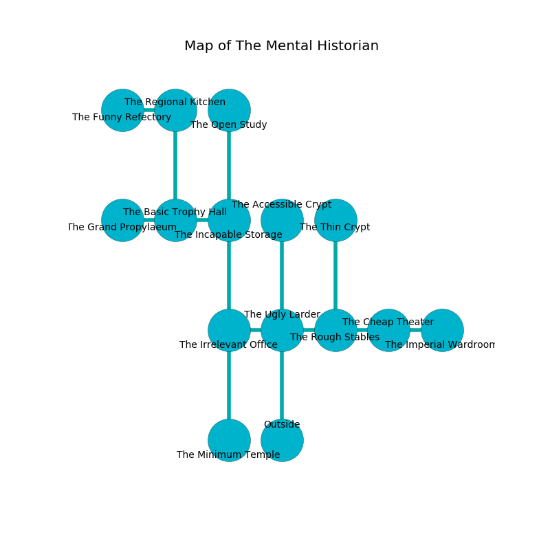

%Ruin Dogs

##The Mental Historian
###Overview
The Mental Historian is located in an alien plain. Some rooms of it are flooded. A massive storm is happening outside. It is occupied by Deep Gnomes. Wyatt Dehart The Tactless, a Cloud Giant is here. The Deep Gnomes are the soldiers of Wyatt Dehart The Tactless. He  is founding a new religion. 

###Artifact
####The Relative Hallway

The Relative Hallway looks like a sharp figurine. When carried it burns the mind. 

###Locations

####the ugly larder
There are a Silver Dragon Wyrmling and a Fire Giant here. The obsidion walls are bloodstained. 

* There is a ghost here.
* To the west a torchlit opening opens to [the irrelevant office](#the-irrelevant-office).
* To the east a hazy walkway opens to [the rough stables](#the-rough-stables).
* To the north a dark pathway connects to [the accessible crypt](#the-accessible-crypt).
* To the south is the entrance.

####the irrelevant office

There is an engraving on a stone written in Deep Gnomes Script. 

> All of us are dying
>
> infinite, impressive, loyal
>

* To the east a torchlit opening opens to [the ugly larder](#the-ugly-larder).
* To the north a flooded artery leads to [the incapable storage](#the-incapable-storage).
* To the south a flooded pathway leads to [the minimum temple](#the-minimum-temple).

####the accessible crypt
The wooden walls are caving in. Yellow lichens are decaying from the ceiling. The air tastes like parsley here. 

* There is a hammer here.
* To the south a dark pathway opens to [the ugly larder](#the-ugly-larder).

####the rough stables
There are a Rhinoceros, a Wererat, an Unicorn, and a Plesiosaurus here. 

* To the west a hazy walkway leads to [the ugly larder](#the-ugly-larder).
* To the east a long corridor leads to [the cheap theater](#the-cheap-theater).
* To the north a narrow hallway leads to [the thin crypt](#the-thin-crypt).

####the minimum temple
There are a Young Silver Dragon, a Commoner, a Rhinoceros, a Piercer, a Bat, and a Shambling Mound here. Yellow ferns are sprouting from the walls. The mirrored walls are unsettled. There is a trap here. When activated, a magical proximity detector will make the walls close in. The air tastes like spice here. 

* To the north a flooded pathway opens to [the irrelevant office](#the-irrelevant-office).

####the incapable storage
The wooden walls are bloodstained. 

* There is an orb here.
* [Wyatt Dehart The Tactless](#Wyatt-Dehart-The-Tactless) is here.
* To the west a narrow artery connects to [the basic trophy hall](#the-basic-trophy-hall).
* To the north a hazy hallway opens to [the open study](#the-open-study).
* To the south a flooded artery opens to [the irrelevant office](#the-irrelevant-office).

####the basic trophy hall
There are a Drow, a Young Remorhaz, a Mezzoloth, and a Gargoyle here. The air tastes like naphthyl here. The floor is cluttered with bones. 

* To the west a long path connects to [the grand propylaeum](#the-grand-propylaeum).
* To the east a narrow artery connects to [the incapable storage](#the-incapable-storage).
* To the north a hazy threshold connects to [the regional kitchen](#the-regional-kitchen).

####the thin crypt
The obsidion walls are bloodstained. 

* To the south a narrow hallway opens to [the rough stables](#the-rough-stables).

####the regional kitchen
There are a Red Dragon Wyrmling, a Swarm of Rats, a Gladiator, a Giant Goat, a Giant Bat, and a Bone Naga here. The floor is bloodstained. The air smells like geranium here. 

* To the west a small corridor opens to [the funny refectory](#the-funny-refectory).
* To the south a hazy threshold opens to [the basic trophy hall](#the-basic-trophy-hall).

####the open study
Gray mushrooms are decaying from the ceiling. The air smells like allspice here. 

There is an engraving on the wall written in common. 

> O everything is inhumane
>
> lazy and normal
>
> genuine, sound, main
>
> the world is informal
>

* There is a shoe here.
* To the south a hazy hallway connects to [the incapable storage](#the-incapable-storage).

####the grand propylaeum
The floor is cluttered with shells. Gray mushrooms are growing from the ceiling. 

There is an engraving on a monolith written in common. 

> Oh pitiful fate
>
> it is never geological
>
> fat, commercial, straight
>
> nothing is logical
>

* To the east a long path opens to [the basic trophy hall](#the-basic-trophy-hall).

####the funny refectory
There are a Kuo-Toa Whip, an Aarakocra, a Crocodile, a Gorgon, a Warhorse, and an Ettin here. Yellow moss is sprouting in cracks in the floor. There is a trap here. When activated, a magical proximity detector will collapse a column. The floor is flooded with five inch deep lukewarm water. The air smells like egg nog here. The concrete walls are ruined. 

There is an engraving on a monolith written in Deep Gnomes Script. 

> I am powerful.
>

* To the east a small corridor leads to [the regional kitchen](#the-regional-kitchen).

####the cheap theater
There are a Hunter Shark, a Water Elemental, a Stone Golem, a Grick, and a Constrictor Snake here. The air tastes like oats here. The stone walls are ruined. There is a trap here. When activated, a magical sound detector will swing a tripping chain. 

There is an engraving on the floor written in Deep Gnomes Script. 

> Poor me! sorry fate
>
> talkative and loud
>
> always straight
>
> cruelty is proud
>

* [The Relative Hallway](#The-Relative-Hallway) is here.
* To the west a long corridor opens to [the rough stables](#the-rough-stables).
* To the east a twisted hallway opens to [the imperial wardroom](#the-imperial-wardroom).

####the imperial wardroom
The floor is cluttered with shells. The air tastes like cognac here. 

There is an engraving on the ceiling written in common. 

> [The Relative Hallway](#The-Relative-Hallway)
>
> but never organic
>
> ever bitter
>
> [The Relative Hallway](#The-Relative-Hallway)
>
> black and traditional
>
> [The Relative Hallway](#The-Relative-Hallway)
>
> nervous, regional, precise
>
> yet incongruous
>
> An arm is a shelter
>
> yet open
>

* There is a sock here.
* To the west a twisted hallway connects to [the cheap theater](#the-cheap-theater).

