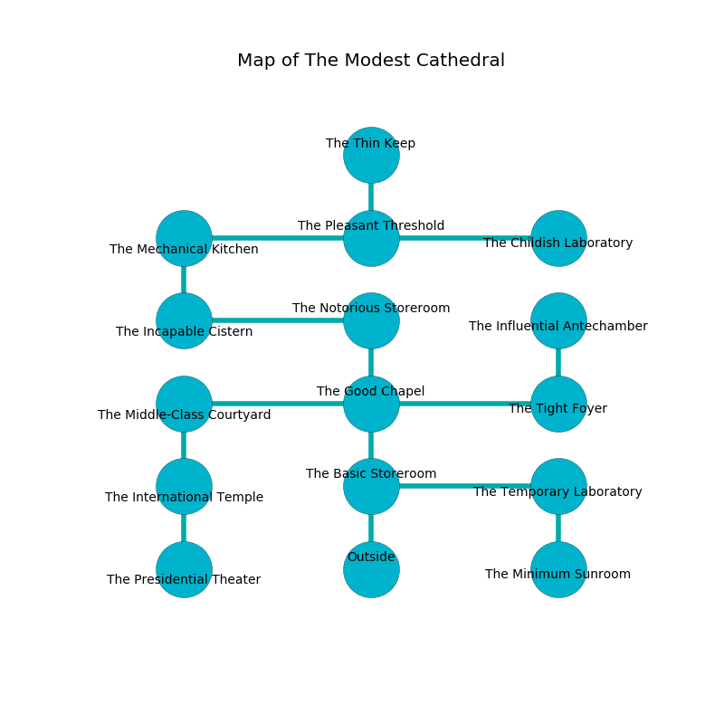

%Ruin Dogs

##The Modest Cathedral
###Overview
The Modest Cathedral is located under a flooded mountain. Some rooms of it are unbearably cold. The ruin is collapsing slowly. It is occupied by Sahuagins. Woodrow Crouse The Selfish, a Cambion is here. The Sahuagins are the slaves of Woodrow Crouse The Selfish. He  is trying to exploit [Imaegd](#Imaegd). 

###Artifact
####Imaegd

Imaegd has the form of a wet sphere. It smells like huckleberry. Fire flows from it. When worshipped it flies into the air. 

###Locations

####the basic storeroom
The air smells like allspice here. 

There is an engraving on the ceiling written in common. 

> I am fleeing this place.
>
> I thought about fighting.
>

* To the east a long threshold leads to [the temporary laboratory](#the-temporary-laboratory).
* To the north a windy corridor leads to [the good chapel](#the-good-chapel).
* To the south is the entrance.

####the good chapel
The crystal walls are covered in mold. There are three Sahuagin Priestesses here. The Sahuagins are crazy with bloodlust. 

* To the west a narrow pathway connects to [the middle-class courtyard](#the-middle-class-courtyard).
* To the east a flooded cave connects to [the tight foyer](#the-tight-foyer).
* To the north a flooded passageway connects to [the notorious storeroom](#the-notorious-storeroom).
* To the south a windy corridor opens to [the basic storeroom](#the-basic-storeroom).

####the notorious storeroom
The air tastes like blueberry here. 

* There is a spoon here.
* To the west a flooded hallway leads to [the incapable cistern](#the-incapable-cistern).
* To the south a flooded passageway leads to [the good chapel](#the-good-chapel).

####the temporary laboratory
The air smells like coumarinic here. Yellow mushrooms are swaying in cracks in the floor. The floor is sticky. 

There is an engraving on a monolith written in Sahuagins Script. 

> I discovered The Modest Cathedral.
>
> Treasure here.
>

* To the west a long threshold leads to [the basic storeroom](#the-basic-storeroom).
* To the south a dripping path leads to [the minimum sunroom](#the-minimum-sunroom).

####the middle-class courtyard
There is a trap here. When activated, a pressure plate will extend a spring loaded spear. The floor is cluttered with ashes. 

* To the east a narrow pathway opens to [the good chapel](#the-good-chapel).
* To the south a dark hall leads to [the international temple](#the-international-temple).

####the incapable cistern

* To the east a flooded hallway connects to [the notorious storeroom](#the-notorious-storeroom).
* To the north a dark passageway leads to [the mechanical kitchen](#the-mechanical-kitchen).

####the tight foyer
The floor is glossy. White ferns are sprouting in a patch on the floor. The air smells like wax here. 

* To the west a flooded cave leads to [the good chapel](#the-good-chapel).
* To the north a dark passageway opens to [the influential antechamber](#the-influential-antechamber).

####the influential antechamber
The floor is bloodstained. The crystal walls are pristine. Green lichens are decaying in broken urns. The air tastes like cotton candy here. 

* To the south a dark passageway opens to [the tight foyer](#the-tight-foyer).

####the international temple
Gray razorgrass is swaying in cracks in the floor. 

* To the north a dark hall connects to [the middle-class courtyard](#the-middle-class-courtyard).
* To the south a long pathway opens to [the presidential theater](#the-presidential-theater).

####the mechanical kitchen
Red ferns are sprouting from the walls. 

* To the east a twisted hallway leads to [the pleasant threshold](#the-pleasant-threshold).
* To the south a dark passageway opens to [the incapable cistern](#the-incapable-cistern).

####the minimum sunroom
The floor is smooth. The air smells like jam here. The concrete walls are bloodstained. 

* To the north a dripping path connects to [the temporary laboratory](#the-temporary-laboratory).

####the pleasant threshold
There are a Hippogriff, a Giant Weasel, a Giant Goat, a Hook Horror, a Flesh Golem, and a Deer here. The metallic walls are pristine. 

* [Imaegd](#Imaegd) is here.
* To the west a twisted hallway opens to [the mechanical kitchen](#the-mechanical-kitchen).
* To the east a dark passageway leads to [the childish laboratory](#the-childish-laboratory).
* To the north a small hallway opens to [the thin keep](#the-thin-keep).

####the childish laboratory
The floor is smooth. 

There is an engraving on a monolith written in Sahuagins Script. 

> I lost [Imaegd](#Imaegd).
>

* There is a bee here.
* To the west a dark passageway connects to [the pleasant threshold](#the-pleasant-threshold).

####the presidential theater

* There is a fly here.
* To the north a long pathway connects to [the international temple](#the-international-temple).

####the thin keep
Green moss is swaying from the walls. The floor is bloodstained. 

* [Woodrow Crouse The Selfish](#Woodrow-Crouse-The-Selfish) is here.
* To the south a small hallway opens to [the pleasant threshold](#the-pleasant-threshold).

