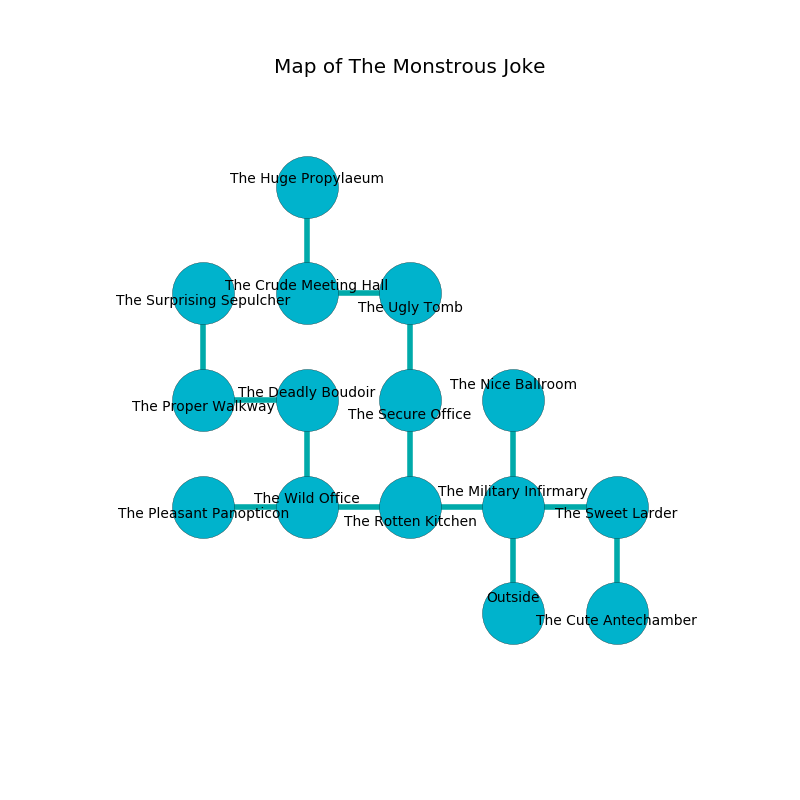

%Ruin Dogs

##The Monstrous Joke
###Overview
The Monstrous Joke is constructed on an alien tree. Some areas of The Monstrous Joke are inaccessible. A solar eclipse is happening outside. It is occupied by Dryads. Kendall Nielsen The Silly, a Mind Flayer Arcanist is here. The Dryads are the minions of Kendall Nielsen The Silly. He  is trying to research [Ded](#Ded). 

###Artifact
####Ded

Ded looks like a cold blade. When eaten it turns surrounding objects to ashes. 

###Locations

####the military infirmary

* To the west a narrow cavern connects to [the rotten kitchen](#the-rotten-kitchen).
* To the east a flooded cavern leads to [the sweet larder](#the-sweet-larder).
* To the north a hazy threshold connects to [the nice ballroom](#the-nice-ballroom).
* To the south is the entrance.

####the rotten kitchen
The air tastes like salt here. 

* To the west a twisted hallway connects to [the wild office](#the-wild-office).
* To the east a narrow cavern opens to [the military infirmary](#the-military-infirmary).
* To the north a hazy threshold opens to [the secure office](#the-secure-office).

####the wild office
There are a Wererat, a Hawk, and a Barbed Devil here. Blue razorgrass is growing in a patch on the floor. 

* To the west a narrow corridor leads to [the pleasant panopticon](#the-pleasant-panopticon).
* To the east a twisted hallway leads to [the rotten kitchen](#the-rotten-kitchen).
* To the north a narrow artery connects to [the deadly boudoir](#the-deadly-boudoir).

####the secure office
The air smells like autumn here. 

* To the north a twisted passageway connects to [the ugly tomb](#the-ugly-tomb).
* To the south a hazy threshold leads to [the rotten kitchen](#the-rotten-kitchen).

####the ugly tomb

There is an engraving on the wall written in Dryads Script. 

> I worship [Ded](#Ded).
>
> A trap ahead.
>

* To the west a torchlit pathway connects to [the crude meeting hall](#the-crude-meeting-hall).
* To the south a twisted passageway connects to [the secure office](#the-secure-office).

####the sweet larder
Gray ferns are swaying in a patch on the floor. 

* To the west a flooded cavern leads to [the military infirmary](#the-military-infirmary).
* To the south a small artery opens to [the cute antechamber](#the-cute-antechamber).

####the crude meeting hall
White mushrooms are swaying from the ceiling. The air tastes like feces here. 

* To the east a torchlit pathway connects to [the ugly tomb](#the-ugly-tomb).
* To the north a hazy threshold connects to [the huge propylaeum](#the-huge-propylaeum).

####the pleasant panopticon
The air tastes like ylang here. 

* To the east a narrow corridor opens to [the wild office](#the-wild-office).

####the huge propylaeum
The wooden walls are bloodstained. The floor is smooth. Yellow razorgrass is decaying in broken urns. 

* To the south a hazy threshold connects to [the crude meeting hall](#the-crude-meeting-hall).

####the cute antechamber
The floor is sticky. There are a Crab, an Elephant, a Boar, a Myconid Adult, a Goblin, a Giant Elk, and a Scorpion here. 

There is an engraving on a stone written in common. 

> Oh meak we
>
> yet never free
>
> it is always valid
>
> sadness is free
>

* To the north a small artery connects to [the sweet larder](#the-sweet-larder).

####the nice ballroom
The obsidion walls are bloodstained. White lichens are decaying from the walls. There is a trap here. When activated, a magical rune will fire an acid arrow. 

* To the south a hazy threshold connects to [the military infirmary](#the-military-infirmary).

####the deadly boudoir
The floor is flooded with two inch deep cool water. The air tastes like bacon here. Yellow ferns are decaying from the walls. The concrete walls are ruined. 

There is an engraving on a stone written in common. 

> Poor me! our fate is inhumane
>
> it is always main
>
> but never funny
>
> sadness is main
>

* There is a seed here.
* There is a breastplate here.
* [Kendall Nielsen The Silly](#Kendall-Nielsen-The-Silly) is here.
* To the west a dark walkway connects to [the proper walkway](#the-proper-walkway).
* To the south a narrow artery leads to [the wild office](#the-wild-office).

####the proper walkway
White moss is sprouting in cracks in the floor. 

* There is a sock here.
* There is an amulet here.
* There is a baby here.
* There is a roof here.
* There is a picture here.
* There is a whip here.
* [Ded](#Ded) is here.
* To the east a dark walkway leads to [the deadly boudoir](#the-deadly-boudoir).
* To the north a dark cave leads to [the surprising sepulcher](#the-surprising-sepulcher).

####the surprising sepulcher
Gray lichens are sprouting in a patch on the floor. There are seven Dryads here. There is a trap here. When activated, a pressure plate will make the ceiling slowly lower. The brick walls are scratched. The Dryads are performing a ritual. If not interrupted, the Dryads will become more powerful. 

* To the south a dark cave connects to [the proper walkway](#the-proper-walkway).

