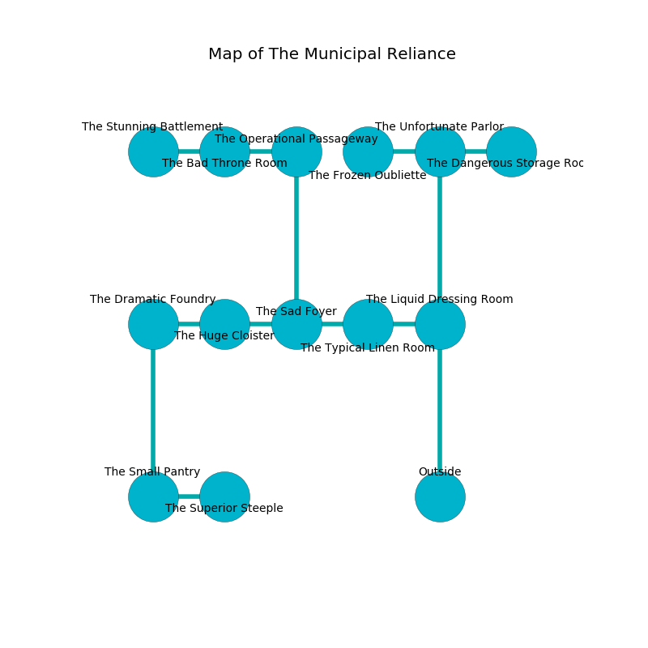

%Ruin Dogs

##The Municipal Reliance
###Overview
The Municipal Reliance is located on a crystal plain. Some areas of it are somewhat cold. A windstorm is happening outside. It is occupied by Thri-Kreens. Sherman Spradlin The Vulgar, a Bulette is here. The Thri-Kreens are the minions of Sherman Spradlin The Vulgar. He  is trying to use [Dum](#Dum). 

###Artifact
####Dum

Dum looks like a transparent spear. Water incinerates away from it. When smelled it grants psychic powers. 

###Locations

####the liquid dressing room
The floor is sticky. Green ferns are decaying from the walls. 

* To the west a windy path opens to [the typical linen room](#the-typical-linen-room).
* To the north a narrow passageway leads to [the unfortunate parlor](#the-unfortunate-parlor).
* To the south is the entrance.

####the unfortunate parlor
The air smells like hyssop here. 

* There is a card here.
* There is a bell here.
* [Dum](#Dum) is here.
* To the west a windy hall opens to [the frozen oubliette](#the-frozen-oubliette).
* To the east a flooded cave connects to [the dangerous storage room](#the-dangerous-storage-room).
* To the south a narrow passageway opens to [the liquid dressing room](#the-liquid-dressing-room).

####the typical linen room
Blue lichens are sprouting from the ceiling. 

* There is a wall here.
* To the west a flooded gap leads to [the sad foyer](#the-sad-foyer).
* To the east a windy path leads to [the liquid dressing room](#the-liquid-dressing-room).

####the sad foyer
The metallic walls are unsettled. The floor is glossy. 

* To the west a narrow opening leads to [the huge cloister](#the-huge-cloister).
* To the east a flooded gap opens to [the typical linen room](#the-typical-linen-room).
* To the north a long walkway connects to [the operational passageway](#the-operational-passageway).

####the operational passageway
There are six Thri-Kreens here. The brick walls are bloodstained. The air smells like spice here. The Thri-Kreens are willing to negotiate. 

* There is a seed here.
* To the west a hazy cavern connects to [the bad throne room](#the-bad-throne-room).
* To the south a long walkway connects to [the sad foyer](#the-sad-foyer).

####the huge cloister
Red moss is growing from the walls. The air tastes like pear here. There are a Veteran, a Constrictor Snake, and a Killer Whale here. The floor is smooth. There is a trap here. When activated, a magical proximity detector will shoot a lightning bolt. The metallic walls are ruined. 

* To the west a flooded cavern opens to [the dramatic foundry](#the-dramatic-foundry).
* To the east a narrow opening opens to [the sad foyer](#the-sad-foyer).

####the bad throne room
The wooden walls are unsettled. There are six Thri-Kreens here. The air tastes like anise here. One of the Thri-Kreens is on watch, the rest are feasting. 

* [Sherman Spradlin The Vulgar](#Sherman-Spradlin-The-Vulgar) is here.
* To the west a dripping hall connects to [the stunning battlement](#the-stunning-battlement).
* To the east a hazy cavern connects to [the operational passageway](#the-operational-passageway).

####the dramatic foundry
The air smells like privet here. The brick walls are bloodstained. 

There is an engraving on a stone written in Thri-Kreens Script. 

> I am the best.
>

* To the east a flooded cavern opens to [the huge cloister](#the-huge-cloister).
* To the south a twisted path leads to [the small pantry](#the-small-pantry).

####the stunning battlement
White mushrooms are swaying from the ceiling. The floor is cluttered with ashes. The concrete walls are ruined. There are six Thri-Kreens here. The Thri-Kreens are performing a ritual. If not interrupted, the ruin dogs will be weakened. 

* To the east a dripping hall leads to [the bad throne room](#the-bad-throne-room).

####the small pantry
Gray moss is sprouting in broken urns. The air tastes like rain here. The floor is cluttered with rocks. There are six Thri-Kreens here. If the Thri-Kreens notice the Ruin Dogs, one of them will retreat and alert [Sherman Spradlin](#Sherman-Spradlin). 

There is an engraving on a monolith written in Thri-Kreens Script. 

> I tried cowering.
>

* To the east a twisted gap connects to [the superior steeple](#the-superior-steeple).
* To the north a twisted path opens to [the dramatic foundry](#the-dramatic-foundry).

####the dangerous storage room
The air tastes like grease here. 

* To the west a flooded cave leads to [the unfortunate parlor](#the-unfortunate-parlor).

####the superior steeple
There are six Thri-Kreens here. The floor is bloodstained. Red ferns are growing in broken urns. The air smells like hazelnut here. The Thri-Kreens are drunk. 

* To the west a twisted gap leads to [the small pantry](#the-small-pantry).

####the frozen oubliette
Yellow lichens are swaying from the ceiling. There are six Thri-Kreens here. The Thri-Kreens are willing to negotiate. 

* To the east a windy hall opens to [the unfortunate parlor](#the-unfortunate-parlor).

