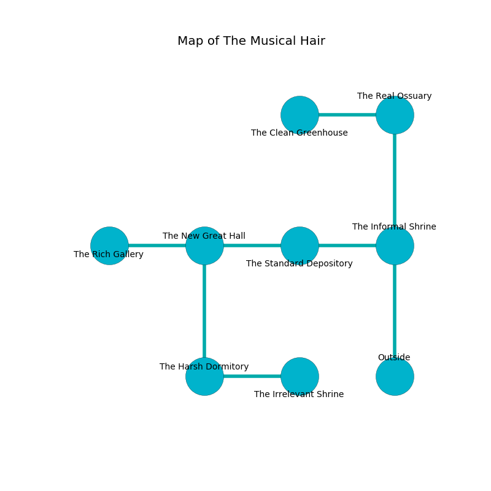

%Ruin Dogs

##The Musical Hair
###Overview
The Musical Hair is located on a poisoned rift. Parts of The Musical Hair are somewhat hot. A lunar eclipse is happening outside. It is occupied by Gnolls. Ila Boggs The Intolerant, a Fire Giant is here. The Gnolls are the slaves of Ila Boggs The Intolerant. She  is trying to discover [Mahudaeedaeum Mod](#Mahudaeedaeum-Mod). 

###Artifact
####Mahudaeedaeum Mod

Mahudaeedaeum Mod looks like a wet crystal. Fire glows away from it. It is a dark yellow color. It smells like camphoreous. When worshipped it repels insects. 

###Locations

####the informal shrine
The air tastes like char here. Gray moss is sprouting from the ceiling. 

* To the west a hazy gap connects to [the standard depository](#the-standard-depository).
* To the north a flooded walkway leads to [the real ossuary](#the-real-ossuary).
* To the south is the entrance.

####the standard depository
There are an Azer, a Giant Vulture, a Will-O’-Wisp, a Myconid Sovereign, and a Displacer Beast here. Green razorgrass is growing in cracks in the floor. The floor is smooth. 

* To the west a small gap leads to [the new great hall](#the-new-great-hall).
* To the east a hazy gap leads to [the informal shrine](#the-informal-shrine).

####the real ossuary
There is a trap here. When activated, a magical rune will open a large pit in the floor. The metallic walls are unsettled. The air smells like civet here. White moss is decaying from the walls. There are a Swarm of Bats, a Blue Slaad, and a Griffon here. 

* [Mahudaeedaeum Mod](#Mahudaeedaeum-Mod) is here.
* To the west a twisted cavern opens to [the clean greenhouse](#the-clean-greenhouse).
* To the south a flooded walkway opens to [the informal shrine](#the-informal-shrine).

####the new great hall

* There is a shield here.
* There is a hook here.
* To the west a dripping walkway connects to [the rich gallery](#the-rich-gallery).
* To the east a small gap opens to [the standard depository](#the-standard-depository).
* To the south a torchlit hall opens to [the harsh dormitory](#the-harsh-dormitory).

####the harsh dormitory
The brick walls are unsettled. 

* There is a specter here.
* To the east a long threshold opens to [the irrelevant shrine](#the-irrelevant-shrine).
* To the north a torchlit hall leads to [the new great hall](#the-new-great-hall).

####the rich gallery
The wooden walls are caving in. Green lichens are decaying in a patch on the floor. 

* To the east a dripping walkway opens to [the new great hall](#the-new-great-hall).

####the irrelevant shrine
The air tastes like old wood here. The stone walls are caving in. There is a trap here. When activated, a magical proximity detector will make the ceiling slowly lower. The floor is cluttered with debris. 

* There is a ring here.
* [Ila Boggs The Intolerant](#Ila-Boggs-The-Intolerant) is here.
* To the west a long threshold connects to [the harsh dormitory](#the-harsh-dormitory).

####the clean greenhouse
There are two Gnoll Fangs of Yeenoghu and two Gnolls here. The Gnolls are willing to fight to the death. 

* To the east a twisted cavern connects to [the real ossuary](#the-real-ossuary).

