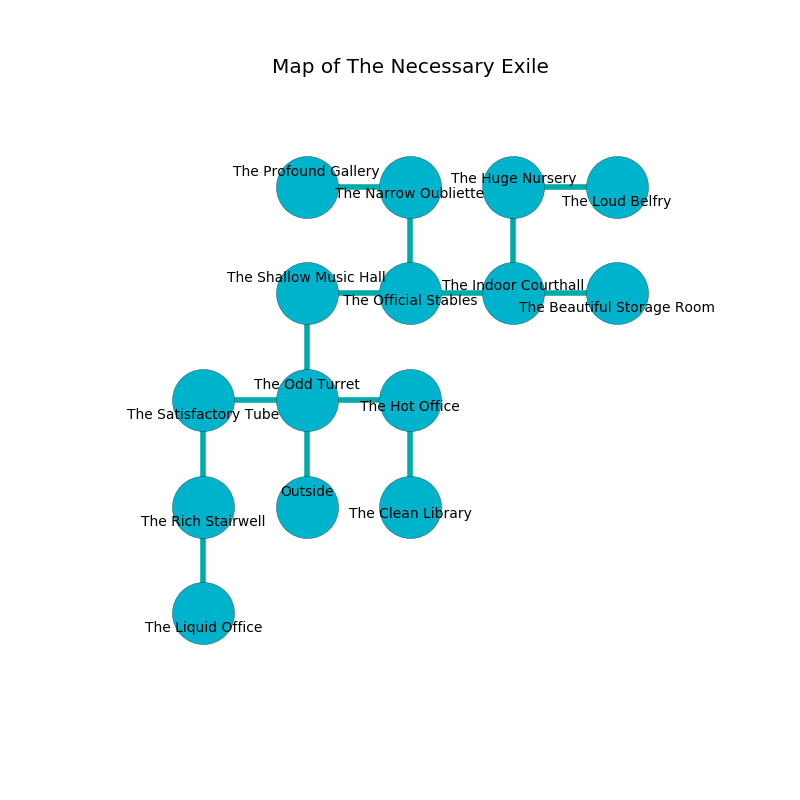

%Ruin Dogs

##The Necessary Exile
###Overview
The Necessary Exile is constructed on a cursed rift. Regions of The Necessary Exile are flooded. The ruin is sinking into the earth. It is occupied by Thri-Kreens. Dong Steel The Sarcastic, a Kuo-Toa Archpriest is here. The Thri-Kreens are the minions of Dong Steel The Sarcastic. He  is trying to destroy [Asebaemedaeum](#Asebaemedaeum). 

###Artifact
####Asebaemedaeum

Asebaemedaeum looks like a mushy monument. It smells like unripe banana. When picked up it becomes a shielding force. 

###Locations

####the odd turret
The wooden walls are caving in. Yellow lichens are swaying from the ceiling. The floor is sticky. 

* To the west a dark corridor opens to [the satisfactory tube](#the-satisfactory-tube).
* To the east a windy threshold opens to [the hot office](#the-hot-office).
* To the north a flooded gap opens to [the shallow music hall](#the-shallow-music-hall).
* To the south is the entrance.

####the satisfactory tube
The obsidion walls are pristine. There are a Flesh Golem, a Giant Hyena, and a Xorn here. The floor is glossy. 

* To the east a dark corridor leads to [the odd turret](#the-odd-turret).
* To the south a windy hallway connects to [the rich stairwell](#the-rich-stairwell).

####the shallow music hall
The floor is smooth. The air tastes like pimenta here. The metallic walls are scratched. There are a Vrock and an Owlbear here. 

* There is a femur here.
* To the east a windy hallway connects to [the official stables](#the-official-stables).
* To the south a flooded gap connects to [the odd turret](#the-odd-turret).

####the official stables
There are a Displacer Beast and a Salamander here. 

* To the west a windy hallway leads to [the shallow music hall](#the-shallow-music-hall).
* To the east a torchlit threshold connects to [the indoor courthall](#the-indoor-courthall).
* To the north a long hallway opens to [the narrow oubliette](#the-narrow-oubliette).

####the indoor courthall
The floor is cluttered with broken glass. The air smells like peanut here. 

* To the west a torchlit threshold opens to [the official stables](#the-official-stables).
* To the east a flooded walkway connects to [the beautiful storage room](#the-beautiful-storage-room).
* To the north a narrow threshold opens to [the huge nursery](#the-huge-nursery).

####the hot office
The brick walls are scratched. There are seven Thri-Kreens here. The Thri-Kreens are sleeping. 

* [Asebaemedaeum](#Asebaemedaeum) is here.
* To the west a windy threshold connects to [the odd turret](#the-odd-turret).
* To the south a small cavern opens to [the clean library](#the-clean-library).

####the huge nursery
There are seven Thri-Kreens here. The metallic walls are caving in. The air smells like roasted peanut here. Green ferns are sprouting in broken urns. One of the Thri-Kreens is on watch, the rest are sleeping. 

* There is a ring here.
* To the east a small artery leads to [the loud belfry](#the-loud-belfry).
* To the south a narrow threshold leads to [the indoor courthall](#the-indoor-courthall).

####the narrow oubliette

* To the west a twisted hallway opens to [the profound gallery](#the-profound-gallery).
* To the south a long hallway opens to [the official stables](#the-official-stables).

####the beautiful storage room
There are an Unicorn, a Young Faerie Dragon, and a Duergar here. The air tastes like praline here. 

* [Dong Steel The Sarcastic](#Dong-Steel-The-Sarcastic) is here.
* To the west a flooded walkway opens to [the indoor courthall](#the-indoor-courthall).

####the loud belfry
The stone walls are pristine. The air tastes like white rose here. Gray ferns are growing in broken urns. 

* To the west a small artery connects to [the huge nursery](#the-huge-nursery).

####the rich stairwell
Gray ferns are sprouting in broken urns. The obsidion walls are caving in. There is a trap here. When activated, a magical sound detector will open a trapdoor in the floor. 

* To the north a windy hallway leads to [the satisfactory tube](#the-satisfactory-tube).
* To the south a flooded passageway leads to [the liquid office](#the-liquid-office).

####the profound gallery
Green razorgrass is decaying from the ceiling. The air tastes like green peas here. The glass walls are covered in mold. There are seven Thri-Kreens here. The Thri-Kreens are willing to negotiate. 

* To the east a twisted hallway connects to [the narrow oubliette](#the-narrow-oubliette).

####the liquid office
The wooden walls are covered in mold. There are a Giant Ape, a Vine Blight, a Shadow, a Tridrone, and a Dretch here. 

* To the north a flooded passageway connects to [the rich stairwell](#the-rich-stairwell).

####the clean library
There are a Deep Gnome, a Myconid Sovereign, a Dryad, and a Shadow Demon here. 

* There is a monkey here.
* To the north a small cavern opens to [the hot office](#the-hot-office).

