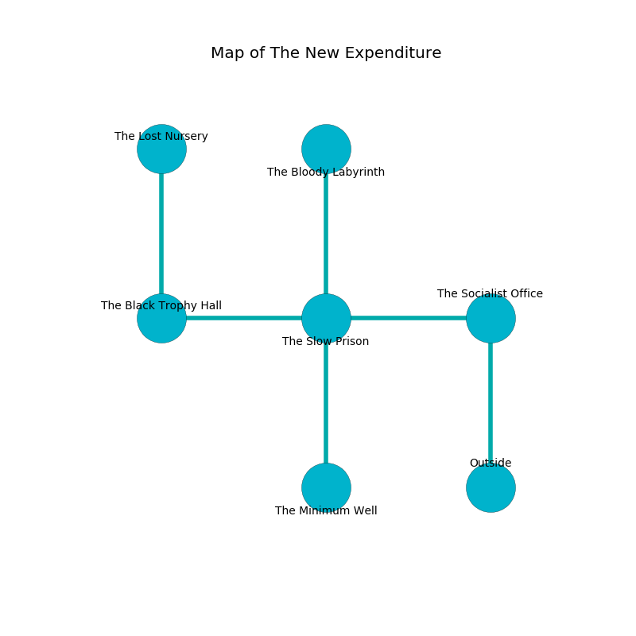

%Ruin Dogs

##The New Expenditure
###Overview
The New Expenditure is constructed on a haunted city. Some areas of The New Expenditure are flooded. A massive storm is happening outside. It is occupied by Harpies. Jon Marion The Truculent, a Yuan-Ti Malison is here. The Harpies are ruled by Jon Marion The Truculent. He  is founding a new religion. 

###Artifact
####Dehb Iamaed

Dehb Iamaed has the form of a wet sphere. Fire slips away from it. It is a pale yellow color. It smells like acid. When thrown it frightens children. 

###Locations

####the socialist office
The floor is smooth. The brick walls are unsettled. There are four Harpies here. One of the Harpies is pointing a ballista at the entrance. 

* To the west a flooded passageway leads to [the slow prison](#the-slow-prison).
* To the south is the entrance.

####the slow prison

* There is a shoe here.
* To the west a twisted walkway leads to [the black trophy hall](#the-black-trophy-hall).
* To the east a flooded passageway opens to [the socialist office](#the-socialist-office).
* To the north a narrow threshold leads to [the bloody labyrinth](#the-bloody-labyrinth).
* To the south a twisted pathway leads to [the minimum well](#the-minimum-well).

####the minimum well
The air smells like ozone here. 

* To the north a twisted pathway opens to [the slow prison](#the-slow-prison).

####the bloody labyrinth
The concrete walls are unsettled. There are a Darkmantle, a Kuo-Toa Whip, a Pteranodon, and a Bugbear Chief here. 

* There is a lyre here.
* To the south a narrow threshold leads to [the slow prison](#the-slow-prison).

####the black trophy hall
There are four Harpies here. The air smells like peanut butter here. One of the Harpies is on watch, the rest are feasting. 

* [Dehb Iamaed](#Dehb-Iamaed) is here.
* [Jon Marion The Truculent](#Jon-Marion-The-Truculent) is here.
* To the east a twisted walkway opens to [the slow prison](#the-slow-prison).
* To the north a hazy artery opens to [the lost nursery](#the-lost-nursery).

####the lost nursery
Red ferns are swaying from the ceiling. The floor is smooth. The air smells like plastic here. 

* To the south a hazy artery connects to [the black trophy hall](#the-black-trophy-hall).

